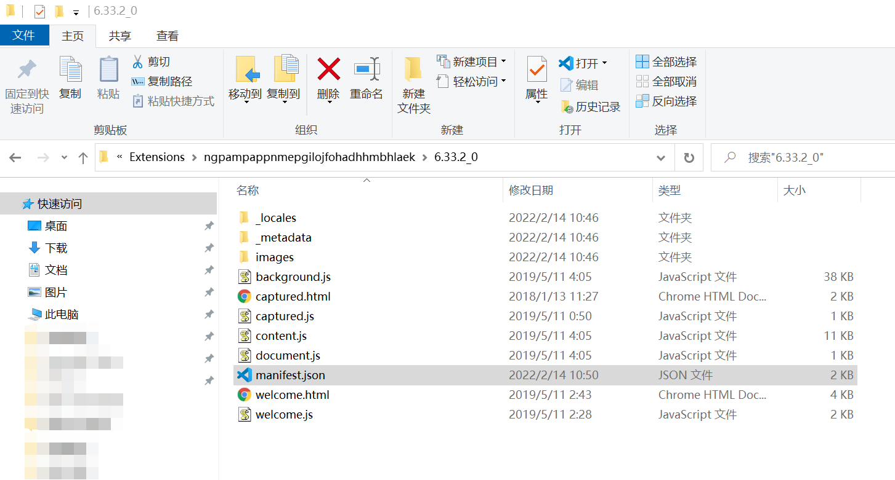
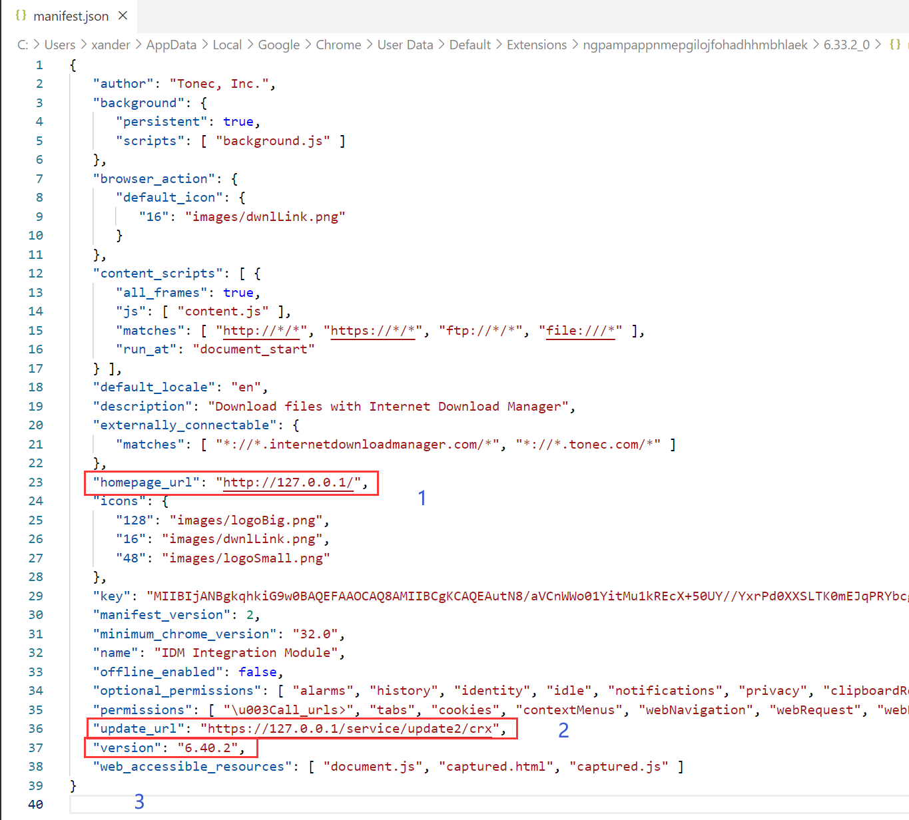

IDM目前我用的是俄罗斯大神破解版，版本6.33，现最新版本应该是6.40，本来相安无事，但chrome会自动更新IDM插件，导致出现“此版本的idm不支持该类下载”的弹窗。解决心路如下

# 1 治标不治本

在chrome中卸载IDM扩展，然后去IDM安装路径里找到`IDMGCExt.crx`文件，拖到chrome中重新安装。

但有效期往往只有一天

# 2 治本

参考https://blog.csdn.net/CW_SZDX/article/details/108748072

得知chrome是依靠一个manifest.json来自动更新扩展的，找到扩展的本地路径`C:\Users\xander\AppData\Local\Google\Chrome\User Data\Default\Extensions\ngpampappnmepgilojfohadhhmbhlaek\6.33.2_0`

打开manifest.json，关注3个红框，改成下图即可。

