OS讲课笔记

---

# ch1 概论

## 需要掌握的问题

1. 应用软件、支撑软件/系统软件、操作系统、硬件的层级关系
2. 操作系统的两大功能是什么？
3. 按功能和使用方式划分，操作系统有哪三种？
4. 多道程序设计中，CPU的利用率怎么算？
5. 多道程序设计提高了什么？损失了什么？
6. 应用程序调用fprintf()之后，调用关系是怎样的？
7. 系统调用的处理过程是怎样的？在用户态做了哪些事，在内核态做了哪些事？
8. 系统调用和函数调用的区别？从调用方式/被调用代码位置/提供者回答
9. 操作系统的三个基本元素是什么？
10. 内核需要提供的4个基本功能是什么？
11. 微内核和宏内核（也叫单内核）的优劣对比
12. 微内核和宏内核的操作系统代表有哪些？
13. 操作系统的功能在用户进程内执行的代表是？作为独立进程执行的代表是？

## 回答

### 1. 应用软件、支撑软件/系统软件、操作系统、硬件的层级关系

知道那张层次图、知道系统软件是编译器、数据库

### 2. 操作系统的两大功能是什么？

对上层：提供资源抽象

对下层：管理硬件

### 3. 按功能和使用方式划分，操作系统有哪三种？

批处理操作系统、分时操作系统、实时操作系统

### 4. 多道程序设计中，CPU的利用率怎么算？

那两张图会算就行，利用率 = CPU时间/一个作业周期时间

### 5. 多道程序设计提高了什么？损失了什么？

提高了资源利用率，增加了用户响应时间

### 6. 应用程序调用fprintf()之后，调用关系是怎样的？

C库的fprintf() -> C库的write() -> write系统调用 -> sys_write处理函数

### 7. 系统调用的处理过程是怎样的？在用户态做了哪些事，在内核态做了哪些事？

1. 设置系统调用号和参数（用户态）
2. 陷入内核态（内核态）
3. 保护被中断进程的CPU环境，将处理机状态字PSW、程序计数器PC、系统调用号、用户栈指针以及通用寄存器内容等压入内核堆栈（内核态）
4. 根据系统调用号，作为下标，查系统调用入口表（内核态）
5. 转到对应的处理函数处理（内核态）
6. 恢复被中断进程的现场（内核态）
7. 返回用户态，继续执行被中断进程的下一条指令（用户态）

### 8. 系统调用和函数调用的区别？从调用方式/被调用代码位置/提供者回答

调用方式：系统调用是用trap/int调用，函数调用用call 函数名调用

被调代码位置：内核代码，进程代码

提供者：操作系统，编程语言

### 9. 操作系统的三个基本元素是什么？

内核、进程、线程

### 10. 内核需要提供的4个基本功能是什么？

中断管理、时钟管理、进程调度、原语管理

### 11. 微内核和宏内核（也叫单内核）的优劣对比

微内核：灵活、独立、稳定、便于维护。但进程通信开销大，效率低

宏内核：效率高，但不稳定，不易维护

### 12. 微内核和宏内核的操作系统代表有哪些？各举1个

微内核：Minix、QNX、Mach

宏内核：Linux、Unix

（另，windows和mac os都是宏内核，不过借鉴了微内核的设计思路，不是纯粹的宏内核，所以不做明确分类，如果考到了，写宏内核）

### 13. 操作系统的功能在用户进程内执行的代表是？作为独立进程执行的代表是？

在用户进程执行的：unix

作为独立进程执行的：windows

# ch2 处理器管理

处理器管理主要讲CPU的工作

## 需要掌握的问题

处理器状态

1. ESP、EBP 寄存器的功能
2. CS, DS, SS 寄存器分别是哪个段的描述符
3. CR0寄存器的PE位和PG位的功能
4. CR3寄存器的高20位存的是什么？为什么只使用高20位？
5. 特权指令有哪些功能？
6. intel x86处理器有4个特权级别，用户态和内核态分别运行于哪一级？
7. 程序状态字包含哪些内容？
8. EIP 存的是什么？

***

中断机制

1. 中断源的分类
2. 中断的处理过程
3. 异常的处理过程

***

进程

1. 进程的定义
2. 进程的运行态，就绪态，等待态的切换图是怎样的？
3. 进程的三个上下文是哪三个？
4. 线程和进程的区别是什么？
5. fork和vfork的异同点
6. 进程创建步骤
7. 进程撤销步骤 exit
8. 进程阻塞步骤
9. 进程唤醒步骤

***

进程调度算法

1. FCFS
2. SJF
3. SRTF
4. HRRF
5. 时间片轮转算法

## 回答

处理器状态

### 1. ESP、EBP 寄存器的功能

ESP栈顶，EBP栈底

### 2. CS, DS, SS 寄存器分别是哪个段的描述符

代码段，数据段，栈段

### 3. CR0寄存器的PE位和PG位的功能

PE = 0：实模式，PE = 1：保护模式

PG = 0：不允许分页，PG = 1：开启分页

### 4. CR3寄存器的高20位存的是什么？为什么只使用高20位？

存的是页目录表的物理地址。页目录表总是放在以4K字节为单位的存储器边界上，所以只用高20位。

### 5. 特权指令有哪些功能

启动I/O设备、设置时钟、控制中断屏蔽位、清主存、建立存储键、加载PSW等

### 6. intel x86处理器有4个特权级别，用户态和内核态分别运行于哪一级？

用户3，内核0

### 7. 程序状态字包含哪些内容？

EFLAGS，EIP，处理器状态位（用户态3，内核态0），中断码，中断屏蔽位

### 8. EIP 存的是什么？

当前指令相对于当前段的偏移量

***

中断机制

### 1. 中断源的分类

外中断是异步的，即随时可能发生，来自机器的端口，有IR0~IR7八根引脚，对应引发外中断的外设们

内中断是同步的，来自程序内部

内中断的执行可以被外中断打断，可以被内中断打断（即嵌套执行）

但外中断的执行不可被打断

### 2. 中断的过程

粗略来说

1. 产生中断向量

2. 拿中断向量查表
3. 保护现场
4. 执行中断处理程序
5. 恢复现场

***

细致来说

这里指在保护模式下的外中断，可以分为4步，中断请求->中断响应->中断处理->中断返回

中断请求：硬件向8259A可编程控制器发送中断请求，由8259A决定是否屏蔽该请求

中断响应：CPU看8259A控制器是否有中断请求，如果有，就去总线上取中断向量

中断处理：

1. 根据中断号查IDT（Interrupt Descriptor Table，中断描述符表），获得中断描述符（段选择符）
2. CPU使用IDT查到的中断服务程序的段选择符从GDT中取得相应的段描述符
3. CPU会根据当前cs寄存器里的CPL和GDT的段描述符的DPL，以确保中断服务程序是高于当前程序的，如果这次中断是编程异常（如：int 80h系统调用），那么还要检查CPL和IDT表中中断描述符的DPL，以保证当前程序有权限使用中断服务程序
4. CPU会根据CPL和中断服务程序段描述符的DPL信息确认是否发生了特权级的转换，比如当前程序正运行在用户态，而中断程序是运行在内核态的，则意味着发生了特权级的转换，这时CPU会从当前程序的TSS信息（该信息在内存中的首地址存在TR寄存器中）里取得该程序的内核栈地址，即包括ss和esp的值，并立即将系统当前使用的栈切换成新的栈。这个栈就是即将运行的中断服务程序要使用的栈。紧接着就将当前程序使用的**ss,esp**压到新栈中保存起来。
5. 保护当前程序的现场：CPU开始利用栈保护被暂停执行的程序的现场：依次压入当前程序使用的eflags，cs，eip，errorCode（如果是有错误码的异常）信息
6. 跳转到中断服务程序的第一条指令开始执行，CPU利用中断服务程序的段描述符将其第一条指令的地址加载到cs和eip寄存器中，开始执行中断服务程序。这意味着先前的程序被暂停执行，中断服务程序正式开始工作。
7. 用iret指令返回用户态，程序执行这条返回指令时，会从栈里弹出先前保存的被暂停程序的现场信息，**即eflags,cs,eip**，被打断的程序继续执行

### 3. 异常的处理过程

和中断仅有一处不同，就是中断的中断向量会从硬件处获取，即到总线上取，但异常的中断向量是程序给好的

***

进程

### 1. 进程的定义

进程是**可并发执行的程序**在某个数据集合上的一次计算活动，也是操作系统进行**资源分配和保护**的基本单位

### 2. 进程的运行态，就绪态，等待态的切换图是怎样的？

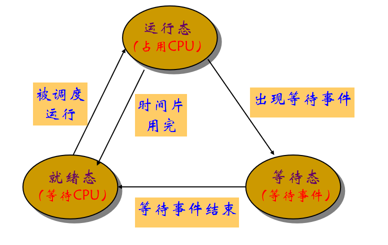

### 3. 进程的三个上下文是哪三个？

用户级上下文：程序块、数据块、共享内存区、用户栈

系统级上下文：PCB、页表、段表、内核栈

寄存器上下文：处理器状态寄存器、EIP、ESP、EBP、通用寄存器（EAX、EBX、ECX、EDX）

### 4. 线程和进程的区别是什么？

进程是操作系统进行资源分配和保护的单位，同一进程下的线程共享进程的资源

### 5. fork和vfork的异同点

fork创建子进程是独立于父进程的，与父进程互不干扰

vfork创建的子进程与父进程共享地址空间，共享页表，可看做父进程的一个线程

### 6. 进程创建步骤

1. 在进程列表中增加一项，从PCB池中申请一个空闲PCB，为新进程分配惟一的进程标识符
2. 为新进程的进程映像分配地址空间
3. 为新进程分配除主存空间外的其他各种所需资源
4. 初始化PCB，如进程标识符、处理器初始状态、进程优先级等
5. 把新进程状态置为就绪态，并移入就绪进程队列

### 7. 进程撤销步骤

1. 根据撤销进程标识号，从相应队列中找到并移出它
2. 将该进程拥有的资源归还给父进程或操作系统
3. 若该进程拥有子进程，先撤销所有子进程，以防它们脱离控制
4. 回收PCB，并归还到PCB池

### 8. 进程阻塞步骤

1. 停止进程执行，保存现场信息到PCB
2. 修改进程PCB有关内容（如进程状态由运行态改为等待态等），并把修改状态后的进程移入相应事件的等待队列中
3. 转入进程调度程序去调度其他进程运行

### 9. 进程唤醒步骤

1. 从相应的等待队列中移出进程
2. 修改进程PCB的有关信息（如进程状态改为就绪态），并移入就绪队列
3. 若被唤醒进程比当前运行进程优先级高，重新设置调度标志

***

进程调度算法

### 1. FCFS

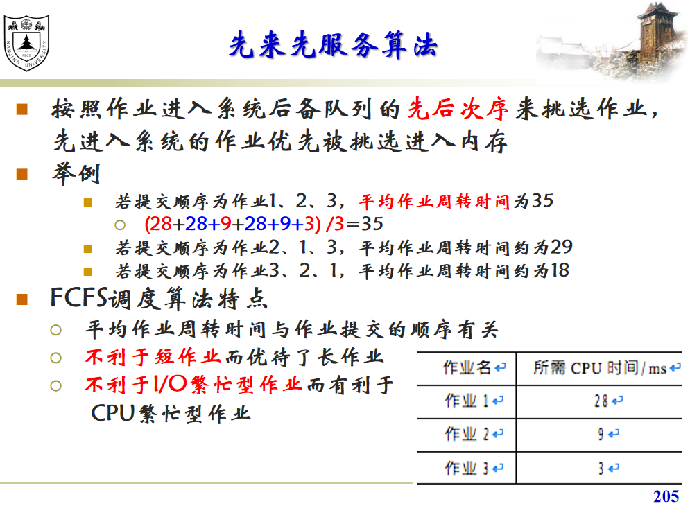

### 2. SJF

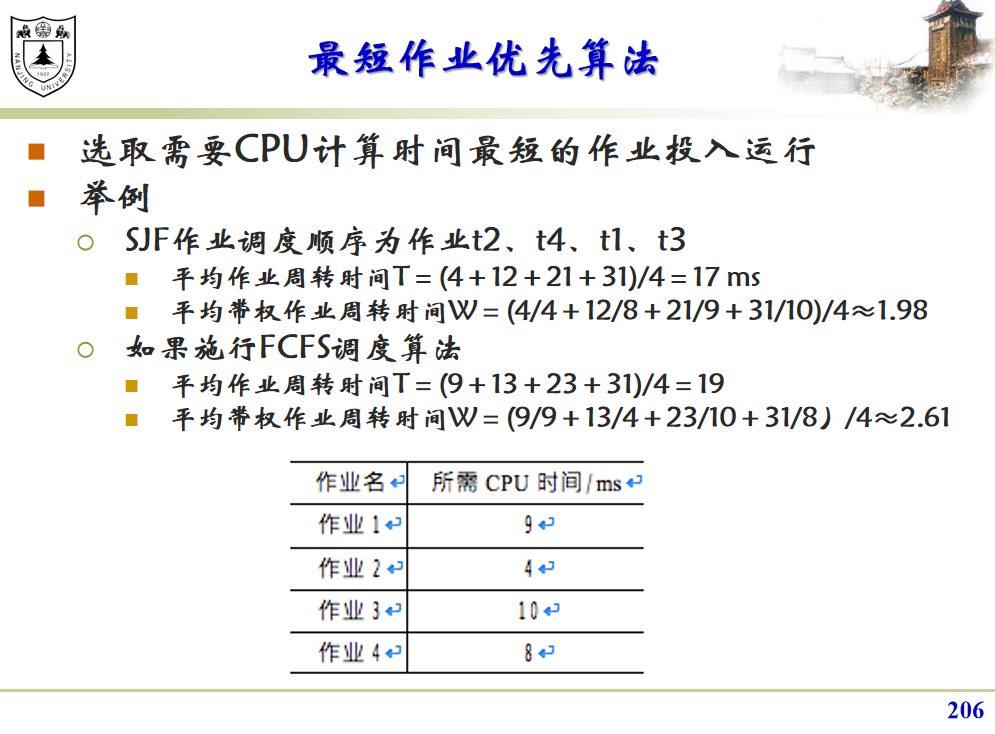

​	

### 3. SRTF

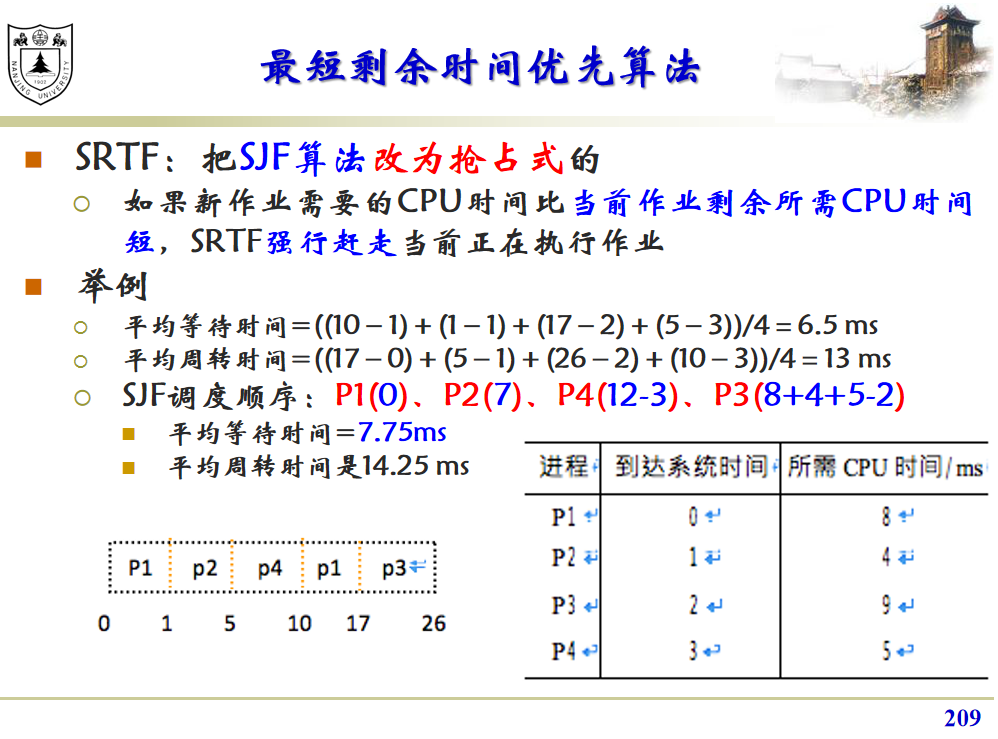

### 4. HRRF

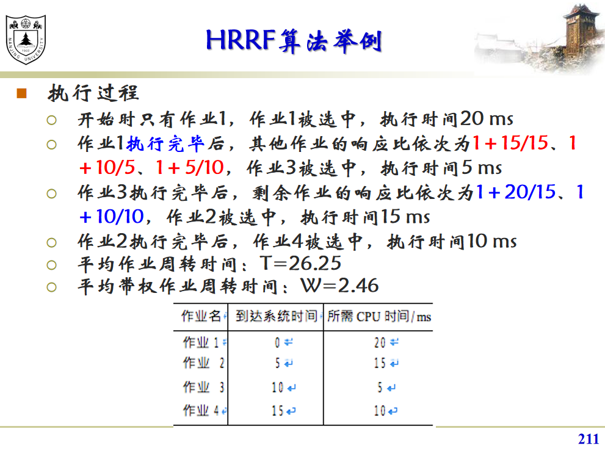

### 5. 时间片轮转算法

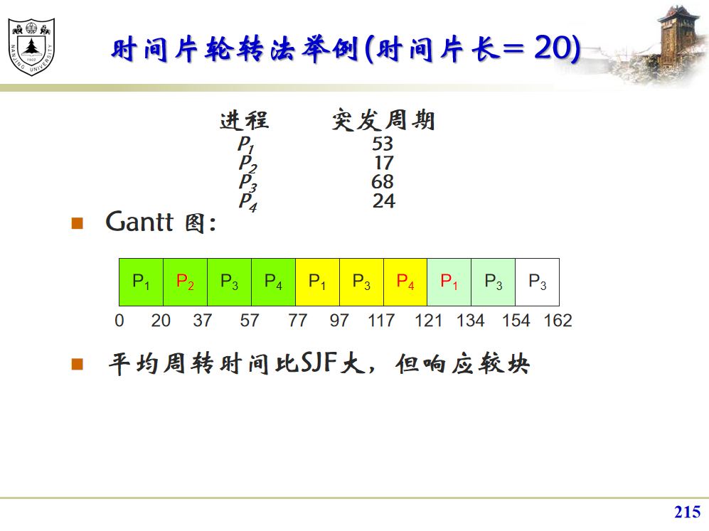

需要注意的是，如果在时间t时，一个进程的时间片耗尽，它按理要被放到队尾，但如果与此同时有一个新进程进来，它也要被放到队尾，那么谁先谁后呢？

答：应该是耗尽时间片的那个进程排在先，然后新进程排在队尾。原因是如果耗尽时间片的进程被放在后，假如在时间t进来很多个新进程，那么这个耗尽时间片的进程会被很多新进程“插队”，得等待很久

# ch3 并发进程管理

## 需要掌握的问题

并发进程和临界区管理

1. Bernstein条件的判断
2. 实现临界区管理的软件手段、硬件手段

***

信号量和PV操作（看ppt，oschap3）

1. 五个哲学家就餐问题
2. 读者-写者问题
3. 1个生产者-1个消费者-1单位缓冲区 的生产者-消费者问题
4. m个生产者-n个消费者-k单位缓冲区 的生产者-消费者问题
5. 睡眠理发师问题
6. 吸烟者问题
7. 生产线装配问题
8. 男女混用浴室问题
9. 独木桥问题1234
10. 安全岛问题

***

管程

霍尔管程解决

1. 生产者-消费者问题
2. 五个哲学家就餐问题
3. 睡眠理发师问题
4. 吸烟者问题
5. 生产线装配问题
6. 文件读写问题

***

死锁

1. 死锁定义
2. 死锁产生的4个必要条件
3. 银行家算法
4. 进程-资源分配图检测死锁法

***

进程通信

1. 信号机制
2. 管道
3. 消息队列
4. 共享内存

## 回答

并发进程和临界区管理

### 1. Bernstein条件的判断实现

P1的读和P2的写，P1的写和P2的读，P1的写和P2的写，不能有交集

### 2. 临界区管理的软件手段、硬件手段

软件手段：Peterson算法

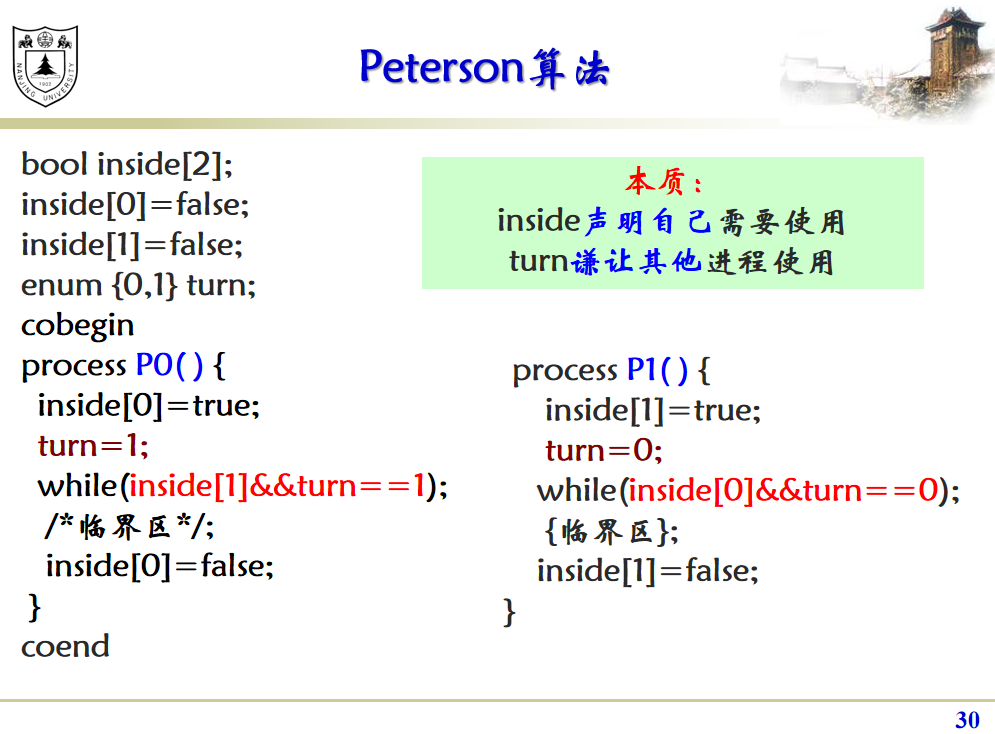

硬件手段：关中断、TS指令、SWAP指令

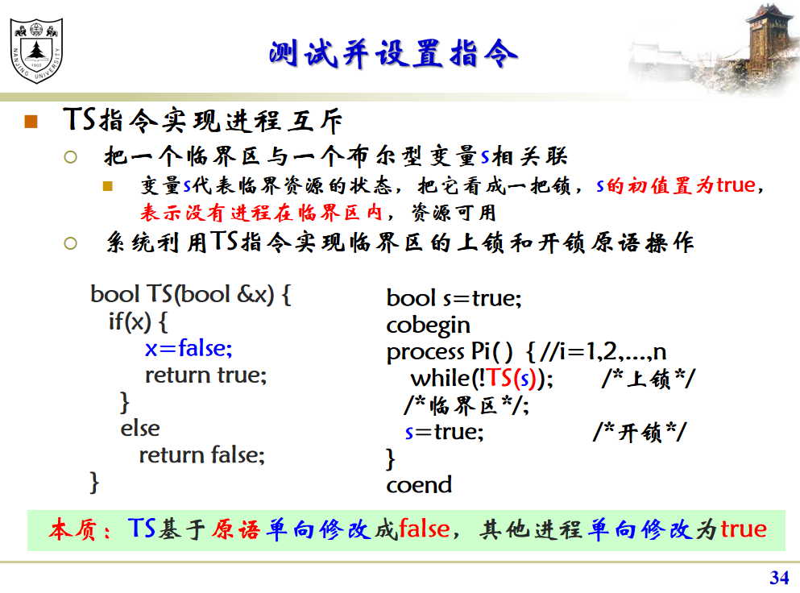

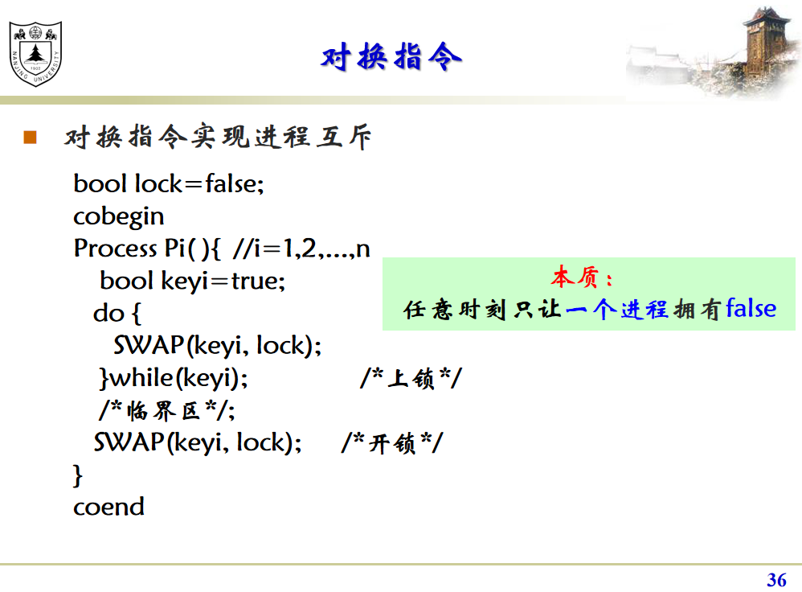

***

# ch4 存储管理

## 需要掌握的问题

1. 存储管理的功能
2. 存储器的层次金字塔长什么样
3. 静态重定位、动态重定位、运行时链接地址重定位的概念区别
4. 固定分区存储管理、可变分区管理的概念
5. 分页式管理和地址转换、反置页表，要求会算
6. 相联存储器和快表
7. 分段式管理和地址转换、段表
8. 分段和分页的比较
9. 虚拟存储管理的概念
10. 请求分页虚拟存储系统的基本原理
11. 缺页中断率的影响因素、缺页中断的处理流程
12. 页面替换策略算法
13. Belady异常是什么
14. 伙伴系统的定义、分配和合并策略

## 回答

### 1. 存储管理的功能

存储分配、地址抽象与映射、存储保护、存储共享

### 2. 存储器的层次金字塔长什么样
自顶向下：

寄存器

cache

内存

磁盘缓存

磁盘

可移动存储介质

### 3. 静态重定位、动态重定位、运行时链接地址重定位的概念区别

静态重定位：装载程序将程序里的逻辑地址全部替换为物理地址

动态重定位：装载程序不修改程序里的任何逻辑地址，用一个重定位寄存器来做基址，访问逻辑地址时，物理地址=逻辑地址+重定位寄存器的值

运行时链接地址重定位：用页表和缺页中断来实现，当页面首次被引用时，产生缺页异常并且把对应页从磁盘装入内存

### 4. 固定分区存储管理、可变分区管理的概念

固定分区存储管理：内存空间被划分为不同大小的区，但每个区的大小是固定的，每个区里装一个作业

可变分区存储管理：根据作业大小，划分不同大小的区给作业用

### 5. 分页式管理和地址转换、反置页表，要求会算

页表：页表的尺寸是页号的数量，每次拿一个页号去查页表，查到页框号，然后拼接偏移量得到物理地址

反置页表：反置页表的尺寸是页框的数量，每次拿一个页号计算hash值，然后去访问反置页表，沿着链找到匹配的页号，然后将hash值拼接偏移量得到物理地址

### 6. 相联存储器和快表

快表存在相联存储器里，拿页号去查快表，并行匹配得到页框号，拼接偏移量得到物理地址；或者匹配失败，还得去查页表，然后搬到快表里

### 7. 分段式管理和地址转换、段表

48位的逻辑地址=16位段寄存器+32位偏移量

用段寄存器里的13位作为下标去查段表，得到段描述符

从CS寄存器里取出CPL，CPL是当前进程的特权级，从段描述符里取出DPL和RPL，看是否满足CPL <= DPL且CPL <= RPL，满足就继续取段描述符里有段起始的虚拟地址（也称线性地址），不满足就产生GP异常

然后将这个起始地址拼接32位偏移量得到完整的32位虚拟地址，然后拿32位虚拟地址查页表（or快表-页表），得到物理地址

### 8. 分段和分页的比较

分段，不同的段是有逻辑含义的，是用来有效利用虚拟空间的

分页，每一页是没有逻辑含义的，是用来有效利用物理内存的

### 9. 虚拟存储管理的概念

就是用了段表和页表

### 10. 请求分页虚拟存储系统的基本原理
分页式虚存不把作业信息(程序和数据)全部装入内存，仅装入立即使用的页面，在执行过程中访问到不在内存的页面时，产生缺页中断，再从磁盘动态地装入

### 11. 缺页中断率的影响因素、缺页中断的处理流程

缺页中断率影响因素：进程分配了多少个页框，页面替换策略算法、页面大小、程序特性

缺页中断处理流程

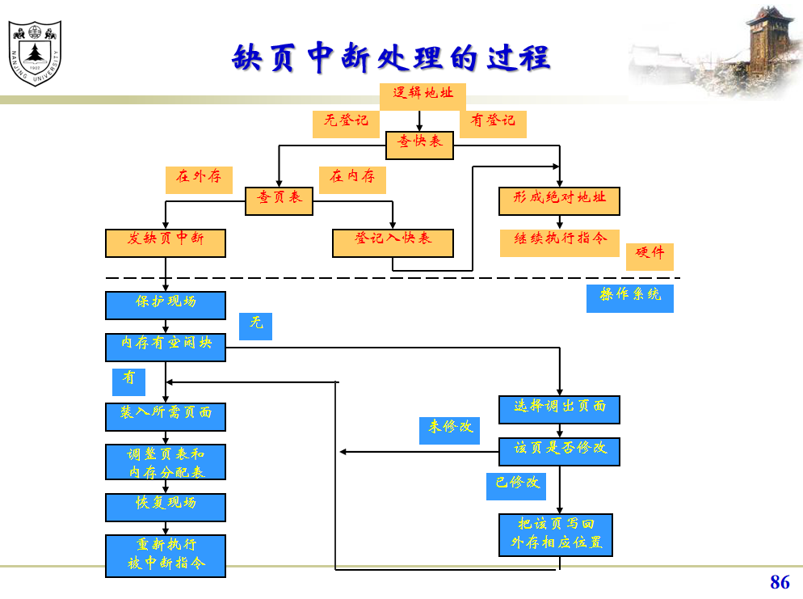

### 12. 页面替换策略算法

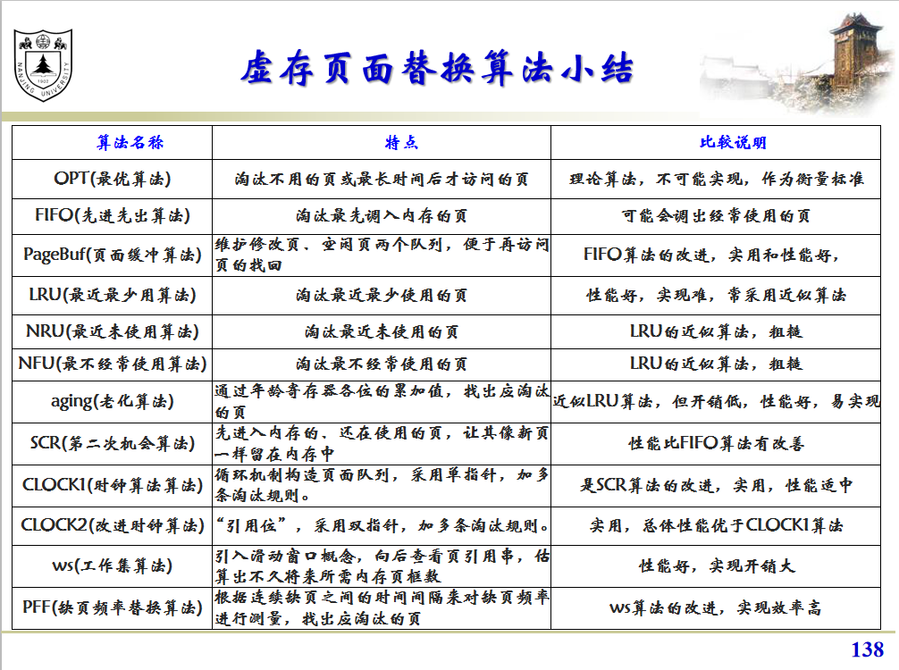

### 13. Belady异常是什么

在FIFO替换策略中，给进程更多的页框，有时反而会导致缺页中断率上升

### 14. 伙伴系统的定义、分配和合并策略

伙伴系统：

1. 把所有空闲页框分组为10个块链表
2. 每个块链表分别包含大小为1，2，4，8，16，32，64，128，256，512个连续的页框
3. 每个块的第一个页框的物理地址是该块大小的整数倍
   例如：大小为16个页框的块，其起址是16×4KB的倍数

伙伴的必要条件：

1. 大小相同
2. 物理地址连续

伙伴分配：

比如请求5个页，那么去8块的链表里找，然后把8块的5个分配出去，剩下三个拆成1块+2块，添加到对应的链表里去

伙伴合并发生在归还页框的时候：

1. 当两个伙伴都空闲时，则合并成一个更大的块
2. 该过程一直进行，直到找不到可以合并的伙伴为止

# ch5 设备管理

## 需要掌握的问题

1. IO四种控制方式：轮询、中断、DMA、通道
2. 缓冲技术思想、单缓冲、双缓冲
3. 顺序存储设备和随机存储设备、磁盘物理结构、访问磁盘的物理顺序
4. 优化分布
5. 移臂调度算法：先来先服务、电梯、最短查找时间、循环扫描等
6. 提高IO速度的方法
7. Spooling技术的概念

## 回答

### 1. IO四种控制方式：轮询、中断、DMA、通道缓冲技术思想

轮询：需要IO的时候反复测试IO设备的忙闲状态位，相当于阻塞了程序

中断：IO设备发送中断处理请求，CPU执行中断处理程序

DMA：由DMA控制器控制数据在IO设备和内存直接交换

通道：CPU-通道-控制器-IO设备，四级连接

* CPU在执行主程序时遇到I/O请求，启动指定通道上选址的设备
* 一旦启动成功，通道开始控制外围设备进行操作
* CPU可执行其他任务并与通道并行工作，直到I/O操作完成
* 通道发出操作结束中断时，CPU才停止当前工作，转向处理I/O操作结束事件

### 2. 缓冲技术思想、单缓冲、双缓冲

从磁盘读数据时，先读到缓冲里，再送到内存里让CPU算

向磁盘写数据时，先写到缓冲里，再写到磁盘上

单缓冲：用一个缓冲区

双缓冲：两个缓冲区，一个填满了/搬空了再用另一个

### 3. 顺序存储设备和随机存储设备、磁盘物理结构、访问磁盘的物理顺序

顺序存储设备：磁带

随机存储设备：ROM，RAM

磁盘物理结构：

1. 盘片，每个盘片有一个磁头
2. 磁道：一个个同心圆环组成盘片，同心圆环就是磁道
3. 扇区：磁道里的一小段是扇区
4. 柱面：所有盘片的同半径的磁道组成一个空心圆柱，就是柱面

### 4. 优化分布

把数据放在一些扇区里，使得读取了1个数据，然后到处理完的时候，盘片刚好旋转到下一个要读的数据

### 5. 移臂调度算法：先来先服务、最短查找时间优先、扫描、分步扫描、电梯调度、循环扫描

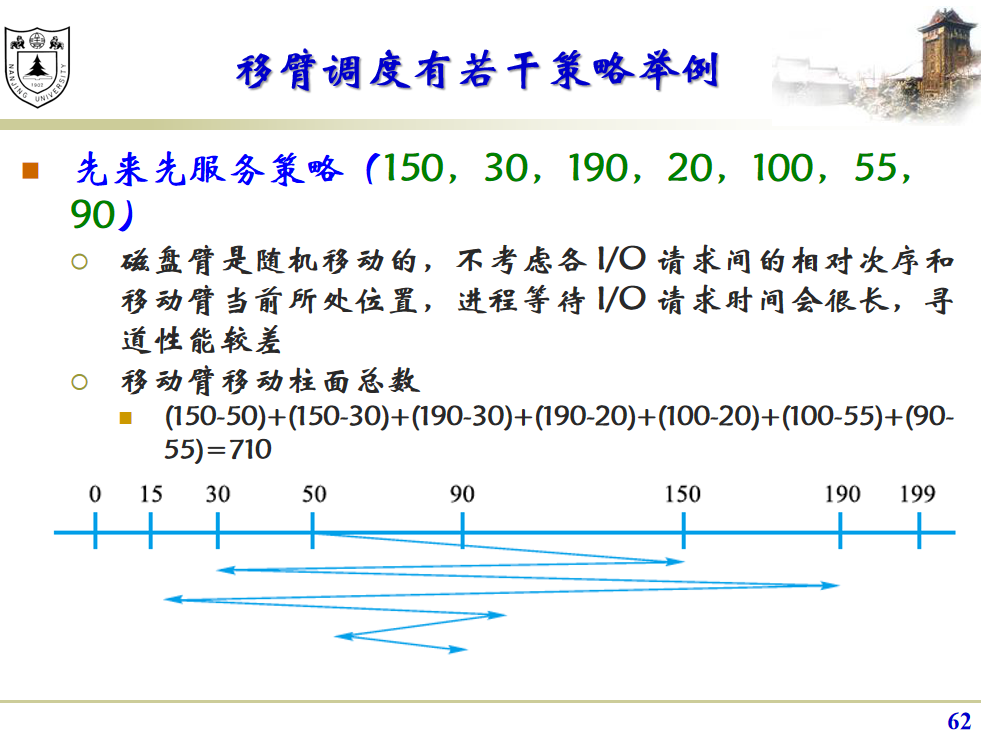

.

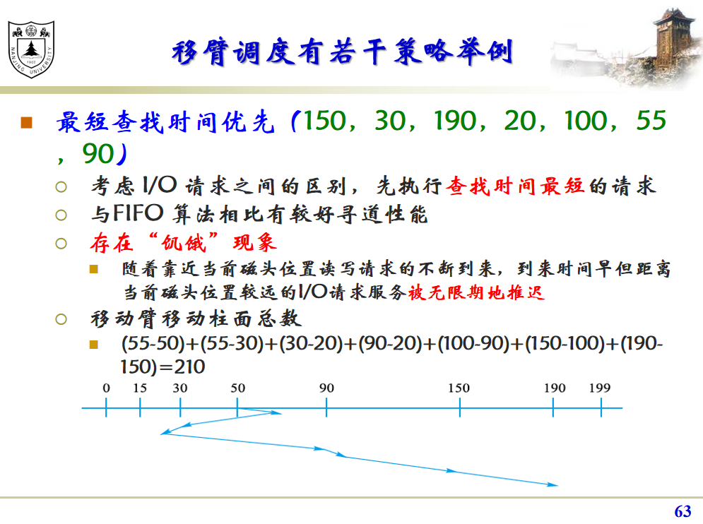

.

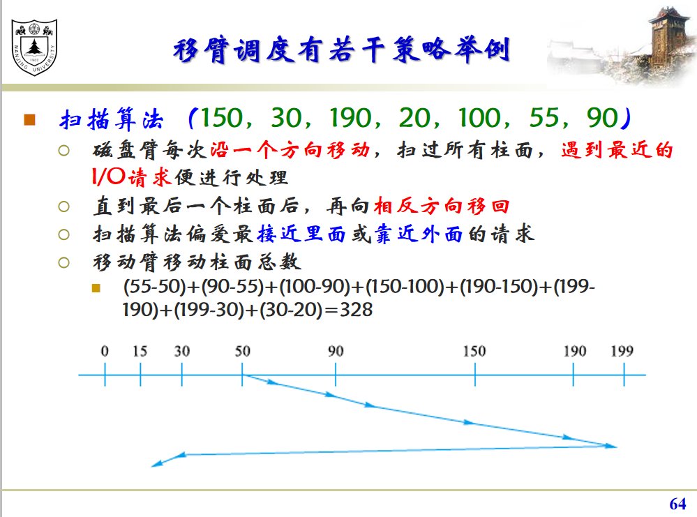

.

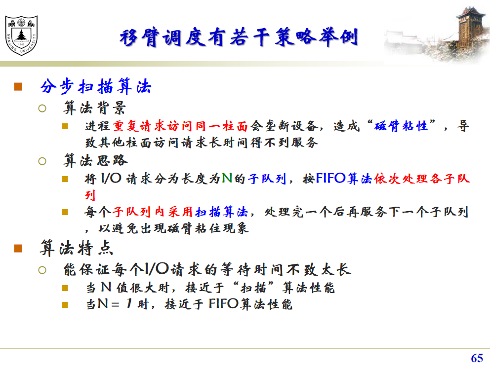

.

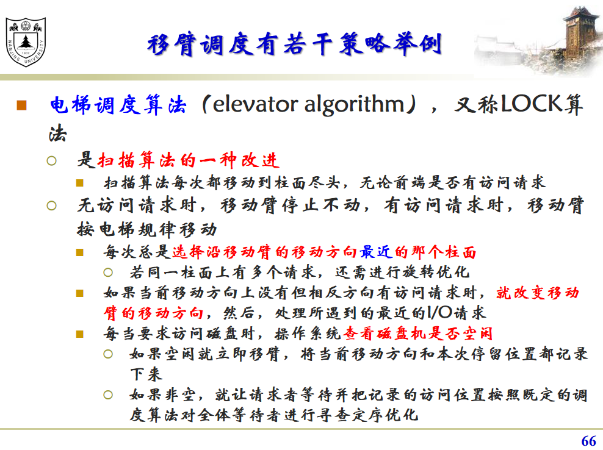

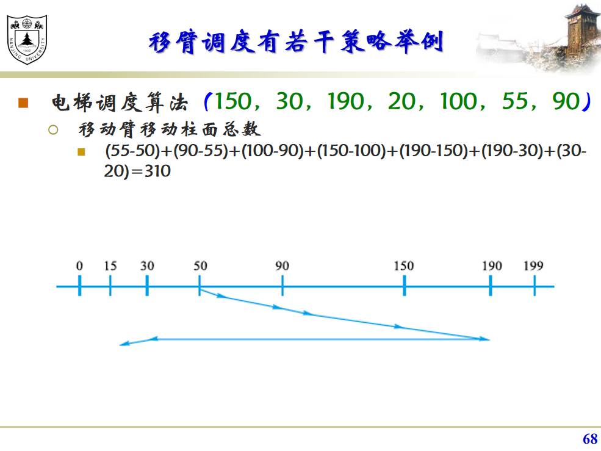

.

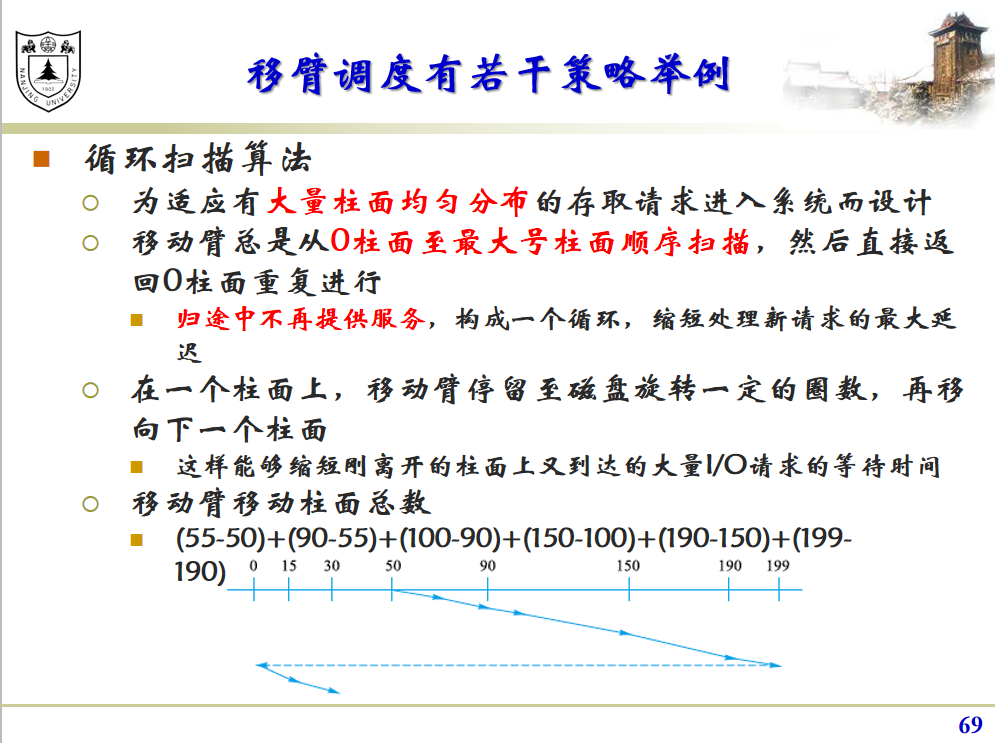

### 6. 提高IO速度的方法

提前读：把当前块读入时，后面跟着的数据块也一起读入

延迟写：将修改了的缓冲区放到空闲缓冲区队尾，再有进程申请到这个缓冲区时，再把缓冲区里的内容写回磁盘

虚拟盘：把磁盘里的一部分内容放到内存里，进程结束时再写回磁盘

### 7. Spooling技术的概念

解决静态分配设备时，分配出去的设备对新的请求是拒绝的情况

1. 预输入：操作系统将一批作业从输入设备上预先输入至磁盘的输入缓冲区中暂存 
2. 作业调度程序调度作业执行，作业使用数据时不必再启动输入设备，只要从磁盘的输入缓冲区中读入  
3. 作业执行过程中不必直接启动输出设备，只要将作业的输出数据暂时保存到磁盘的输出缓冲区 
4. 缓输出：作业执行完毕后，由操作系统组织信息成批输出

# ch6 文件管理

## 需要掌握的问题

1. 文件系统的功能
2. 目录文件里存的是什么？
3. 文件检索的过程
4. 流式文件、记录式文件的概念和区别
5. 顺序文件、连接文件、索引文件的概念
6. Linux里的inode结构，直接索引、一二三级索引
7. 活动inode表的概念
8. 用户打开文件表项，系统打开文件表项的概念
9. 文件创建、打开、关闭、删除、链接的过程
11. 文件静态共享和动态共享
11. 符号链接和硬链接的区别
12. 磁盘块分配和回收算法
13. 磁盘块一致性检查和文件一致性检查

## 回答

### 1. 文件系统的功能

* 文件的按名存取，实现从逻辑文件到物理文件的转换
* 文件目录的建立和维护
* 文件的查找和定位
* 文件存储空间的分配管理
* 提供文件的存取方法和文件存储结构
* 实现文件共享、保护和保密
* 提供一组易用的文件操作和命令
* 提供与设备管理交互的统一接口 

### 2. 目录文件里存的是什么？

存的是目录项，组成是

文件名+inode号

### 3. 文件检索的过程

### 4. 流式文件、记录式文件的概念和区别

流式文件：无结构的文件，怎么解析是应用程序的事

记录式文件：是一种有结构的文件，包含若干逻辑记录，逻辑记录是文件中按信息在逻辑上的独立含义所划分的信息单位

* 记录式顺序文件：文件的记录顺序生成并被顺序访问
* 记录式索引顺序文件：这种文件使用索引表，表项包含记录键和索引指针，记录键由应用程序确定，而索引指针便指向相应记录，这种文件可针对特定记录进行存取，也保持着顺序访问记录的功能

### 5. 顺序文件、连接文件、索引文件的概念

.

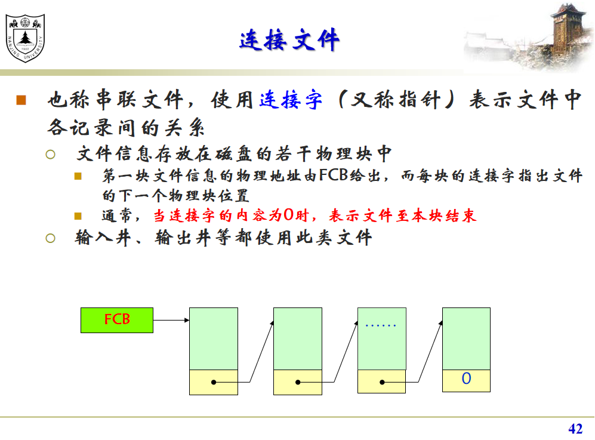

.

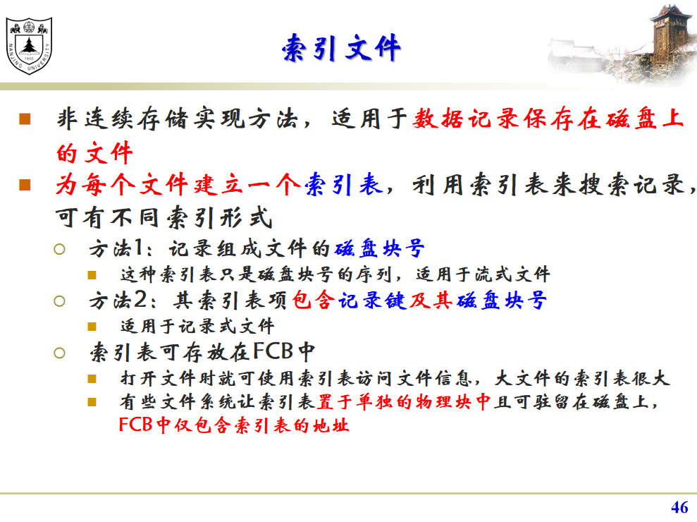

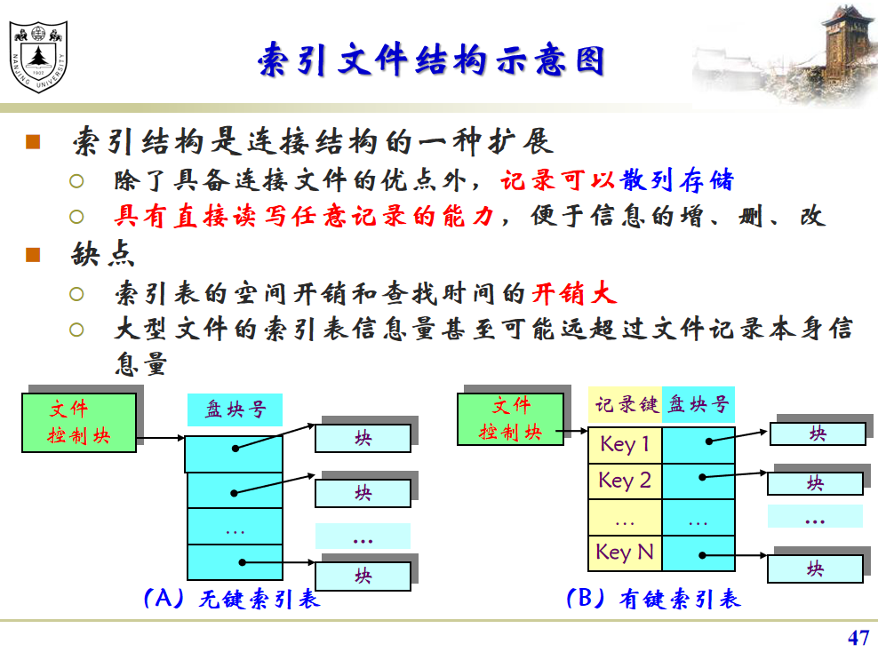

.

### 

### 6. Linux里的inode结构，直接索引、一二三级索引

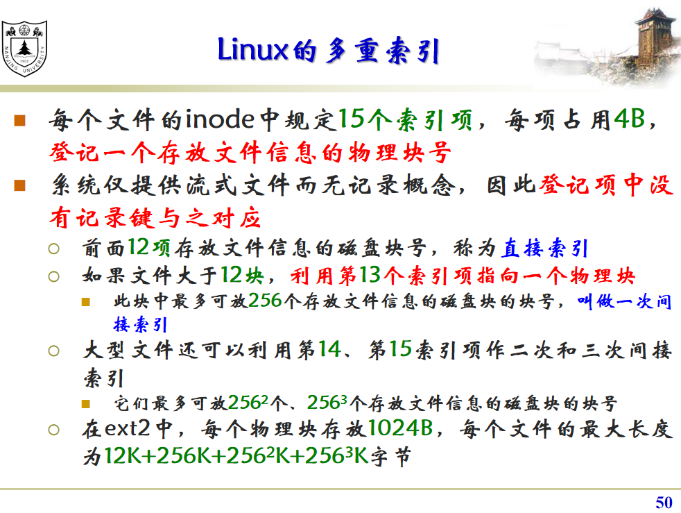

### 
### 7. 活动inode表的概念

解决去磁盘里读inode太慢的问题

把用到的inode放到内存里，称为活动inode表

### 8. 用户打开文件表项，系统打开文件表项

每个用户进程有一张表，记录该用户进程打开的文件

整个操作系统有一张表，记录所有被打开的文件

### 9. 文件创建、打开、关闭、删除、读写的过程

文件创建：

1. fd = create (filenamep, mode)
2. 为新文件分配inode和活动inode，并把inode号与文件分量名组成新目录项，记到目录中
3. 在新文件所对应的活动inode中置初值，如
4. 置存取权限i_mode，连接计数i_nlink等
5. 分配用户打开文件表项和系统打开文件表项，置表项初值，读写位移f_offset清“0”
6. 把各表项及文件对应的活动inode用指针连接起来，把文件描述字返回给调用者

文件打开：

1. fd = open (filenamep, mode);
2. 检索目录，把它的外存inode复制到活动inode表
3. 根据参数mode核对权限，若非法，则这次打开失败
4. 当“打开”合法时，为文件分配用户打开文件表项和系统打开文件表项，并为表项设置初值，通过指针建立这些表项与活动inode间的联系
5. 把文件描述字，即用户打开文件表中相应文件表项的序号返回给调用者
6. 若已有其他用户打开同一文件，则不执行复制inode的工作，仅把活动 inode的计数器i_count加1，i_count反映通过不同的系统打开文件表项来共享同一活动inode的进程数目

文件关闭：

1. close (fd);
2. 根据fd找到用户打开文件表项，再找到系统打开文件表项，释放用户打开文件表项
3. 把对应系统打开文件表项中的f_count减“1”，如果非“0”，说明还有进程共享这一表项，不用释放直接返回；否则释放表项
4. 把活动索引节点中的i_count减“1”，若不为“0”，表明还有用户进程正在使用该文件，不用释放而直接返回；否则在把该活动inode中的内容复制回文件卷上的相应inode中后，释放该活动inode

文件删除：

1. unlink (filenamep)
2. 把指定文件从其所在的目录文件中去
3. 如果没有连接用户(i_link 为1)，还要把文件占用的存储空间释放

读文件：

1. nr = read (fd, buf, count);
2. 系统检查读操作合法性
3. 如果合法，按活动inode中i_data[]指出的文件物理块存放地址，从文件当前位移量f_offset处开始，读出所要求的字节数到块设备缓冲区中
4. 送到buf指向的用户数据区中

写文件：

1. nr = write(fd, buf, count);
2. 系统检查写操作合法性
3. 如果合法，把buf里的count字节送到块设备缓冲区
4. 按活动inode中i_data[]指出的文件物理块存放地址，从文件当前位移量f_offset处开始，写入到磁盘里

随机存取：

1. lseek (fd, offset, whence);
2. 文件初次“打开”时，文件位移量f_offset清空为0，以后的文件读写操作总是根据offset的当前值来顺序地读写文件 
3. whence值为0时，则f_offset被置为offset，值为１时，则f_offset被置为文件当前位置值加上offset

### 10. 文件静态共享和动态共享的概念和区别

静态共享：无论进程是否运行，其文件的链接关系都是存在的，因此，称为静态共享

1. link(oldnamep, newnamep);
2. 检索目录，找到oldnamep所指文件的inode
3. 再次检索目录，找到 newnamep所指文件的父目录文件，并把已存在文件的 inode 编号与别名构成目录项，记录到目录中去
4. 把已存在文件inode的连接计数i_nlink值加1

动态共享：共享关系只有当用户进程存在时才可能出现，一旦用户的进程消亡，其共享关系也就自动消失

1. 活动inode表是整个系统公用的
2. 系统在每个进程的PCB中设立用户打开文件表，并通过它与各自已打开文件的活动inode联系
3. 不同进程的读写指针如何设置？
   * 情形1：同一用户父、子进程协同完成任务，使用同一读/写位移，同步地对文件进行操作
     * 该位移指针放在相应文件的活动索引节点中
     * 当用系统调用fork建立子进程时，父进程的pcb结构被复制到子进程的pcb结构中，使两个进程的打开文件表指向同一活动inode，达到共享同一位移指针的目的
   * 情形2：若一个文件为两个以上的用户所共享，每个用户希望能独立地读/写此文件，彼此互不干扰
     * 位移指针不应放在相应文件的活动inode中，而需独立设置

### 11. 符号链接和硬链接的区别

硬链接（hard link）：将文件名和自身的inode链接起来

1. 只能用于单个文件系统，但不能跨越文件系统
2. 可用于文件共享但不能用于目录共享
3. 实现简单，访问速度快

符号链接，又称软链接，是一种只有文件名，不指向inode的文件

1. 有自己的inode，通过名称来引用文件 
2. 能用于链接计算机系统中不同文件系统中的文件，支持目录链接
3. 可链接计算机网络中不同机器上的文件，此时，仅需提供文件所在机器地址和该机器中文件的路径名
4. 搜索文件路径开销大，需要额外的空间查找存储路径

### 12. 磁盘块分配和回收算法

位示图：

用若干字节构成一张位示图，其中每一字位对应于一个物理块，字位的次序与块的相对次序一致 

空闲区表：

将空闲物理块的位置及其连续空闲的物理块数构成一张表

空闲块链：

把所有空闲块用链表连接在一起

成组空闲块链：

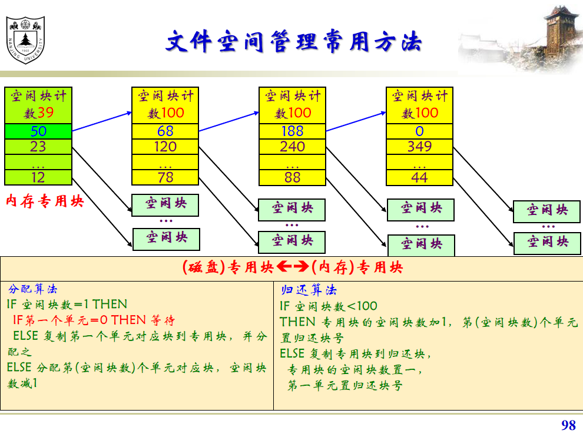

### 13. 磁盘块一致性检查和文件一致性检查

磁盘块一致性检查：

1. 占用计数器：记录磁盘块在文件中出现次数，初值置0
2. 空闲计数器：记录磁盘块在空闲块链表中出现次数，初值0
3. 如果一个计数器为0时，其另一个计数器为1（即两个计数器之值是互补的），此时系统中的所有磁盘块处于一致性状态
4. 不一致的情况
   1. 情况1：磁盘块对应的两个计数器均为1
      该块既是空闲的，又是被占用的
      解决方法：空闲计数器置”0”，并从空闲块链表中丢弃
   2. 情况2：有一个磁盘块对应的两个计数器均为0
      该块既非空闲的，又非被占用的，从系统中消失
      解决方法：空闲计数器置”1”，并将其加入空闲块链表  
   3. 情况3：磁盘块占用计数器为0，且空闲计数器为2
      解决方法：将空闲计数器置为1，并重建空闲块链表 
   4. 情况4：占用计数器为2，且空闲计数器为0
      解决方法
      分配一个空闲磁盘块，把占用块的内容复制到该空闲磁盘块中，从而替换其中一个文件的原磁盘块，对原占用计数器值进行修改
      这样文件内容未变（尽管可以肯定其中一个文件是不正确的），文件系统的一致性也得到保证

文件一致性检查

1. 检查文件inode中的链接数i_nlink与其出现在文件系统中不同位置的次数是否一致
2. 假如不一致
   1. 情形1：inode中链接计数i_nlink大于目录项数
      问题：导致无法释放inode
      解决办法：把i_nlink减少并改为正确值
      如正确值为0，则应删除该文件
   2. 情形2：inode中的链接计数i_nlink小于目录项数
      问题：在删除文件过程中会导致inode提前释放，使得文件系统中还有一个目录指向不可用的inode
      如果该inode又分配给其他文件，将会造成严重后果
      解决方法：把inode的链接计数修改改为等于实际的目录项