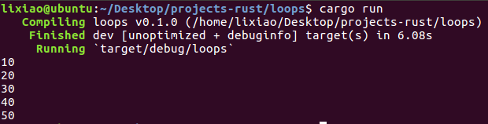

# ?

## while中的let问题

这是一段简单的遍历数组代码
```Rust
fn main() {
    let array: [i32; 5] = [10, 20, 30, 40, 50];

    let mut index = 0;

    while index < 5 {
    	println!("{}", array[index]);

    	index = index + 1;
    }
}
```
运行结果显然



但如果略作修改，即index的mut关键字去掉，在迭代时用let index 隐藏原来的index
```Rust
fn main() {
    let array: [i32; 5] = [10, 20, 30, 40, 50];

    let index = 0;

    while index < 5 {
    	println!("{}", array[index]);

    	let index = index + 1;
    }
}
```
运行结果就是无限输出10。

***

## 