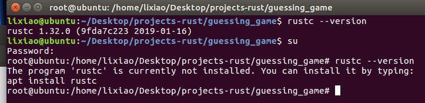

# 概述

vct说Rust环境配置很复杂，小李哥不信邪地来打算试一试。

操作系统：Ubuntu 16.04

# 1-安装curl

> $ apt install curl

# 2-安装rustup

> $ curl https://sh.rustup.rs -sSf | sh

这个命令会帮你装好rustc, cargo等一系列后面要用到的东西，可以说是一键安装了。

中途会遇到这个3个选项，需要选一个，手动输入1，回车。


安装成功后提示


然后**重启系统**，重启会使得**rust被添加到PATH中**。这一步很重要。

重启后，查看是否成功。
> $ rustc --version


# 3-Hello, world!

Rust源文件以.rs结尾，文件中的单词以下划线分割，编写hello_world.rs

```Rust
fn main() {
    println!("Hello, world!");
}
```

编译+运行
> $ rustc hello_world.rs -o hello_world

> $ ./hello_world

如果显示如下，那便成功了。


# 4-换中科大的源

按照上面完成后，rustc和cargo都应该自动装好了。但问题在于，速度不够快。使用cargo管理项目的时候，会涉及更新问题，但rust是被墙挡在外面的，更新速度慢是小事，可是卡的根本更新不了，就是大事了。

所以我们需要，换 **中科大的源** 。

操作如下：

* 在完成上面的步骤的基础上
* 进入**root**目录，如果有 **.cargo** 目录就进入(应该是一个隐藏目录，用 <code>ls -a</code> 查看)，没有就新建一个 **.cargo** 目录，然后进入
* 进入 **.cargo** 目录后，如果有 **config** 文件就打开，没有就新建 **config** 文件
* 在 **config** 文件中写入如下内容，保存退出
    ```
    [source.crates-io]
    registry = "https://github.com/rust-lang/crates.io-index"
    replace-with = 'ustc'
    [source.ustc]
    registry = "git://mirrors.ustc.edu.cn/crate.io-index"
    ```
* 然后重启一下系统就行了，以后更新就不用翻墙啦。

# 5-疑难杂症

小李哥遇到一个奇怪的问题，就是2-安装rustup完成后，重启，查看version后发现是ok的。结果装了个vim，敲完hello_world.rs，编译的时候它提示：找不到rustc！我再查看version的时候发现我的rustc没了？！

很玄学……我重启了一下系统就好了，原因未知。

emmm……查看cargo的version时再次遇到找不到cargo！rustc也找不到了！和上次的共同之处在于：我试图关闭终端的时候提示还有进程在运行，然后我直接关掉终端，再次打开终端，cargo和rustc再次出现！

真奇怪啊……

见鬼图↓，估计和环境变量有关系，应该是我自己的问题……

