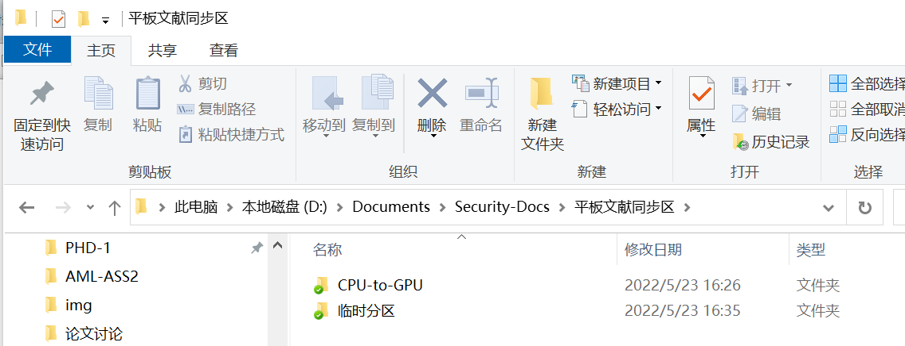
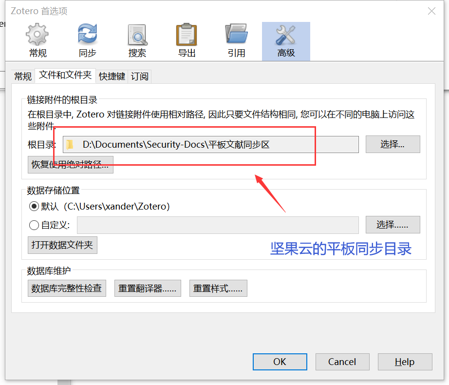
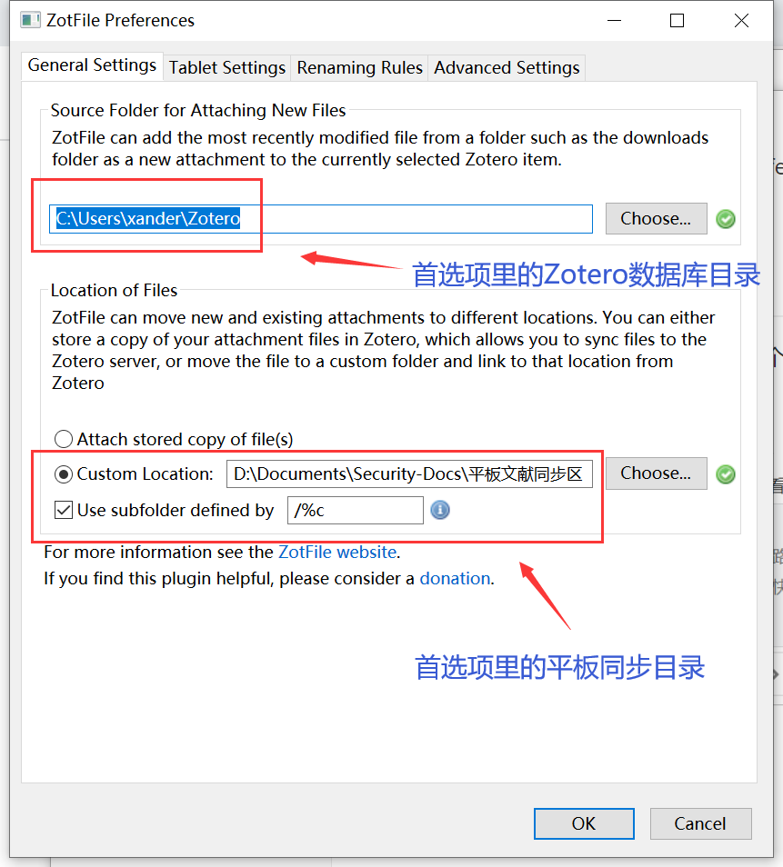
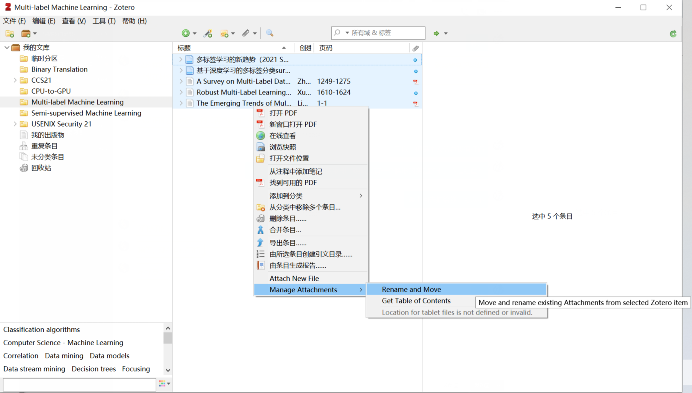
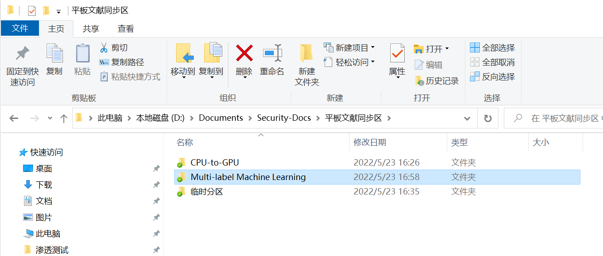
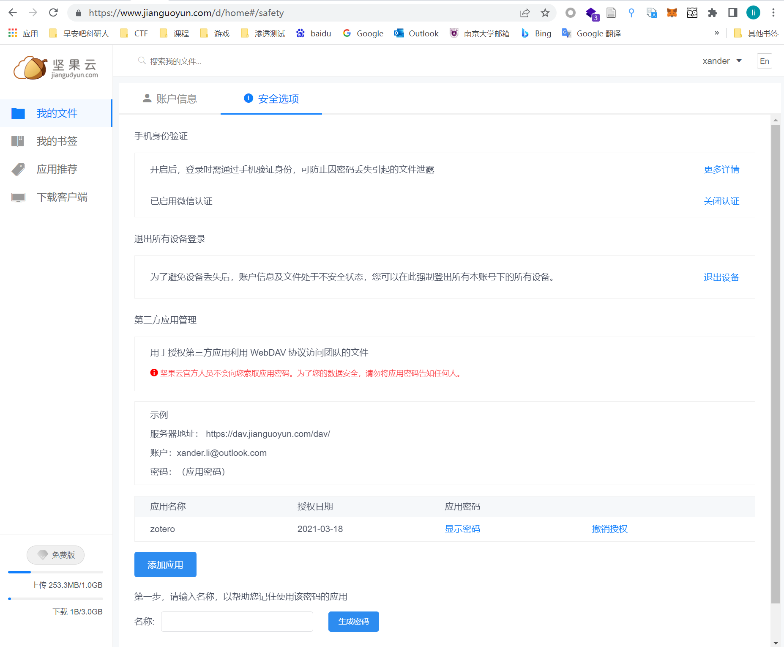

# 引言

记录一下zotero+坚果云+pdfexpert实现PC和ipad同步文献的方法和坑。

# 坚果云

在PC上你喜欢的位置新建一个文件夹，然后右键设置坚果云同步，比如我的是【D:\Documents\Security-Docs\平板文献同步区】

# Zotero

需要完成两处设置

其一在【编辑-首选项-高级-文件和文件夹】

- 把红框里的根目录设置为刚刚那个坚果云的同步目录【D:\Documents\Security-Docs\平板文献同步区】
- 至于下面的数据存储位置，就用默认的【C:\Users\xander\Zotero】即可。

其二需要安装ZotFile插件，去【工具-插件】自己装好，然后去【工具-ZotFile Preferences】里

- 第一个红框里填刚刚首选项里的Zotero数据库目录【C:\Users\xander\Zotero】
- 第二个红框里填坚果云的平板同步目录【D:\Documents\Security-Docs\平板文献同步区】
- 勾选Use subfolder defined by，填入 【/%c】，这样同步到坚果云上的目录名字就不会是一串字母了

然后在Zotero中选择你想同步的文章，【右键-Manage Attachment-Rename and Move-确定】，注意，需要建立一个条目然后再重命名，否则会报错，top-level item不能命名之类。

此时回到平板文献同步目录，发现已经同步到坚果云了

接下来就是把坚果云上的内容通过webdev传送到ipad上

# 坚果云 webdev

登录坚果云网页版 https://www.jianguoyun.com/d/home#/safety

- 添加应用，设置密码

# ipad PDF Experts

在ipad上下载app：PDF Expert

- 在里面【添加连接-webdav】
- 【标题】随意，然后填入坚果云网页版里的【服务器地址】【账户】【应用密码】，完成
- 然后下拉同步一下就可以完成同步了，PC端和ipad端的修改都会互相同步

