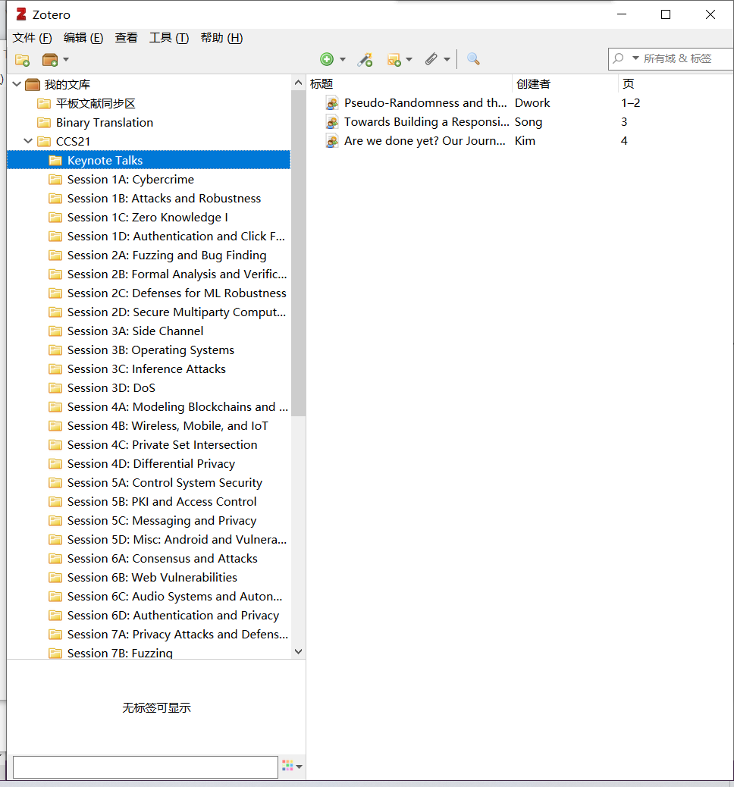

# 引言

最近突发奇想，打算利用碎片时间浏览一下安全领域四大顶会的paper，于是产生如下需求：

1. 下载CCS 2021的全部paper（还有USENIX/NDSS/S&P）
2. 按主题进行分类
3. 生成参考文献格式

分析下需求：

1. 首先，来源单一，所有目标论文均来自具体的1个会议，不需要去犄角旮旯里找
2. 然后，到dblp搜索CCS 21，发现一共有200+篇paper，于是放弃手动下载/管理
3. 最后，选择组合使用 【dblp的批量导出功能】+【zotero批量导入/下载/管理功能】

# dblp

dblp是一个计算机领域的论文索引库，只收录索引，不收录具体的paper和slides文件，理解成一个搜索引擎（类似google scholar，不过更全更专业）即可。

官网地址：https://dblp.uni-trier.de/

## 搜索CCS 2021

红框搜索CCS 2021，在搜索结果里往下翻，翻到2021年的CCS论文集

CCS 2021地址：https://dblp.uni-trier.de/db/conf/ccs/ccs2021.html

这个论文集里列出了每一篇文章的地址，可以点进去手动下载paper，手动复制title/author/abstract等，但这样太慢辣，导师看了直摇头好吧。

## 导出BibTex

我们选择批量解决。如图2，点BibTex

如图3，下载这个BibTex文件，其中包含了CCS 2021的所有论文的title/author/下载地址等等

下面看Zotero的发挥

# Zotero

Zotero是一个免费的文献管理软件，可下载，可导出文献，配合浏览器插件，香香。

## 导入BibTex

点【文件】-【导入】

选择刚刚下的BibTex文件【CCS21.bib】

一路【Next】，最后【Finish】，得到一个CCS21的分类，如图7

现在已经有了索引，还缺pdf文件，别着急，先把这200+篇分类，再下载。

## 建立分类

回到dblp，如图8所示，发现CCS把文章分为了【Keynode Talks】【Session 1A: Cybercrime】【Session 1B: Attacks and Robustness】等类别，我们也要分一下类。

再Zotero里手动新建一下子类吧，这是唯二手动的部分了

然后要把索引拖到这些子类中去，分类方法：【看文献页码】，同一类别是连号的。如果你的Zotero没有显示页码，可按图10和图11的方法，显示页码/按页码排序

点击【页】，完成排序

然后按dblp的页码，对Zotero里的索引进行拖动分类，按【shift】多选

分类好后如图13所示，重复分类动作直到所有索引都分类完毕

最后一步，下载

## 批量下载

选中你想下载的paper，【右击】-【找到可用的pdf】

如图15，Zotero会根据网址自动爬取pdf

> 当然，如果是IEEE或者ACM的数据库，可能因为认证/权限问题爬不到，这里我还未解决，挖个坑，TODO。

# 成品展示

USENIX 2021的结果比较好（主要是因为免费），所以用作展示，如图16

