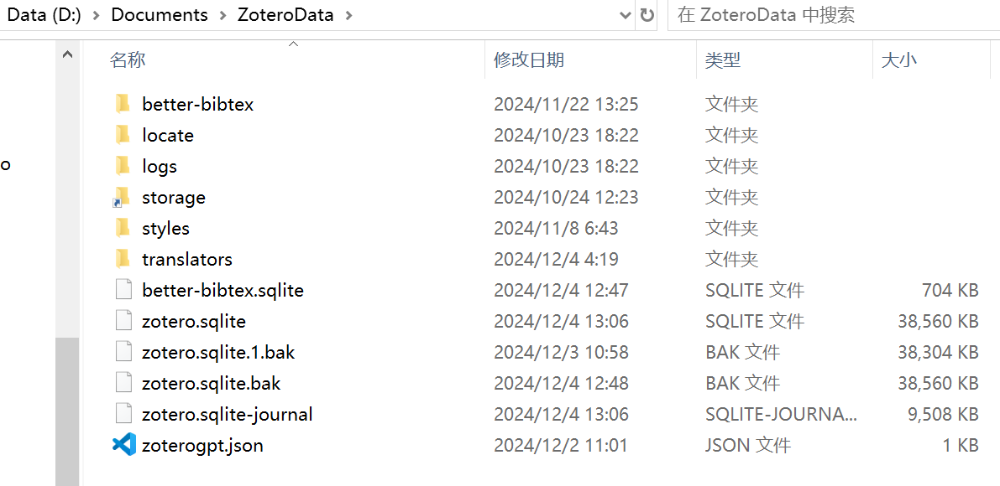

## intro

需求是在两台PC上同步zotero文件


## zotero文件管理原理 

首先，zotero的软件安装和数据管理是分开的

软件安装在D:\Softwares

数据管理由你自定义，默认在C:\Users\xander\Zotero，可以通过编辑-高级-文件和文件夹-数据存储位置-自定义来修改


数据管理的结构是这样的

- zotero.sqlite存的是索引表（zotero打开期间会一直读写此文件）
- zotero.sqlite.bak，zotero.sqlite.1.bak里也是索引表（跟随zotero启动出现，关闭zotero的时侯不会出现）
- storage存储了索引表里的具体内容（snapshot，pdf）
- 其他都不重要，插件之类的



zotero.sqlite的结构同zotero界面，比如这样

```
我的文库
  - LLM (目录)
    - attack on LLM (目录)
      > A Survey of Attacks on Large Vision-Language Models (top-item)
        * Liu et al_2024_A Survey of Attacks on Large Vision-Language Models.pdf
        * Snapshot
    - defence on LLM
```

关于这个pdf，索引里会存它的文件地址，文件地址有哪几种？

我们知道，一个top-item的建立，可以通过如下几种方式：

1. 手动新建+拖入pdf
2. 浏览器插件保存+下载pdf（成功）
3. 浏览器插件保存+下载pdf（失败，比如被ieee/acm登录卡了），手动拖入pdf
4. 浏览器插件保存+下载pdf（失败，比如网络卡了下载失败），在top-item上寻找可用的pdf

那么问题来了，pdf的文件地址分别会在哪里呢？如果不考虑zotfile插件的存在，位置情况如下

| id   | 情况                                                         | pdf位置（没zotfile）（可能有误，TODO测试） | pdf位置（有zotfile并设置zotefile preferences-general settings-location of files-use subfolders defined by /%c） |
| ---- | ------------------------------------------------------------ | ------------------------------------------ | ------------------------------------------------------------ |
| 1    | 从本地地址A拖入pdf（无论是直接拖到空白自动建立item，还是建立空的item后拖进来） | storage/../xx.pdf                          | storage/../xx.pdf                                            |
| 2    | top-item右击添加附件-添加文件副本A                           |                                            | storage/../xx.pdf                                            |
| 3    | top-item右击添加附件-添加文件链接A                           |                                            | A/xx.pdf                                                     |
| 4    | 浏览器插件保存建立item+下载pdf（成功）                       | storage/../xx.pdf                          | zotfile/xx.pdf                                               |
| 5    | 浏览器插件保存建立item+下载pdf（失败，比如被ieee/acm登录卡了），然后从本地地址A拖入pdf | A/xx.pdf                                   | storage/../xx.pdf                                            |
| 6    | 浏览器插件保存+下载pdf（失败，比如网络卡了下载失败），在top-item上寻找可用的pdf | storage/../xx.pdf                          | storage/../xx.pdf                                            |

下面介绍一下zotfile插件，有它在情况会发生一点不同（？）

## zotfile插件原理

功能：帮用户整理附件pdf，从默认的storage目录复制到一个新目录上（或移动到，copy or move不重要，关键是索引的文件地址改成了新目录）

好处：这样更美观。（storage中子目录的命名全是索引号，例如A3SADSA，无法直接看出某个pdf来源于哪个文库。但是zotfile目录可以设置/%c，就可以按文库名和子文库名分类，从文件管理器里看得很爽）


## Q&A

### Q：如果一个pdf的索引在storage，那么zotfile会备份这个文件吗？我通过zotero笔记改了storage文件，那么zotfile备份的pdf会一并修改吗？

TODO

### Q：如果一个pdf的索引在zotfile，那么storage里会有这个文件吗？我通过zotero笔记改了zotfile的文件，storage里会一并修改吗？

TODO

### Q：如何把乱七八糟的pdf索引，全部改成索引到storage，或者全部改成索引到zotfile？

A：

1. zotero界面点到LLM/attack on LLM目录
2. ctrl+A全选top-items
3. 然后右击-manage attachments-rename and move
4. 这时候会提示你有多少个附件pdf需要被move，比如65个
5. 确认后，按理在zotfile目录里会找到这65个pdf
6. 但实际只转移了30个，还有35个还停留在老的zotfile目录（平板文献同步区），怎么办？

原因

1. zotero 在rename and move的时侯遇到第一个报错就会停下来
2. 报错的原因，目前发现有2种
   1. pdf的文件名是“全文”
   2. pdf在adobe或者zotero里打开了

解决也简单

1. 全文：找到pdf然后按父级元数据重命名
2. 占用：关闭zotero所有pdf和adobe等


### Q：如何实现pdf去重，主要是storage和zotfile都存在的时侯，会命名成title.pdf和title2.pdf

Q补充：如果不小心点过按父级元数据重命名，变成了“等”，而zotfile还是et al，也算是一种重命名

A：TODO


### Q：zotfile和storage里的pdf有什么区别？

区别1：logo不一样，zotfile有锁链，storage没锁链


区别2：右侧是否已索引不一样，zotfile没索引，storage有索引


区别3：将storage pdf做一下修改（比如abstract中标黄），发现没有同步到zotfile上。此时，点父目录TF-Attack的manage attachments-rename and move，发现storage也变成link logo了，而且文件地址移动到了zotfile，被命名为Li et al_2024_TF-Attack2.pdf，虽然在zotero里命名还是Li et al_2024_TF-Attack.pdf，没有2。


### Q：zotero附件里，为什么有的命名作者是Li et al TF-Attack.pdf，有的命名时Li等 TF-Attack.pdf？

A：网页插件保存下来的默认是 et al，但如果在zotero里对着pdf右击-按父级元数据重命名文件，就会变成等

这个重命名规则设置的地方：没找到……

没事，不重要，只是pdf的命名有变化，想导出bibtex时侯还是会根据父级元数据导出


### Q：为什么还有附件pdf命名是“全文”？

A：寻找可用pdf的命名就是全文，位置在storage，需要手动点pdf右击-按父级元数据重命名文件


## 多PC同步storage+zotero.sqlite

我们想同步的东西就是storage和zotero.sqlite，其中

- storage借助onedrive来同步

- zotero.sqlite用zotero.org提供的同步（只同步索引，不同步附件内容）（为什么不也用onedrive？因为zotero.sqlite在打开期间会一直读写占用文件，onedrive同步会有问题）


zotero.org提供的同步library网址：https://www.zotero.org/xanderli/library

查看余量（初始送300MB）：https://www.zotero.org/settings/storage?ref=usb

如果仅存元数据肯定够够的了，但我之前错误设置导致zotero.org上还同步了一些附件，怎么一并删掉呢？

TODO


## references

[1] 讲win和mac互同步的，原理相同 https://www.vmvps.com/how-to-set-up-zotero-onedrive-to-sync-your-papers.html

[2] 同样是win和mac互同步，图不一样，https://www.cnblogs.com/blue-lin/p/14025541.html