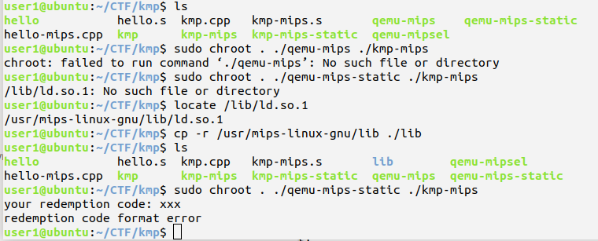

# mips

## linux环境下编译

系统：ubuntu 18.04-64

安装编译器

> sudo apt-get update
>
> sudo apt-get install g++-mips-linux-gnu

用的时候名字是反过来，命令和g++类似

编译成可执行文件：

> mips-linux-gnu-g++ hello.cpp -o hello

编译成mips汇编文件

> mips-linux-gnu-g++ hello.cpp -S -o hello.asm

## mips模拟器

### MARS

官网下载链接：http://courses.missouristate.edu/kenvollmar/mars/

但MARS识别不了mips-linux-gnu-g++生成的汇编代码，会报语法错误，不知道和版本有没有关系，MARS的支持是2003~2014，可能有新汇编语法？

### Spim

同样识别不了，有语法错误，奇了怪了

### QEMU

可直接运行mips可执行文件的环境

安装：

> sudo apt-get install qemu-user-static qemu-system-mips

qemu可执行动态链接的mips程序，但是会出现报错：ld.so.1缺失

解决办法1：

1. 将qemu-mips和qemu-mips-static从`/usr/bin`复制到当前目录
2. 尝试`sudo chroot . ./qemu-mips ./hello`会报chroot错如下图，改用`sudo chroot . ./qemu-mips-static ./hello`后ok，报库缺失
3. 用`locate /lib/ld.so.1`查看缺失库的路径
4. 将ld.so.1所在lib复制到当前目录
5. 运行`sudo chroot . ./qemu-mips-static ./hello`，完工

或者，编译时就编译为静态程序，可直接执行，无需上面的复杂操作，弊端就是静态程序有点大

> mips-linux-gnu-g++ -static hello.cpp -o hello
>
> qemu-mips-static ./hello