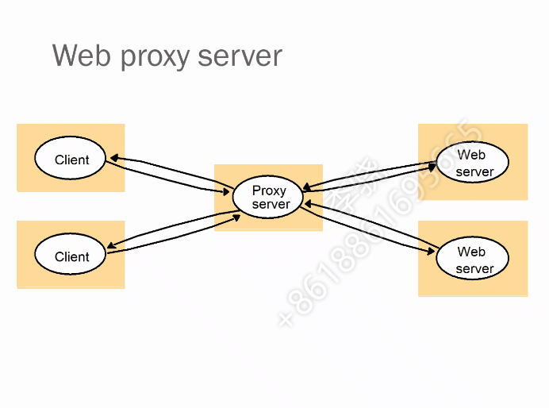
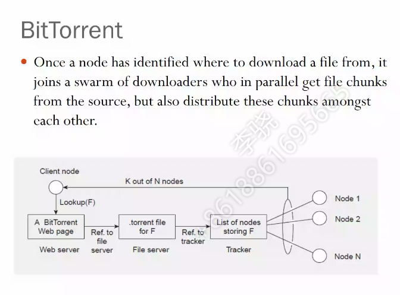
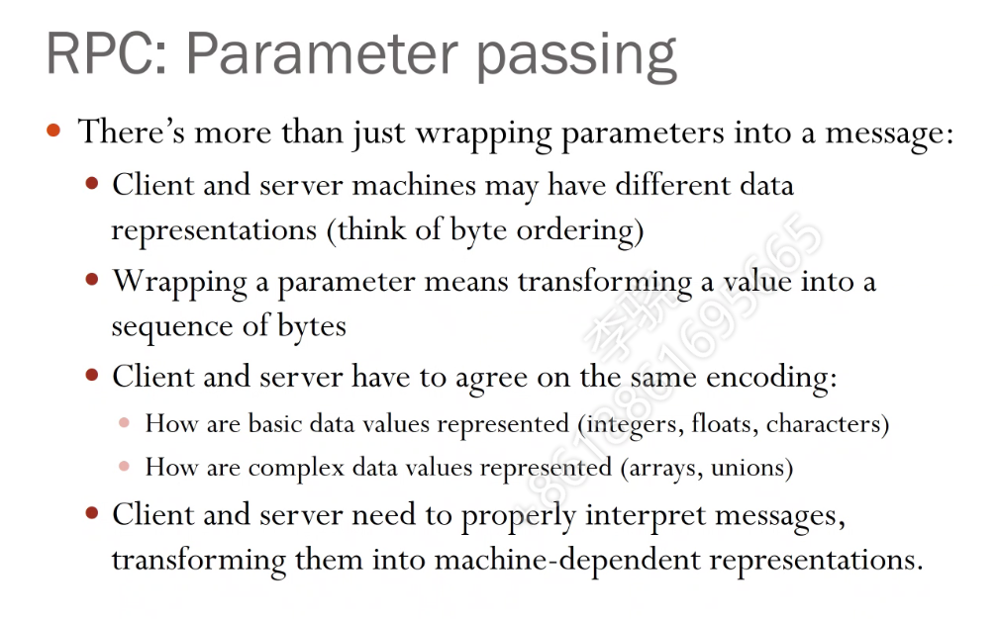
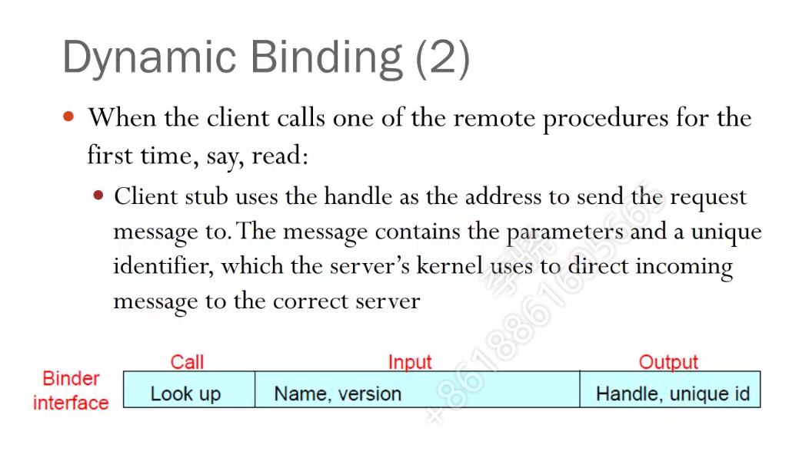

分布式系统笔记

40平时作业（3-4大作业，20-30天完成一个，每个10-15分），60%期末闭卷考试

# class-1

分布式的课程很多，内容很多

主要教材：分布式系统：原理和范型distributed systems: principles and paradigms 2nd edition, prentice hall, 2007

参考：distributed systems: concepts and design, 4th edition, addison-wesley, 2005

-

分布式系统：几台机器，对用户来说看起来好像是一个系统，是一个中间层

-

为什么需要分布式？

- 经济，可以用小破电脑叠加
- 速度
- 。。看课件

-

分布式系统的任务

- 资源可用，利用起来
- 透明性，对用户来说只看到一个单一系统
- 开放，接口简单
- 可扩展性

-

分布式系统只提供机制，不提供策略（策略和业务相关联）

（例如，TCP IP是传输机制，滑动窗口是策略）

Qos：quality of service

-

规模上，可扩展性上

- 用户数量/处理器数量
- 节点之间的最大地理距离
- 管理权限层次性（中心节点，次一级，再次一级）

-

grid要求最好是同构的

# class-2

讲architectural

## 架构

层次式系统：

- 首先，各个节点要连接起来，网络层的那一套比较薄弱，需要搭一套消息通信。

- 然后，备份系统，备几份，备份多久等等。

- 层次式递进。

面向对象系统

--

## 风格

风格

-

## 组织

分布式系统的组织organization

- centralized：一组节点作为管理者/管理组
- decentralized：所有节点自己管理自己
- hybrid

-

1 单服务器

理一下一个应用跑到服务器经过了多少层

该架构的问题

- 服务器限制了瓶颈
- 服务器挂了就gg
- 服务器扩容难

-

2 多服务器

比上面的single server多了一个服务器之间的数据同步

-

3 代理服务器

-

4 web applets（现在不用了，不安全啊）

-

## 应用

-

划分方式不同

e比如百度云之类的云盘

-

现在流行瘦客户端

- 客户端该做哪些事，能做哪些事

-

常规的模型

-

去中心化模型P2P

- 结构化P2P，节点都是同构的，邻居是确定的
- 非结构化P2P，邻居是随机挑选的
- 混合P2P

-

P2P最后还是要落实到物理网上

环状的时候数据单向传递，为啥。。

右边的图叫超立方体

节点不是永久存在

-

-

在unstrucutured P2P的基础上选一些superpeers

。

-

superpeer本质还是peer，不过是多做了点事。

但edge server与实际peer是不一样的

-

BT下载就是P2P应用

# class-3

## 上节课的遗留内容

P2P系统里也可以有server，就是一个机器同时充当client和server，但这样client会成为性能瓶颈

-

非集中式的系统，需要做到自管理

-

-

以下今天内容

## Processes

分布式系统中的进程具体是跑在哪台机子，不关心？

整个系统中运行了多少个进程？关心

-

进程是一个包含了状态的执行流，动态是核心

- 指令流
- 执行态的代码
- 指令序列
- 线程控制

-

-

进程切换

- processor context: register, stack pointer, ..
- thread context: 
- 。

-

线程的实现模式

user-level线程切换可以不经过操作系统，但是如果线程被block的话，OS看到它所在的进程被block了，就换到下一个进程了，即该线程没法自己恢复

然后可以用kernel-level线程切换了，OS看得到线程

或者用折中方案，把线程映射到轻量级进程，实现复杂，理论方案罢了

-

多线程在分布式系统里的好处

- 隐藏了网络时延：比如浏览器看网页，文字线程先出来，图片后出来，让你感觉到是在加载
- 多线程性能提升
- 多线程才能利用多核
- ……

-

## Virtualization

以前流行虚拟机，现在流行容器，container

-

先看看VirtualMachine的设计，一台物理机上面多个VM

进程VM，VM Monitor

-

## Client

FTP的cs例子

-

一个dispatcher负责接受请求+分配请求，worker去处理

-

带外数据 out of band communication：一些控制数据，量小但是很重要

可能会打断正常数据，所以最好预留好带宽给这些out-of-band communication

-

client和server通信时，如果没有连接状态，那么假如client断线了，重连上来的时候生成新连接，server不知道老连接不用了，也就不释放，然后就浪费了。

-

cookie存在客户端上，只有一些基本信息。cookie算是stateful，但不完全是。

-

？

-

# class-4

## middleware所处的位置

前面半小时主要讲分布式系统夹在TCP之上，IP也会涉及

主要是要设计中间件，CS模式

-

CS的同步点，有三个

-

永久性通信（邮件系统）和临时通信

-

同步点在request processing后，是同步通信，在request submission时，是异步通信

## RPC

remote procedure control

大部分时候是同步的，对程序员来说是透明的，反正就是一个调用，而且和本地调用差不多

-

RPC的十个步骤

-

不同操作系统，不同架构，怎么传参呢

语法一样，转成字节流，要求同样的编码，处理本地引用

-

### 服务器挂了

客户端无法定位服务器

- 服务器down了
- 服务器用了新版本，客户端用的旧版本

怎么处理？

- 

-

丢包怎么办？

- 如果超时，会重传
- 服务器没法确定新来的包是重发包还是新的包
- 如果丢的太多了，客户端误以为服务器down了，回到了无法定位服务器问题

-

服务器crash了怎么办？

- 客户端发消息前就crash了--回到无法定位
- 客户端发请求后，服务器接到消息，执行了后crash
- 客户端发请求后，服务器接到消息，没执行就crash了

23情况客户端是无法区分的

-

服务器至少执行一次/至多执行一次指的是啥？

-

### 客户端挂了之类

客户端发了一个RPC，然后挂了，然后重启，然后再次RPC

服务器一看懵逼了你怎么又发了一次

-

解决方法：

1. client日志记录，看看之前已有连接。和服务器说把之前的挂掉或者继承
2. client重启后有个广播，让server把上个时段的全杀了
   1. 温和一点的，server将找不到远程请求的杀了
3. 超时的：server过一段固定时间，任务还没结束就认为有问题了

-

### 总结一下同步RPC的问题

### 异步RPC

client发完RPC后不用等待，server完成RPC后回送一个事件给client端

-

客户端怎么定位服务器呢？

- ip地址可能会换，不妥
- 动态，server在通信开始的时候告诉client的binder程序，注册好，然后client就知道怎么定位server了

-

动态绑定如下图，handle和unique id用来识别server

-

好处就是灵活

坏处就是binder成为大型系统的瓶颈（DNS服务器就是binder的作用，实际里还有忍三登录时候看配置文件，里面是ip列表）

# class-5

下周开始布置作业...工作量1-2天，DDL约20天

今日标题communication-2

-

## message-based communication

message-based 的通信（消息中间件）

- 低层次的接口
- 原语 send receive
- 阻塞or非阻塞？
- 原语是持久的吗

-

阻塞（同步）：sender send之后阻塞，直到receive才继续

非阻塞（异步）：send后消息通过某缓冲区，再出去

-

持久：类似QQ留言，消息存在网络上，第三方服务器上

-

几张时序图，手上无ppt，待补充

-

tcp-ip的原语，时序图

-

### queue类型的中间件

queue类型的中间件应该提供这4种primitive：

- put：放一个消息
- get：阻塞的get
- pool：非阻塞的get
- notify：install a handler when put message？

-

queue-based的架构图

为了利用带宽，会使用多个queue，而不是只有一个中心服务器

这个和CDN/边缘计算的思想有些相似

多个queue使得问题变得复杂，后面讨论

-

### message brokers

sender和receiver之间的中间代理，集中管理消息

工作

- 转换，统一消息格式
- 关心应用层里的东西

现在，message broker往往作为一个原服务，放在容器里

## stream-oriented communication

流媒体的出现得益于：带宽变大

特点

- 持续不断（如监控），量很大
- 无向的
- 单一流：单源，多sink（单一音频，文字）
- 复合流：stereo audio
- 与硬件相关连

-

流媒体的发送速度，太快太慢都有问题

太慢：前面的没发出去，后面的来了

太快：网络拥塞？

-

### QoS

怎么衡量quality

- session建立花费的时间
- 最大端到端时延
- bit rate
- 最大抖动
- 最大往返时延（有时和端到端一样处理）

-

保证QoS的办法

- 数据包到达有快慢：缓存，存够一部分再播
- 丢包：比如一共1~16帧，4帧并成一个数据包，如果按序排1-16帧，第三个包丢了，那么9-12帧丢，画面丢的比较集中。但如果我先打散，再组装数据包，那么第三个包丢了，丢的是3 7 10 14这样，丢的很分散，人眼不一定看得出来。但这样需要更大的缓冲区，因为到达的包是乱序的，先排个序才能播放。

-

复合流，如何同步音频，左右声道？

MPEG：

- sender：将substream complex into single stream
- receiver：decomplex single stream

-

## multicast communication 

组播

chord-tree，看看就行

-

ALM，overlay不是那么精确

-

病毒传播算法

- 逆熵anti-entropy：我有新消息了，随机选择一个人，我们两个人交换信息，这样随着时间发展，整个系统的信息会统一
- gossiping：我有新消息了，告诉所有人

-

anti-entropy中的交换信息可以是

- pull：我从对方那里拉
- push：我告诉对方
- push-and-pull

只push效率比较低，比如这个消息80个人知道，20个人不知道，我选择push的对象时选到那20个人的概率很低

-

gossiping，告诉所有人的动作什么时候停呢？

- 假如我告诉了一个人，发现她已经知道了，那我推测这个消息已经传播出去了，那接下来我就以1/k的概率去告诉所有人

问题：一个人要知道所有人的存在

-

病毒传播的通用问题：撤回消息

- 如果只删掉，那没用，等会还会传播回来
- 要传播一个death certificate，如果有人有var，有人有death cert，他俩一交流，就传播death cert？
- death cert一般设为超时时间
- 还有super death certificate：即使没超时（？），也kill掉（？）

# class-6 Synchronization

前几节课里漏讲的东西：

命名：匿名，动态绑定（看教材）

今天主要讲时钟的同步，下周五（11.12）运动会，咕咕

-

单机器中，同步主要是mutual exclusion和critical regions的问题，用原语和锁解决，基于shared memory，但这在分布式系统里是不行的。

分布式系统关注的问题是两个事件谁先发生。

-

triggering patterns

一张图，来自16年某顶会，展示了abc三个机器在工作时，因为网络原因延时，导致的好几种bug

## sync的思路

思路

如果有一个理想的时钟，那就很ok了

共享资源同步的mutual exclusion

共享资源时的election问题

-

如果有一个全局的时钟（一般是集中式系统才有），那对于每个user来说，时钟是没有歧义的，比如教室里的时钟。但如果每个人各自看各自的手表，那就有歧义了。

例如 unix中的makefile，检查time(input.c) < time(input.o)，就判断源文件没改，不用重新编译

-

每台机器上自己的时钟硬件是石英，但不同机子石英的频率不一样，时间久了就会有偏差

现实世界中，UTC的生成是：133号原子裂变多少次的时间，定义为1s，全世界一共五十家机构测这个时间，然后取平均。

-

其实，我们也不是一定要一个和物理时间一模一样的时钟，时钟只是解决同步问题的手段，我们只要一个有序就行

## Cristian算法

专门有time server作为标准时间机器

client向server提问现在的时间

-

注意，时间不能倒流，所以client拿到的标准时间不能直接去重置client的时间

存在网络传输的时间差

## Berkeley算法

反过来，server轮询client，告诉他们该怎么同步

但是，server不是标准时间机器，他取所有client的平均值

-

也存在网络传输的时间差

## Averaging算法

纯分布式，没有server

其实是对Berkeley的改变：哪个进程需要时间，他就承担server的角色

-

## happened-before关系

定义：hb的两种情况：

1. 同一个进程内，a先于b发生，a->b
2. 两个进程，a是发送者，b是接收者，a->b

hb关系有传递性

-

## Lamport's算法

每个进程Pi自己维护一个local的计数器Ci

1. Pi内部发生事件，Ci+1
2. Pi发送一个消息，设置消息的时间戳为Ci
3. Pi接收到一个消息，看下时间戳t，如果t<Ci，那就不动；如果大于，那就取t，设置Ci=t，然后调用步骤1

-

例子：全序组播

银行有两个数据库，其中一个是副本，初始有1000块，进程1想加100，进程2想加1%，那么谁先谁后执行会导致银行两个数据库不一致

-

但，lamport算法没法体现事件的因果关系

## vector clocks算法

每个进程Pi维护一个local的计数数组Vi = [c1, c2, ..., cn]，n是进程总数

看ppt，不麻烦

## mutual exclusion

先看集中式的me，好处是能达到me，fair，starvation-free，易于实现

-

如果有中心服务器管理锁，中心服务器挂了就gg

-

如果纯分布式，一个进程的timestamp小，他win，进去，出来的时候广播一个我出来了，然后后续进程可以进入。

但是，如果这个进程进去之后挂了，那后面的进程全部无限制等待

-

如果令牌环，令牌丢了要重新生成

-

### election算法

选一个协调人：解决纯分布式里一个进程挂了的情况

为什么不能随便选？因为一个进程挂了这件事，和一个进程运行太久，可能比较难区分

协调人选出来之后要让所有人知道

-

### election之Bully算法

选进程ID最大的

### election之ring的问题

如果选举过程中有进程挂了怎么办

两个进程同时启动init选举，会有问题吗

# class-7 Consistency and Replication

## 作业又提了一嘴

作业有3个部分，12部分必做，3选作加分，ddl 1月。

内容：同步，一致性复制，go语言

提交：代码+报告，报告遵循学术规范，中英文标题，中英文摘要，intro，算法，实验验证，参考文献。。等

-

## Replication

复制的必要性

- 防止单点存储挂了
- 扩大系统规模，从数量和地理位置上

复制的问题

- 透明性的问题，对用户他不关心你到底存在哪
- consistency的问题
  - update的开销
  - availability may suffer if not careful

-

为啥产生一致性问题？

- 时间要求高
- 物理copy慢

-

### Object Replication

复制object的时候有两种架构

- 一种是，有一个中心adapter来处理复制（存储和应用分离）
- 另一种是每个存副本的server都有一个adapter，自己处理请求（没分离）

还有复制哪些东西的策略，也有俩，看ppt

-

升级一下，几个问题

- 3个副本，1个local，2个remote，如果只是很小的改动，2个remote的副本可以不同步，不同步到什么地步
- 以数据为中心的一致性vs用户为中心的一致性

-

## Data-Centric Consistency Models

考虑有3个副本

### Strict Consistency

严格一致，任何read读出来都是全局时间线上最近一次的write

### Sequence Consistency

所有人看到的write顺序是一样的，至于read，无所谓。

### Linearizability

满足3个条件

- SC
- 需要时间戳来辅助，如果op1比op2的时间戳要早，那么op1比op2早发生

linearizability比strict弱，比sc强

需要时间戳，开销较大，实际使用中很少实现linearizability

### Causal Consistency

因果一致性

有因果关系的write操作顺序，在所有进程看来必须一样，其他并发写操作可以不一样

（比如写同一个变量，或者有关联的两个变量）

（一个进程如果先read a，再write b，就隐含了先a后b，b的值依赖于a。看causal consistency(3) (a)，有点迷惑）

cc比sc更弱，但是满足sc未必满足cc

### FIFO Consistency

只要求保证同一个进程里的写操作顺序一样，不同进程里的因果关系不管

fifo相当于各跑各的，不管别人

比cc更弱

FIFO(4) ppt的例子，SC结果有3种，P1终止，P2终止，P1 P2都不终止

FIFO的结果有4种，多一种P1 P2都终止

### Weak Consistency

引入synchronize

把一组操作变成原子操作S，对临界区变量更新完成后，其他进程才允许进行读写

靠S来进行一个全局同步，S就类似并发课里那个把前后语序都挡住的墙？好像不是

### Release Consistency

acq，rel操作

就是那个墙，acq固定后面的语句，rel固定前面的语句

rel是weak的强化

### Entry Consistency

临界区，进出需要acq和rel，类似拿锁和释放锁

### summary

PPT有图

# class-8

回顾了一下上周的几种一致性图表

虽然paxos已经完备了，但是很复杂，实际系统实现时和效率做一个折中

## Client Centric Consistency

客户为中心的一致性：

- 客户需要数据的时候，系统要有同步，传播数据的能力
- 单个用户访问数据时可能比较容易，多个用户访问数据时可能出错

-

> 题外话，机制是基本的能力，策略是在机制上设计的算法
>
> 研究上的套路：机制我不动，我把问题转化成一个NP-hard问题，然后用数学方法去解，设计一个好的策略
>
> 机制上的创新可能很难，策略上的创新比较简单
>
> 先从策略起步，厉害了再做机制，这就是sigcom和infocom的差别

比如在client centric这个机制下，设计一个好的策略，既满足高速访问，又满足客户访问不出错。

-

四个要求

- Monotonic Reads：一个线程一旦读了x的值，在该线程的此次读之后的读一定会读到x或者更新的值

-

### Replica Server Placement

很多个格子，每个格子放多少服务器

-

放多少不一定是技术问题，是商业问题管理问题

client读信息的时候，可能访问的是有copy的服务器，也可能访问的是没copy的服务器

怎么更新内容？

- 传播要更新的通知
- 直接传播数据
- 传播操作（传播数据的数量可能很大）

信息传递的方式

- pull
- push

服务器分成主副本和从副本，主副本固定

-

### Quorum-Based Protocols

读的人和写的人进行投票，票数V_w和V_r，V是副本数量？，需要满足

V_w + V_r > V

V_w > V/2

-

### Causally-Consistent Lazy Replication

# class-9 Fault Tolerance

容错的需求：

- 可靠reliable：给定时间段里正常工作的概率，可持续操作
- 可用available：可提供功能的时间段
- safety
- maintainability：修起来容易不

reliable和available的区别：

假如一个系统每小时有1s会不工作，我们说他是不可靠。但因为24h随时去都能用，所以很available

如果白天上班8小时，那么可靠性好，可用性差

-

错误的差别

- failure：
- error：
- fault：故障，蓝屏

-

fault cause error result by failure

-

## improve dependency

做副本，让系统可靠性强一些

- information redundancy：额外的bits，比如奇偶校验码，带修复的校验码
- time redundancy：允许一段时间不工作？
- physical redundancy：
  - 硬件冗余：多台server
  - 软件冗余：多个进程

设计系统的时候没有关键模块，避免类似中心节点挂了

-

triple voter

协作者

进程：主拷贝

-

## bizantine fault

如果系统是K容错的

- 节点挂了没反应：需要K+1个副本
- 拜占庭故障：节点挂了会返回一个错误的结果，需要2K+1个副本

> byzantine 将军：一群将军打拜占庭，其中有t个叛徒，将军总数至少要达到多少才能让忠诚的将军达成一致（问题的关键不是找叛徒，而是一致）答案是3t+1

-

拜占庭算法：看ppt，挺简单的思路

## reliable client-server communication

需要设计可靠RPC

failure类型

- client找不到server
- client到server的request丢了
- server接受到request后挂了
- server发给client的reply丢了
- client发送一个request后挂了

-

可靠组播

- 扁平式
- 层次式：类似集中式，自己没收到就问上层重新要，扩展强

原子多播

要么都处理，要么都不处理

-

分布式commit

2-phase commit，协调者，参与者，阻塞问题

3-phase commit，避免阻塞

## recovery

设置恢复点

backward恢复，类似win10恢复

forward恢复，继续往前走，类似纠错码

互不依赖的恢复点vs有依赖的恢复点

# class-10 分布一致性协议@助教

一致性只解决达成一致，不保证正确性

## Paxos

前提：信道可信

高容错：2F+1

目的：一个节点拿到数据后，系统中的其他节点也都能拿到数据，整个系统达到一致

-

角色划分

- proposer提议发起者：
  - 主动发起提议
  - 处理客户端请求
- acceptor提议接收者：
  - 对提议进行投票表决，如果超过半数，则提议被选中
- learner提议学习者
  - 无投票权，只能从acceptor处获知哪个提议被选中

-

paxos中，存在多个proposer，但只有一个提案会被选定

## Raft

## Gossip

# class-11 大数据分布式系统@助教2

hadoop dfs的三个副本，成功率99.999%

它的优势是把3年完成的任务加速到1个月完成，但是对于1小时加速到30min，不太合适。

合适的应用

- 网页倒排索引
- pdf压缩编辑（？？）

-

mapreduce不好的地方

1. 每次map和reduce时候都需要读写磁盘（中间结果读-写）
2. 元数据超过了单机最大容量（500台服务器以上）

针对1，spark把map的结果（一定会被reduce用到）放在内存中，这个称为弹性分布式数据集RDD。比hadoop快一个数量级

## 往年题

https://docs.qq.com/doc/DYnJGQnpOSHBwSkN1

助教题1 容错问题，2k还是3k，和N相关的复杂度

助教题2 对于DAG型作业，spark+yarn的优势（相比于hadoop+hdfs）在哪里？

1. DAG型的每个中间结果hadoop会有频繁的磁盘IO，spark用分布式弹性数据集把中间结果存在内存中，避免了DAG中间结构的频繁IO
2. 单纯用hadoop+mapreduce，集群要管任务管理信息和集群信息。YARN把复杂的集群管理逻辑交给应用，虽然应用逻辑变复杂了，但这样集群可以支持更多的设备

-

往年题1 分布式系统中采用多副本的优缺点

优点：

1. 当出现节点崩溃，出错等情况时，可根据副本快速恢复节点。
2. 当其他节点出现错误时，可根据副本排查问题，明确出错的节点位置。

缺点：需要耗费更多的资源

-

往年题2 网格计算与传统分布式计算的区别

-

往年题3 分布式有那些架构

主从，混合，。。。

-

往年题4 消息通信

-

往年题5 lamport时钟，逻辑时钟，有计算题，传下去时候数字是几

-

往年题6 机制与策略的区别

-

往年题7 RPC出错原因有哪些？RPC出错了怎么办

出错原因：网络中断，发送出错，接受出错，。。

解决：多发几次，收到了校验，。。。

-

往年题8 RPC怎么保证语言一致性

-

往年题9 分布式系统特点

透明性，。。。

-

往年题10 给个例子然后让你判断说明是不是符合XX一致性

