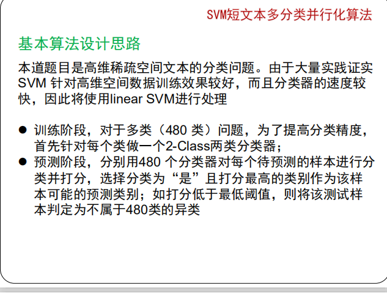

# ch1 概论

## 需要掌握的问题

1. 为什么需要并行计算？
2. 提高计算性能的方法？
3. 上述方法的瓶颈是什么？
4. 并行计算技术的分类
5. 并行加速评估公式 Amdahl 公式
6. MPI 主要功能
7. MPI 的优点和缺点
8. MapReduce的三种理解是什么


## 回答

### 1. 为什么需要并行计算？

web规模爆炸增加

计算量和计算复杂度增加，比如电影渲染


### 2. 曾经的提高计算性能的方法？

1. 处理器字长变长
2. 提高集成度
3. 微体系结构技术，如流水线，乱序发射
4. 提高处理器频率（CPU主频）


### 3. 上述方法的瓶颈

1. 集成度到极限了，受制于芯片制作工艺
2. 微体系指令并行技术到极限了，ILP墙
3. 处理器速度与存储器速度不匹配，存储墙
4. 功耗和散热限制了处理器速度，功耗墙


### 4. 并行计算技术的分类

1. 按数据和指令类型分（弗林分类）
2. 按并行类型
3. 按存储访问结构
4. 按计算特征
5. 按系统特征
6. 按并行程序设计模型/方法


弗林分类：SISD, SIMD, MISD, MIMD，用的最多的是MIMD


并行类型

* bit级并行
* 指令级并行（ILP: instruction-level parallelism
* 线程级并行
  * 数据级并行：大数据块切成小数据块
  * 任务级并行：大任务切成子任务


按存储访问结构

* 共享内存，也称UMA，uniform memory acess
* 分布式共享存储，每个处理器有自己的本地存储器，再共享一个全局存储器
* 分布式内存，每个处理器有自己的本地存储器，无全局存储器


按系统类型分

* 多核处理器MC
* 对称多处理系统 SMP：symmetric multiprocessing
* 大规模并行处理 MPP：massive multiprocessing
* 集群cluster
* 网格grid：异构计算机


按计算特征分：

* 数据密集型：web搜索
* 计算密集型：天气预报，一大堆矩阵运算
* 混合型：3d电影渲染


按并行程序设计模型/方法：

* 共享内存变量：Pthread，OpenMP
* 消息传递方式：MPI
* mapreduce


### 5. 并行加速评估公式 Amdahl 公式

设S为加速比，P为程序中可并行的比例，N是处理器数量

$S = \frac{1}{(1-P)+\frac{P}{N}}$


### 6. MPI主要功能

message passing interface，消息传递接口

计算密集型任务，所有节点运行同一个程序，但数据不同


### 7. MPI 优点和缺点

优点：

1. 适合计算密集型任务
2. 有独立于语言外的标准，可移植性好
3. 有很多开放机构和厂商提供支持


缺点：

1. 没有数据划分和任务划分
2. 通信开销大
3. 无分布式文件系统支撑
4. 无错误恢复机制，一个节点计算失效可能导致所有结果无效
5. 无良好架构，程序员需要考虑复杂的细节


### 8. MapReduce的三种理解是什么？

1. 基于集群的高性能并行计算平台
2. 并行程序开发与运行框架：自动完成任务的并行化处理、自动划分数据、数据通信、错误恢复等等
3. 并行程序设计模型与方法：函数式编程思想，用两个函数完成基本的并行计算任务


# ch2 MapReduce 简介

## 需要掌握的问题

1. mapper，combiner，partitionner，reducer的关系
2. MapReduce的优点


## 回答

### 1. mapper，combiner，partitionner，reducer的关系


### 2. MapReduce 的优点

提供了统一的计算框架

* 划分数据和任务、出错恢复、数据通信、负载均衡等等

提供了抽象的程序模型

* map函数和reduce函数，把做什么和怎么做区分开

平滑的可扩展性

* 用的集群是普通商用机，可扩展性好，性能可以随处理器数量线性增长

把处理向数据迁移

* 处理器先处理本地磁盘的数据，处理不了时再用就近原则把数据传输去附近的计算节点上算


### 3. Google MapReduce 基本工作流程


1. 拥有的输入：数据块切分为大小相同的数据块比如64MB，以及对应用户程序
2. 用户程序提交给master节点
3. master节点寻找配置map节点和reduce节点，把数据和程序给map节点，把程序给reduce节点
4. map节点优先从本地读取数据计算，并且做一些整理排序的任务，中间结果输出到本地，并且告知master计算已完成、和中间结果的存储位置
5. reduce从存储位置中远程读中间结果，进行计算，输出到结果文件


### 4. MapReduce失效处理

主节点：定期设置计算任务的checkpoint，如果发现失效，恢复到最近的checkpoint继续执行


工作节点：经常失效，主节点会发心跳包，假如没有回复，主节点把任务调度给其他节点并终止失效的工作节点


### 5. MR带宽优化

大量键值对在从map端中间结果，远程传输到reduce节点时会占用很大带宽，可以用combiner整合key相同的键值对，降低带宽占用


### 6. MR计算优化

reduce节点需要等所有map节点算完后才能开始运行，所以如果有一个map很慢，拖后腿了，那会大幅降低性能，所以可以安排多个map节点同时算，取那个算得最快的


### 7. MR数据分区

reduce的输入可能来自多个map端，所以需要先用partitioner进行分区，把属于同一个reduce的数据聚到一起，解决数据相关性问题


### 8. GFS的设计理念

* 廉价的本地磁盘分布存储

* 多数据自动备份解决可靠性

* 为MapReduce框架提供支持


### 9. GFS基本架构是什么

用户-master节点-多个server


master节点存储3种元数据

* GFS的目录结构（日志恢复）
* 文件名和chunk的映射表（日志恢复）
* chunk副本的位置信息，默认3个副本（master启动或server注册时生成）


一个chunk是64MB，数据更新只有3个副本都更新成功时才认为成功

chunk再切分为64KB的子块，物理上存在linux文件系统里


### 10. 用户在访问GFS文件时工作过程是什么

用户告诉master：文件名或者chunk索引

master查目录，告诉用户对应文件或chunk在哪些server上

用户直接访问server，读取数据

> 这样绕过了master读取实际数据，可以避免master成为瓶颈


### 11. GFS用到的技术

* 大规模集群安装
* 故障检测和恢复
* 动态添加新节点
* 节能技术：蓄电池，而非UPS


### 12. 分布式数据表 BigTable 的设计目标

广泛的实用性：存储不同类型数据

很强的可扩展性：新增服务器节点

容错性和高可用性

高吞吐量：PB级

自动管理

简单


### 13. BT的架构是什么样


主服务器-子表服务器

子表服务器上用SSTable存子表

* 一个SSTable有64KB大，存在GFS中
* 一个GFS Chunk中可存1000+个子块，需要索引
* SSTable可以被不同子表共享，避免重复数据
* 子表寻址：由chubby服务器找到根子表，再查二级索引子表，再访问到具体SSTable


### 14. BT的数据模型是什么样

行：行关键字

列：族名+列名

时间戳：比如网页数据跟随时间变化


### 15. Hadoop MapReduce 的架构

把google mr里的master节点改名叫JobTracker节点，worker节点改名TaskTracker节点


### 16. Hadoop的一些组件

InputFormat：决定读文件的格式，包括TextInputFormat、KeyValueInputFormat等

InputSplit：记录数据分块，64MB为一块这样

RecordReader：记录如何读取一块，LineRecordReader就是按行读，key为行号，value为行内容

TextOutputFormat：输出文件的格式


### 17. HDFS 和 GFS 的联系

NameNode对应master节点

DataNode对应server


# ch4 Hadoop环境配置和开发

## 需要掌握的问题

1. hadoop配置文件


## 回答

### 1. hadoop配置文件


# ch5 MapReduce 算法设计

## 需要掌握的问题

1. 结论：大数据集上的简单算法能比小数据集上的复杂算法结果更好
2. 自定义kv类型时重写的接口和继承类
3. mr全局排序中，如何有效划分数据
4. 单词同现算法，如果neighbour的范围是一篇文档，要如何构造InputFormat呢？
5. web搜索服务，分为哪三步
6. 带全局排序的倒排索引


## 回答

### 1. 结论：大数据集上的简单算法能比小数据集上的复杂算法结果更好

### 2. 自定义kv类型时重写的接口和继承类


### 3. mr全局排序中，如何有效划分数据

TotalOrderPartitioner


### 4. 单词同现算法，如果neighbour的范围是一篇文档，要如何构造InputFormat呢？

自定义一个MyInputFormat，extends FileInputFormat，重写getSplits和getRecordReader方法，指定不拆分文件，然后在driver端设置InputFormat为自定义的


### 5. web搜索服务，分为哪三步

1. 爬取网页内容
2. 建立倒排索引
3. 根据搜索内容返回排好序的网页


### 6. 带全局排序的倒排索引

map in: <docid id, doc>

map out: <(term, docid), f(term)>

partitioner: 自定义MyPartitioner，extends HashPartitioner，重写getPartition方法，在driver中setPartitionerClass(MyPartitioner)

```
class MyPartitioner extends HashPartitioner<K, V> {
	getPartitioner(K key, V value, int numReduceTasks) {
		term = key.split('#')[0];
		super.getPartition(term, value, numReduceTasks);
	}
}
```

reduce:

```
class Reducer {
	method setup() {
		t_prev = null;
		P = new PostingList;
	}
	
	method reduce(tuple<term, docid>, Iterable(fs)) {
		for (f in)
		if (term != t_prev && t_prev != null) {
			emit(t_prev, P);
			P.Reset();
		}
		P.append(<docid, f>);
		t_prev = term;
	}
	
	method cleanup() {
		emit(t_prev, P)
	}
}
```


# ch6 HBase和Hive

## 需要掌握的问题

1. CAP定理
2. 普通数据库为什么不适用
3. HBase 的物理结构
4. HBase 的逻辑结构


## 回答

### 1. CAP定理
Consistency，一致性

Availablity，可用性

PartitionTolerance，分区容错性


三者不可兼得


### 2. 普通数据库为什么不适用

大表

高并发访问

不停机情况下的动态增删列

分布式网络分片问题


### 3. HBase的逻辑结构

行关键字，时间戳，列关键字


### 4. HBase的架构

HBase位于HDFS和上层应用之间

有MasterServer和RegionServer，对应BigTable里的主服务器和子表服务器

大表中的底层数据存在HDFS里


子表中的数据区Region

* 由很多Store组成
* 每个Store由一个memStore和若干FileStore组成


除此之外还有一个HLog，日志恢复


### 5. 访问/更新HBase数据的过程

三级搜索结构：

* 用户的数据表存在子表服务器上，它的信息记录在元数据表（.META.表）里

* 元数据表存在特殊的子表服务器上，它的信息记录在根子表（root region）里

* 根子表在主服务器里

>  查的时候是反过来，先扫描根子表，得到元数据表位置，再查元数据表，得到用户数据表在哪个子表服务器上


访问：

* 先从Master服务器查到子表服务器，去memStore里找，如果没有，再去StoreFile里搜索，B+树结构，定期压缩
* 两个小的子表可以合并为大子表
* 子表大到一定程度调用 HRegion.closeAndSplit() 进行拆分


更新：

* 先从Master服务器查到子表服务器，然后提交数据更新请求，新数据先写在memStore里，等满一定大小了再往StoreFile里写，StoreFile位于HDFS


### 6. HBase相关命令

建立表、插入数据，查看表

```
create 'student', 'id', 'Description', 'Courses', 'home';

put 'student', '001', 'Description:name', 'lilei';
put 'student', '001', 'Description:height', '186';
put 'student', '001', 'Courses:Math', '99';

describle 'student'
scan 'student'
scan 'student', {COLUMNS=>'Courses:'}
```


### 7. HBase disable和enable

disable 'student'时，会将该表在zookeeper下做记录，然后将表的region全部下线


enable 'student'时，将region全部上线，会去掉zookeeper中的标记，然后看.MATA表中有无该子表的服务器，如果有就上线到那台子表服务器，如果没有就随机选择一个服务器上线


### 8. Hive的架构

组成元素：

* HiveQL：查询语言
* Driver：驱动程序
* Compiler：编译器，用来将HiveQL转化为中间语言
* Execution engine：执行引擎，在driver的驱动下具体执行操作
* metastore：存储操作的数据对象的位置信息等


### 9. Hive的逻辑结构

* Tables：数据表中的列是有类型的，int float string boolean，也可是复合类型map
* partitions：数据表可以按日期划分
* buckets：用桶按hash的方式划分，对抽样和join优化有意义


### 10. Hive相关命令

```
show tables;

create table sharkspeare (freq int, word string) row format delimtied fields terminated by '\t' as textfile;

 

discrible sharkspeare;

load data inpath 'xxx-freq' into table sharkspeare;
```


```
select * from sharkspeare limit 10;

select * from sharkspeare where freq > 10 sort by freq asc limit 10;

select a.foo from invites a where a.ds = '2020-8-12'

select t1.bar t1.foo t2.foo from
	pokes t1 join invites t2 on t1.bar = t2.bar;
```


# ch7 MapReduce 高级编程技术

## 需要掌握的问题

1. 复合键值对的使用
2. 用户自定义数据类型
3. 用户自定义输入输出格式
4. 用户自定义Partitioner和Combiner
5. 迭代完成MapReduce计算
6. 组合式MapReduce程序设计
7. 多数据源的连接
8. 全局参数/数据文件的传递
9. 其它处理技术


## 回答

### 1. 复合键值对的使用

倒排索引中的value-to-key思想，完成排序


### 2. 用户自定义数据类型

需要implements WritableComparable接口

重写readFields, write, compareTo函数

并

setMapOutputKeyClass(xxx.class)

setMapOutputValueClass()

setOutputKeyClass

setOutputValueClass


```java
public class Point3D implements WritableComparable<Point3D> {
	float x, y, z;
	
	public void write(DataOutput out) throws IOException {
		out.write(x);
		out.write(y);
		out.write(z);
	}
	
	public void readFields(DataInput in) throws IOException {
		x = in.readFloat();
		y = in.readFloat();
		z = in.readFloat();
	}
	
	public int compareTo(Point3D p) {
		//compare
		return 0,1,-1
	}
}
```


### 3. 用户自定义输入输出格式

需要extends FileInputFormat

重写createRecordReader、getCurrentKey，getCurrentValue，initialize函数

并且setInputFormatClass(xxx.class)

```java
public class FileNameOffsetInputFormat extends FileInputFormat<Text, Text> 
{ 
    @Override
    public RecordReader<Text, Text> createRecordReader(InputSplit split, 
    TaskAttemptContext context) 
    { 
        FileNameOffsetRecordReader fnrr = new FileNameOffsetRecordReader();
        try 
        { fnrr.initialize(split, context); } 
        catch (IOException e) { e.printStackTrace(); } 
        catch (InterruptedException e) { e.printStackTrace(); }
        return fnrr;
	} 
}

public class FileNameOffsetRecordReader extends RecordReader<Text, Text> 
{ 
    String fileName;
    LineRecordReader lrr = new LineRecordReader();
    ……
    @Override
    public Text getCurrentKey() throws IOException, InterruptedException 
    { return new Text("(" + fileName + “#" + lrr.getCurrentKey() + ")"); }
        
    @Override
    public Text getCurrentValue() throws IOException, InterruptedException 
    { return lrr.getCurrentValue(); }
     
    @Override
    public void initialize(InputSplit arg0, TaskAttemptContext arg1)
    throws IOException, InterruptedException 
    { lrr.initialize(arg0, arg1);
    fileName = ((FileSplit)arg0).getPath().getName();
	} 
}
```


### 4. 用户自定义Partitioner和Combiner

extends HashPartitioner<K,V>并重写getPartition函数

```
public class MyPartitioner extends HashPartitioner<K, V> {
	public int getPartition(K key, V value, int numReduceTasks) {
		return ...
	}
}
```


extends Reducer<K, V>并重写reduce函数

```
public class MyCombiner extends Reducer<K, V> {
	void reduce(K key, V value, Context context) throws IOException, InterruptedException{
		context.write(..., ...)
	}
}
```


### 5. 迭代完成MapReduce计算

pagerank


### 6. 组合式MapReduce程序设计

可视作pagerank的三个阶段


依赖任务的添加

```
joby.addDependingJob(jobx); 使得y需要等待x结束
JobControl JC = new JobControl("xy");
JC.addJob(jobx);
JC.addJob(joby);
JC.run();
```


### 7. 多数据源的连接

比如join两张表

* 可以自行添加标签然后reduce端join，也可以用DataJoin类
* 也可以map端join，利用distributedCache传递较小的文件


### 8. 全局参数/数据文件的传递

driver端：conf.set(...)

map/reduce端：context.getConfiguration().get(...)


### 9. 其它处理技术

多文件输出

```
public class MyOutputFormat extends MultipleTextOutputFormat<K, V> {
	protected String generateFileNameForKeyValue(K, V, String filename) {
		return "self";
	} 
}
```


# ch8 PageRank


# ch9 数据挖掘

## 需要掌握的问题

1. K-means聚类算法
2. 分类算法
3. 频繁项集挖掘算法
4. SVM


## 回答

### 1. K-means聚类算法

将N个点分为K类

1. 选取K个初始中心点
2. 对每个点归进离他最近的中心点，完毕后重新计算K个中心点的值
3. 如果迭代结束条件为满足，重复2


### 2. K近邻


### 3. 朴素贝叶斯


### 4. SVM




# ch10 spark

