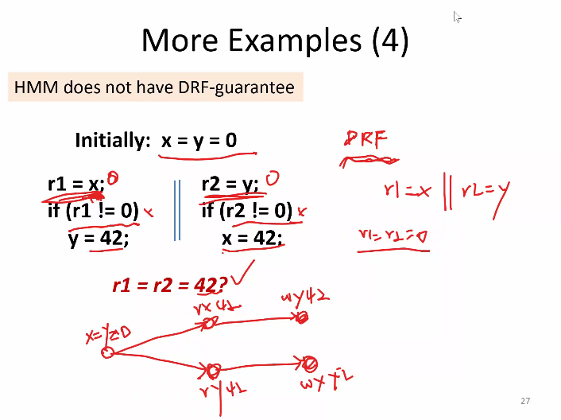
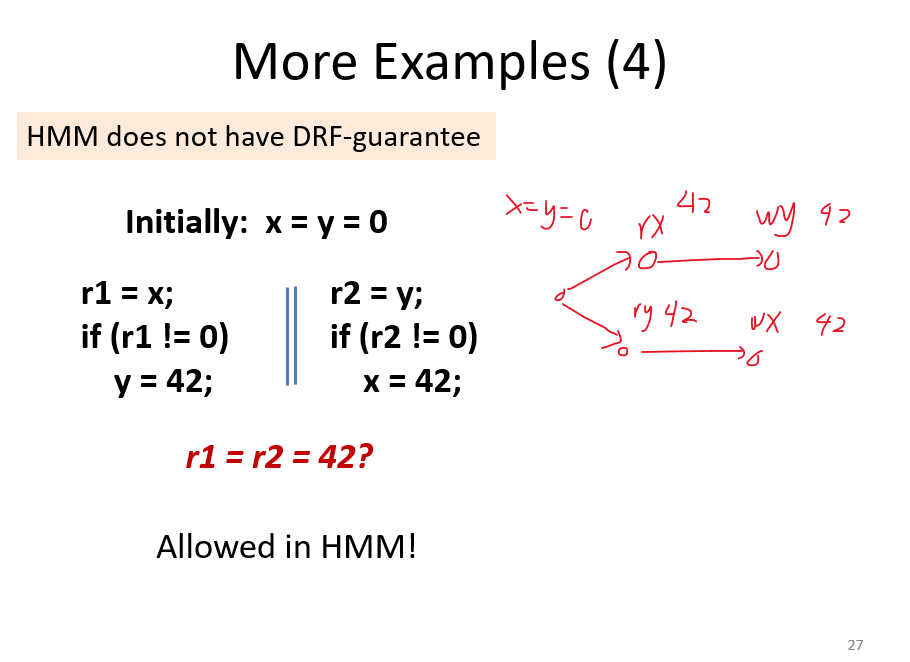
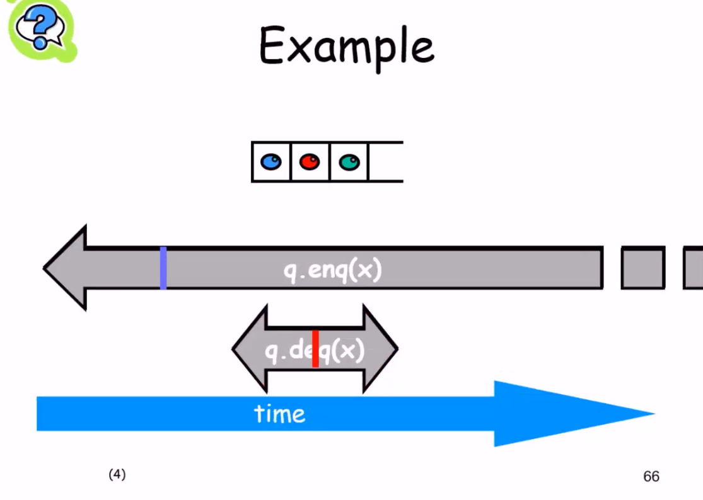
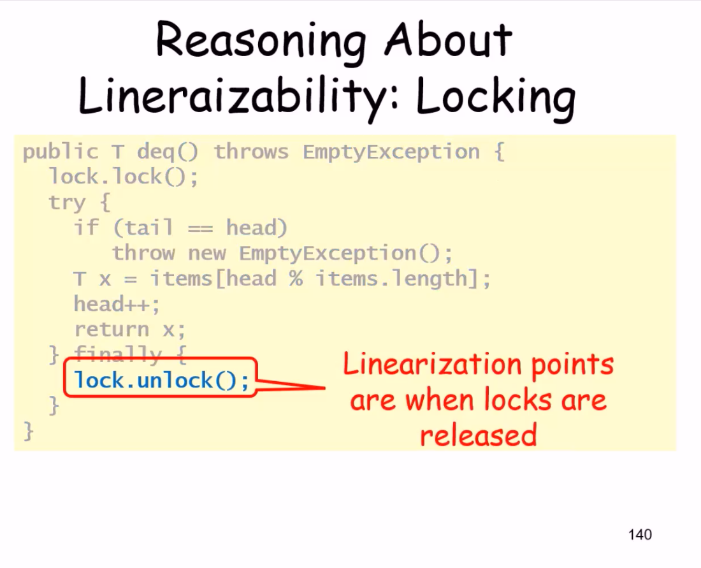
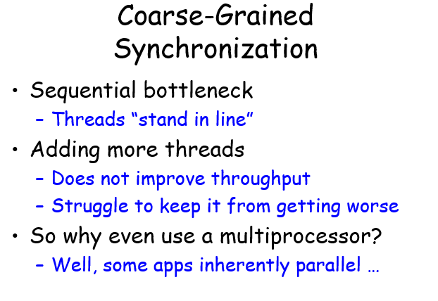

并发算法与理论 笔记

40 平时作业

60 期末考试（最后一节课课上）

# class-1

描述两段代码并行的符号：C1 || C2

注意，main和main中开的子线程是并行的，不要遗漏


cout << x1 << x2 << endl; 涉及三次函数调用，并发是会分割输出x1 x2 endl，而不是作为一条指令，需要讨论并发的粒度(granularity)

如何把三个cout合并成一条指令？C++的做法是引入std::mutex

在这个case中，cout是共享内存，需要锁住

```
#include <mutex>
std::mutex mu; //需要注意mu是全局的，这样才能同时管住"C1"和"C2"

void func() {
	mu.lock();
	cout << x1 << x2 << endl;
	mu.unlock();
}
```

另一种写法

```
#include <mutex>
std::mutex mu;

void func() {
	std::lock_guard<std::mutex> gu(mu);//这里gu诞生，拿锁
	cout << x1 << x2 << endl;
} //到这里gu消亡，释放锁
```


TODO: std::mutex的lock和unlock的内部实现是如何的？是串行的吗？为什么线程并发在执行到lock的实现时不会出事.  （https://zhiqiang.org/coding/std-mutex-implement.html）


concurrent program = concurrent objects + their clients


memory model：描述了并发程序如何使用内存

- Sequential Consistency(SC) model：顺序一致性，表现为并发线程们交替使用内存（https://blog.csdn.net/peterlin666/article/details/39080495/）
- weak/relaxed memory model：C1||C2产生比SC model更多的行为（编译器为了优化或性能做出了违反SC的事）
  - java
  - c++11
  - x86-TSO
  - ARMv8
  - ...


下面的例子中，assert会fail，因为x=x+1会被拆成两条语句，t=x，x=t+1。该线程t=x使得t存了x的旧值，另一个线程增加了x的值，然后回到该线程x=t+1，将x又恢复成旧值，结果就是执行完之后x的值小于预期的200w。

此外，++x和x++均同理


本课不关注算法复杂度，只关注正确性，即实现出来的concurrent object，即使处于并发环境，也能得到“预期的结果”


# class-2

为什么现代程序语言都不是SC的？SC的弱点

- SC模型禁止了一些优化


该图中的问题

- 按SC model，r1=r2=0不会发生
- 但是如果不按SC model，编译器编译C1时，想做优化，他发现x和y是俩变量，独立的，那么可以调换语序，变成箭头所示，然后就乱了
- x86体系结构里，每个线程有自己的write buffer，写操作（x=1，y=1）先写在write buffer中，再写入内存，这个中间隔了时间，导致r1=y，r2=x读到的还是旧的0，0
- 这段程序很经典，叫store buffering


至少一个进程是write，就会出现


DRF涉及的条件

- conflicting：write-write，或者read-write
- concurrent
  - 由内存模型定义什么是并发
  - 比如java的并发，指的是两个操作没有被happens-before确定顺序，如果有锁，需要看清


DRF Guarantee：满足DRF的程序在SC model下行为是一致的，有类似于锁的机制


hb： happens before

sw：synchronized with

。。。

hb引出的out-of-thin-air的理解如下


出现42这种oota的结果，是因为HMM没有DRF-guarantee。


。。。

老师的图如下，特别说明，如果是DRF的话，就只会出现r1=r2=0，不会有oota的42




。。。我的图如下




。。。


# class-3

C++内存模型

C11/C++11自定义了一个DRF，允许比较松的行为，但如果太松就认为是UB


C11定义了memory_order


release/accquire是配合使用的，一写一读


mo_seql_cst是最强的要求，等于SC model，例如在处理store buffering(SB)时不会出现r1=r2=0

message passing(MP)模型：

```
x = 1; || r1 = y

y = 1; || r2 = x
```


用mo_seq_cst，不会出现r1=1，r2=0的结果

-

IRIW：independent reads, independent writes

```
x = 1; || y = 1; || r1 = x || r3 = y
				 || r2 = y || r4 = x
```

-

relax比较松，感觉像语序调整了，使得r1和r2都是1


relax会使用简单机器码，速度快，但行为就奇怪

-

sb(sequence before)：指在之前执行

rf(reads-from)：

asw: 初始化和之后操作的先后关系

dd：struct结构的数据和struct有依赖关系


sc order：store和load

mo：写和写之间的先后关系


sw：synchronized with

-


这个里面会出现UB


。

hb = sw和sb的闭包，带上asw

。

C中的data race：2个操作并发，不全是atomic access，其中至少一个是写，没有HB关系

C有dr，就会有UB，这一点不像java会给出一个行为，C只会UB

精确定义如下：


。

C允许在load(relax)后跟一个fense，形成和acquire-release相同的效果


这俩等价

-


rlx之间没有sw关系，但是W rlx y = 1和Fense acq之间有sw关系，于是x=1和x=1有了sb关系

-

rf，mo都不是hb的一部分

-

cas(&x, v1, v3):

if x == v1

​	x=v2;

​	return true

else

​	return false

把他理解成一次read，再加一次write，但是是原子的操作

-

consume很麻烦，使得hb没有传递性，不建议使用，不讲

-

C中的atomic_init不是原子操作嗷

-

C中有问题，self-satisfying


实现C的标准时不应该允许这个行为，即使模型中无法rule out这个情况

-

对release/acquire的理解：

Release操作：RELEASE操作前所有的READ/WRITE都不能跑到store后面


想象成，前面的读写只能完成，直到我释放

-

Acquire操作：acquire后面都读写操作无法排到前面


想象成，只有我获取到了，后面的值才能进行计算


# class-4

前沿信息

rtach motel reordering：lock往前移动，让更多语句进入临界区，是更安全的；反之，lock往后移动，看起来不那么安全


这样变换之后，t=x这个语句跑到了临界区外面，不安全了

-

WMM：weak memory model

-

。。。

-


mo和hb的冲突，不被允许，mo是对单个变量的写顺序

和下面这个对比一下


这个问题里是x和y之间不存在mo，所以是允许的

-

non-atomic里又不可以了


。

-


读不到0，因为rb，rf，po组成了环

non-atomic只能read到和自己有hb关系的最近的write，所以下图里read到1也是不对的


-


第二段程序的if a == 1，因为是non-atomic，所以只会读hb的a=0，而不可能读出a=1，所以if fail，y=1没了，第三段程序中的if y.load(rlx) == 1也没有rf的来源了，就也没了，然后x=1也没了，第二段程序里的if x.load(rlx) ==1也没了

但，如果串行化之后，把a=1放到第二段程序中，那就有了hb，a可以读出1了，x=y=1也就允许出现了


-

monotonicity：串行化不会引入新的行为

而c11违背了这个原则


-


出现了环（核心是Rsc x，0到Wsc x，1有rb的边），就出问题了


# class-5

讲并发算法

关注算法的正确性，可以被设计出来之类，不关心效率

-

互斥问题

Mutual Exclusion


事件：

1. 瞬时发生，不可能有1点半发生到2点这种事情
2. 一个时间只能有一个事件产生，事件间一定有先后关系（a0->a1代表a0先于a1发生）


method被call，被return也是事件

-

线程就像状态机，事件是transitions


-

时间区间：一个事件到下一个事件之间

时间区间也有先后关系，A的终止事件在B的起始事件之前，A->B

这是偏序的：

非自反：A->A不可以

非对称：A->B就不会B->A

传递：A->B,B->C  => A->C

但，A和B之间可以既没有A->B也没有B->A，所以不是全序（时间区间可以互相覆盖）

-

但事件本身之间是全序的（事件一定有先后顺序）

-

## mutual exclusion

定义


目标：线程i的第k次访问临界区，与，线程j的第m次访问临界区，一定有先后关系

-

deadlock-freedom vs starvation-freedom

死锁free：一个线程lock完就不解锁了，导致所有线程都lock了

starvation free：一些线程lock完，在一些条件下才能unlock

形式上，while类型的程序才能出现这两种情况

-

mutual exclusion和deadlock-freedom，starvation-freedom有什么关系？

- me只要求不出现同时访问临界区即可（反证法）
- df要求没有死锁
- sf要求总能排到
- 有的算法可以满足me但不满足df/sf
- sf是比df更强的性质


page81的lockone算法好奇怪，被证明是me的？然后又存在deadlock？？--现在看来不奇怪了

locktwo，如果只有一个线程的话，就一直锁住里面了

-

然后引出了两者的结合，peterson算法

flag表达自己想进临界区的意愿，victim=i表示自己愿意等

deadlock-free证明：


也可以保证starvation-free：

一个线程如果想进入临界区，那他一定可以进入临界区


-

下面扩展到n>2个线程上去

filter lock， bakery lock

-

## fliter lock

想象一个房子有n层，n个线程想到达第n层。进去时候，一个线程留着1楼，一个线程留在2楼……最后只有一个线程进入第n层


-


-

# class-6

继续filter lock

锁的时候，线程i想进入下一层，然后把victim设为自己，去看看是否存在也想进入更高层的线程k，并且victim还是自己，就锁着

Q：为什么是level[k]>=L而不是level[k]==i

A：这样就不符合me了。如果有线程a到达了L层，下一次循环想到达L+1，但本身还位于L层，此时新来2个线程bc想到达L层，b看victim是c，就到达了L层，然后和a冲突了。

-

### 证明filter lock是me的：

目标是证明只有1个线程能抵达n-1层，我们证一下对于第L层，只有n-L个线程能到达L层

递推一下，对于第L-1层，只有n-L+1个线程能到达第L-1层

假设这些想往L层走的线程里，A是最后一个设置victim[L]=A的，其他线程之一称为B（L<=n-1，所以n-L+1>=2，肯定是有B的）

W_B level[B] = L ->

W_B victim[B] = B ->

W_A victim[A] = A->

R_A level[B]

所以A读到了level[B]>=L，并且victim=A，所以A去不了第L层，而其他的B都能踩着victimA上去到L层


-

### 证明filter lock是starvation free的：

书上讲的有点稀碎，不看了

-

引出一种更强的性质：bounded waitingg


-

r-bounded waiting指的是，线程A第k次想进入临界区的行为中，DA k早于线程B第j次想进入临界区的DB j，然后WA和WB可能产生并发，然后B进入临界区后又来想继续进入临界区r次，最后的结果满足CSA k早于CS j+r


-

fliter lock满足sf，但对于任何r都不满足r-bounded

为啥呢？

因为sf的要求低，只要对于每一个执行的线程都能进入CS

但r-bounded要求对于任何情况，r都生效

-

解决不满足r-bounded问题，引出bakery algorithm

## Bakery lock

类似于银行取号，先拿个号，然后等比自己小的都服务完了，然后再自己上

不一定是字典序的号，只要有一个全序即可

初始化部分如下


lock部分如下


Q：max不是原子操作，可能存在两个线程，取到同一个号，这时候用线程id去辅助比较


unlock部分只把flag置为false，不去管label，所以label只会一直涨，保证没有重复（除非取到一个号）

-

### 满足me的证明：

读label[0]~label[n-1]，写label[i]，再次读label[k]，有时间顺序

如果AB同时进入临界区，假设同时进入的时候，label[A]<label[B]

当B进入临界区时，while条件为假，那么flag[A] = false或者flag[A] == true && label[B] < label[A]

但是呢，已经假设过了，label[A] < label[B]，所以只能是flag[A] = false

既然flag[A] = false，那么有以下先后顺序推理

W_B label[B] -> R_B flag[A] -> W_A label[A]

即B的取号早于A，label[B] < label[A]，与假设矛盾

-

### 证明fcfs：

目标是当DA->DB时，CSA->CSB

DA->DB，说明label[A] < label[B]

W_A flag[A] ->

W_A label[A] ->

R_B label[A] ->

W_B label[B] ->

R_B flag[A]

所以B进入临界区时能看到 flag[A] = true，label[A] < label[B]而被锁在门外，是A先进入临界区的。或者看到flag[A] = false而进入临界区，而此时A也已经退出临界区了

。。。

-

label一直增长，整数溢出了怎么办？

注意到不需要字典序，只需要有一个全序去标注label就行了


# class-7

接上文，那么最好构造一个系统，同时满足不饥饿，并发，时间戳，不溢出


-

一个有序的设计如下


-

两个线程的序可以用3个节点的环来表示，并非全序，因为不满足传递性（1 dominate 0，0 dominate 2，但不满足 1 dominate 2）

这就是不能只有2个节点的原因：1 dominate 2，2 dominate 1，乱掉啦。需要引入第三个节点来缓冲下


-

三个线程的，把维度升高


-


处理K个线程的话需要3^(k-1)个节点

用bit来表示这个数字要log_2^(3^(k-1))个bit位


-

### 对bakery lock的思考：

既然他是如此的，高效，优雅，公平，为啥不实用？


TODO啥意思

## shared memory 问题的通用性质

如何解决MRSW？多个读一个写，表达意愿，需要设置flag

如何解决MRMW？多个读多个写，谦让一下，需要设置victim

flag[]和victim[]称为寄存器


### 定理1

要解决MRSW问题，保证mutual exclusion和deadlock-free，至少需要N个flag

假设只用小于N个，那没法确定A在不在临界区


上限也顶多需要2N个寄存器，参考bakery alg


### 定理2

如果现在是考虑MRMW寄存器，至少需要N个

（发现Writer无论是不是Multiple，都不起作用嗷）

少于N个的时候，B停在要写R_B的前一刻，A进程先进入CS，然后B继续跑，A进程留给R_B R_C的痕迹会被B抹掉，C一看哦豁CS空了，那我就进去了，于是AC同时处于CS了


-

总结

1960s提出了很多不正确的解决me和df的算法

N个ReadWrite-Registers不高效，因为write会cover old write

需要更强的硬件操作来避免covering问题（下节课的内容）

-

如何定义并发算法的正确性？

## safety和liveness的对比

safety是有限步内能检测的性质，liveness无法有限步检测出来

safety认为：如果坏事发生，那么在之前已经发生。如果没有坏事发生，只有当所有前缀都不发生坏事时才成立

liveness认为：不管前面发生了什么事，现在发生了一件好事，那之后还会再次发生好事


mutual exclusion，bounded overtaking都是safety的，（只要发生了一次坏事，比如两个进程进CS了，被抢了不止r次，那就完了）

starvation free，deadlock free都是liveness的（即使单个线程饿了好久，但只要别饿到死，最终能进CS，就可以了）

-


# class-8

## 并发对象的实现探索，queue为例

如果要实现一个mutual exclusive的queue，最简单的办法是在enq和deq的时候加锁释放锁

假如不让用锁呢？

简化一下，只有两个线程，一个只做enq，一个只做deq，这样是一个生产者消费者模型


-

## 如何定义并发对象实现的正确性？

首先来看顺序执行的对象，有状态

-


-

例如队列，出队操作，precondition可能是队列为空或者队列不为空，分开讨论


-


-

再看看并发算法

方法调用要花时间（这页干嘛的？噢噢，串行程序花时间不care，因为是一个接一个，并发程序就要考虑重叠了）


-


-

对比一下

串行程序互不打扰，新增方法不影响老方法；并发程序互相干扰，新增方法干扰老方法。

串行程序有状态，并发程序时间重叠

串行程序的方法可以单独描述，并发程序要考虑所有可能的执行次序

-


## 如何确定并发对象是对的呢？


## queue


-

lock unlock可以保证enq的绿色部分和deq的黄色部分没有重叠


-

## linearizability

可线性化的性质，线性一致性

找一个特殊的时间点（例如上面图里的绿和黄），如果sequential behavior是正确的，那么object就是正确的


-

一个valid的例子

规划一下，先enq(x)，再enq(y)，再deq(x)，再deq(y)，是满足的


一个invliad的例子，整个enq(x)早于enq(y)，所以不可能先deq出y


-

又一个例子，linearizability不关心method是否结束，所以这个例子是ok的。



-

enq deq都是并发的情况，答案不唯一


-

换个模型，这个invalid


-即使红色的read(1)也是做不到的

-但read2就是可以做到的

-

现在问题就是，如何找出method里这个特殊的，起决定性作用的点？（linearization point）

-一些例子可以找，但是还有些例子和具体执行相关


-

### invocation & response

上面都是例子，现在想正式定义一下linearizability，那得先定义一下什么是execution


-


-


- 知道thread就可以知道这个q是调用谁的了，所以method name是隐含的

-

invocation和response要配对


-


-

除此之外，可以做projection，直译是投影

比如H|B，就是保留B线程的内容，剔除A线程的内容

H|q，就是保留对象q的内容，剔除p的内容


-

### complete subhistory

定义complete subhistory

像下图这种没配对的，属于pending invocation，可能生效也可能没生效，要把它丢掉


-

### sequential histories

最后也有一个pending，但是没关系，这是顺序的


-

### well-formed histories


-

### equivalent histories

线程看到的东西是一样的


-

### sequential specifications

ss就是在说一个单线程单object的history是否legal

legal是怎么定义的。。噢想起来了，就是上面说的，比如enq(3) deq(3)，就是合法，enq(3) deq(99)就是非法，要找出一个顺序让并发object合理


-


-

### method的先序关系

要想把concurrent history map成 sequential history，要满足首先是equivalent的

先序关系precedes的定义：一个method的return，在另一个method的invocation之前


-

非先序关系：有overlap了


-

notation（符号）来表示有先后顺序的method call

这个顺序说是一个偏序吗，我觉得不是，不满足自反性啊，可能是并发这门课里的定义的吧。。（不满足A->A也行）

如果想要全序，那H得是一个串行的程序


-

以上都是linearizability的铺垫

一个history H，要给他添加pending的response，或者去掉这些pending，变成一个G

然后找出一个legal sequential history S，G要求满足equivalent S，先序关系也要在S上出现


-

解释一下->G <= ->S


-

注意事项


-

一个例子，其中第一条和最后一条是pending


-

随便选个策略，给A补一个void，把B enq(6)的丢掉


-

只要先enq(4)，再enq(3)就行了

然后看equivalent，看S|A和S|B是不是依然一样，那显然ok，语序没变过嘛

然后看先序关系，线程内部的语序由equivalent保证了，线程之间的呢？

左边的G里面AB间没有先序关系，所以右边的S里怎么搞都行


-

## Composability Theorem

重要定理，多个object的时候，只要保证每个object是linearizability的，那么整体就是linearizability


-

这个定理好，好在模块化，拆开考虑各个object即可


-

回过头看看queue的实现，找一下linearization point

lock之后，unlock之前随便找一个点就行了




# class-9

## 回顾一下linearizable

对象的linearizable的定义如下：

linearizable(o, spec) iff

$\forall$ histories(o), linearizable(H,spec)

linearizable(H,spec) iff

$\exist$ G，completion(H, G)

且$\exist$ S，sequential(S)且valid(s, spec)

且$\forall$ A，G|A $\subset$ S|A

且$\rightarrow_G$ $\subseteq$ $\rightarrow_S$

---

整体的linearizable，只要每个部件的linearizable就行

-

但无法枚举所有histories，怎么办？

找程序里的linearization point（LP）

-

有的linearizable的object没有固定的LP，LP依赖于具体的执行（作业A3里提到）

-

## sequential consistency

不同于linearizability

method内部的代码不能改

同一个线程的operation顺序不能改

不同线程的不重叠的operation顺序可以改


-

例如，这个例子里， 不是linearizable的，但是把enq(x)和enq(y)位置交换，可以满足，所以是sequential consistent的


-

SC没有composability组合性，例如下面，

H|p和H|q都满足SC，但是他俩SC的条件里，p.enq(y)->p.enq(x)，q.enq(x)->q.enq(y)

结合已有的顺序p.enq(x)->q.enq(x)，q.enq(y)->p.enq(y)，成了环


-


-


-

写自己，读对方，是很多mutual exclsion算法的核心

non-negotiable是不可协商的意思


-

硬件上的SC代价昂贵


-

现代多核处理器，读写内存一般是先读写cache，即使如此也比指令执行要慢


程序员自己设置memory barrier，额外的指令等来做sync

-

linear，这门课以后的算法都用linear作为标准


-

-


-


-

## 06 ppt

wait-free是无锁的

怎么实现呢

像环形FIFO queue，无锁

-

共识


-


-

# class-10

## consensus

寻找一个新问题，叫consensus：多个线程决定一个输入的问题，达成共识。

-

consensus有性质：不能被register实现

但consensus可以被queue实现，所以推理出queue不能被register实现？

-

consensus作为一个中间人，上面的queue可以换成其他对象object，如果能证明object能实现consensus，那就能证明register不能实现object

-

consensus的核心是一个decide(v)函数，要求先写（写指的是propose函数）的人返回自己写的值，后调用的人返回对方写的值

下面看看这些object都可以是哪些

## FIFO x consensus


只针对两个线程的情况即可证明

思路这样，红球先被拿出来，黑球后被拿出来。所以拿到黑球的thread就知道，对方已经propose value了，然后才拿到红球，所以自己decide读到对方的value，很正确。

这个核心在于先propose，再取球


-


-

## consensus number

定义，如果一个object（附加若干寄存器）可以解决n-thread的consensus，并且不能解决n+1-thread，那就说他的consensus nmber是n


-

一些性质：

- 如果能用X实现Y，那么cn(Y) >= cn(X)
- 如果cn(Y) > cn(X)，那么不可能用Y实现wait-free的X


-

## mutiple assignment x FIFO

mutiple assignment不能用register实现

multiple assignment：多个线程同时对数组里的多个元素进行写

3个元素的数组，A线程写a[0]和a[1]，B线程写a[1]和a[2]

-

思路，来的thread，assgin过后，看看对方该写的a[0]（或者a[2]）是不是空，或者对方写的a[1]和自己一样，是的话就自己是先来的，返回自己写的


-

## read-modify-write object

原子地：读旧值，更新旧值，返回旧值


-

例子


-

例子

-


rmw的consensus number是多少呢？

-

首先定义什么是non-trival的rmw

non-trival就是存在一个v，使得v != mumble(v)


-


-

结论

non-trivial RMW的consensus number至少有2

-

思路：thread来了之后get一下旧值，更新一下non-trivial新值，如果得到的旧值和初始值一样，那就说明我是第一个来的


-

有两种mumble function的consensus number就是2，这两种分别是

- commute型
- overwrtie型


-


-

但是，compareAndSet(expect, update)就比较厉害，他的consensus number是无穷大，实现如下


-

证明如下


-

总结下


-

## lock-free vs wait-free

wait-free的实现一定是lock-free的

就像lockout-free（就是starvation free）一定是deadlock-free一样

-

consensus是很有用的


## 07 ppt

处理MIMD的问题


# class-11 Spin Lock

## spin lock的定义


```
spin_lock() {
	look() {
		while(...)
	}
}
```


-

## Test and Set

`bool test_and_set(bool new)` 

只用一个共享变量（一个Read-modify-write register）

操作：取出旧值，设置新值，返回旧值

锁free：旧值是false

锁taken：旧值是true

开锁：重置锁为false

-

根据之前课上的定理，似乎需要n个register才能搞定n个线程的锁，但这里我们用1个register就搞定了，为什么？

> 因为这里的register是Read-modify-write register，consensus number=2，之前说的是read-write register，consensus number=1


-

TAS的理想表现：线程数-花费时间，当线程数增加时花费时间不变

但实际上增长非常快，为什么？

先看TAS的变体：test-and-test-and-set


## Test and Test and Set

在tas之前增加一个test，在test看到false（锁free）的时候去跑TAS

```
lock() {
	while (true) {
		while (test()) ;
		if (!test_and_set()) {
			return;
		}
	}
}
```

TTAS的表现：


看上去有点奇怪，TTAS明明做了更多的操作，为啥还快呢？

> 因为每个线程有自己的cache，如果只读cache的话，代价比set memory低很多


-

TAS上锁：当一个线程set共享变量的时候，他会invalidate其他线程的cache，和memory，这样其他线程下次read的时候就发生cache miss，得重新通过bus去memory里取

TAS开锁：又要set了，要通过bus。但可能其他线程之前因为cache miss还在使用bus，所以开锁线程也要等待bus使用完毕

-

TTAS上锁：test阶段只从cache里读，如果锁没被改的话，就不需要走bus，也不会invalidate其他线程的cache

TTAS开锁：比TAS有更严重的问题，开锁后，其他线程全miss，重新load memory，然后看到false，那就准备进入TAS，假设其他线程都卡在进入TAS之前的地方。第一个执行TAS的成功拿到锁，再invalidate其他线程，第二个执行TAS的线程再次invalidate其他线程，进入新循环，第三个同第二个，。。。

> 出现开锁问题的原因是，如果一轮尝试TTAS失败后（看到的false是假的），立刻进行下一轮尝试。如果尝试失败后，休息一会再来试试呢


## Backoff

在TTAS的基础上，引入一个随机等待时间


效果比TTAS好


## Anderson Queue Lock

给线程排个队，每个线程处于数组中的一个slot，第一个slot开锁后把锁交给第二个slot（设置第二个slot为true）


-


-

表现很好，FIFO，starvation free


-

不好的地方

- 需要长度n的数组
- 如果不知道线程个数呢，该设置多大呢
- 如果设置很大了，但只有很少线程在工作呢

-

改成linked list就行了

-

Anderson Queue Lock符合如下的格式，lineariable point在L=true;

```
bool L = false;

lock() {
	while (L);
	L = true;
}

unlock() {
	L = false;
}
```


## CLH Lock

把anderson的array改成linked list

但不是显式的linked list，注意到我们在上面的anderson里，数组里只用到next，保持next的增长和开锁后通知下一个slot即可，所以可能不需要显式的指针指向下一个。维护好链表的tail就好了

-

所有线程共享一个tail，初值为QNode(false)

每个线程维护2个指针，一个是自己的QNode my，一个是前驱的QNode pred。

> 为什么要用QNode指针而不是直接boolean值？因为这样可以把更新传递给前驱

上锁：设置my指向的对象为true，tail指向my指向的对象，pred指向tail，my和tail的指向交换的结果存在pred里，然后等待pred里的对象变成false（tail的初始false，或者被别的线程的my开锁变为false）。

开锁：my设置false（实际也变更了tail指向的对象，这就是真的开锁），my指向pred（之前的tail，反正肯定是false，但，是什么无所谓，只是之后复用空间才用得到，毕竟lock时候会直接设置my为true）


-


-

空间只要L+N，为啥呢，在有多个锁的情况下，他想重用QNode，主要是my指向的QNode

但我感觉就考虑下一个锁就行了，一个线程里有多个锁的，那不还得顺序执行吗，那同一时间只有一个锁生效，这个L个锁是真没啥必要讨论？


-

CLH Lock的好处

- mutual exclusion
- starvation free
- **first come first served**
- lineariable
- 空间使用率高
- 不需要事先确定线程数n

不好的地方

- 在没cache的架构下（NUMA：non-uniform-memory-architecture）表现不好（有线程cache的情况，pred指向的节点，是线程的local memory，那么spin就很快。没cache的情况下，pred指向的节点，是其他处理器的remote memory，spin会很慢）

-

如何改进cacheless架构下的表现？看MCS Lock

# class-12

## MCS Lock

CLH是pred连接前驱的链表，MCS要做的是next连接后继的链表？

CLH是等着pred的节点开锁时更新，然后这个更新通过bus传递到后继的local cache，然后后继得以拿到锁。后继节点的spin完全依赖于前驱节点

MCS是开锁时通知后继节点，后继节点的spin只在local cache上spin，不会那么依赖前驱节点，所以在NUMS架构下也会表现好。


-

拿锁：

注意qnode definition的位置，是在lock的内部，纯纯local memory

如果tail=null，说明现在无线程，直接进入临界区

如果tail有指向，那就把自己链入链表，然后等pred开锁


-

开锁：qnode.next=null时，并不代表真的没有后继节点，可能是后继节点还没来得及链入链表（未执行pred.next = qnode），所以需要判定一下

CAS是什么？compare and swap，如果tail == qnode，那tail = null，return true，否则啥也不做并return falsee。这个指令比较消耗时间，所以放在内层的if里。

判断是不是真的没有后继节点（如果有后继set了tail但未链入qnode.next，tail是会被改变成其他线程的qnode的）


-

## Abortable Locks

如果有一个线程等着等着不想等了，退出了，怎么办？

### TAS，TTAS，Backoff Lock

都没问题，因为他们的lock函数return时，完全不影响其他线程


### CLH Lock -> Time-out Lock

放弃的节点不能直接quit，因为lock state需要沿着链传递，直接quit的话后继节点就会饿死

改一下mcs lock，叫time-out lock，引入一个特殊状态AVAILABLE，描述quit后的节点

-


-

// myPred == null是初始情况

// myPred.prev == AVAILABLE是前驱节点释放


// 一个计时器，如果前驱突然AVAILABLE了，或者前驱突然放弃了（前驱的tail指向


// if判断如果当前线程有后继，就把后继的前驱指向自己，没的话就tail还是指向自己


// 开锁，先判断有无后继，有的话设置他为AVAILABLE，无的话设置tail=null


-

## Spin Lock总结


# class-13 LinkedList

motivation：粗粒度的加锁（开头上大锁，结束开大锁）太糙了，所有线程其实是串行执行，这样没发挥并行的优越性



-

今天讲4种改进策略

- 第一种，用到很多组件，每个组件上有一个单独的锁，细粒度
- 第二种，乐观锁，先找锁，然后尝试加锁，如果失败了就重来。适用于并发弱的场景
- 第三种，惰性锁，做remove操作时，先标记一下节点，最后再物理删除
- 第四种，不用锁，用复杂的算法和操作，让多个线程并发时，某一个线程能完整执行完

-

## Linked-List实现一个Set

提供三个接口


-

list是根据key单调递增的链。

list有头尾节点，key是正负无穷


-

representation


-

add和remove


-

### Coarse Grained Locking

大锁，很简单，但是是独占的，完全没有并发


-

### Fine-grained Locking

细粒度，每个节点单独有锁


-

### Hand-over-hand locking

add和remove的时候，先拿12节点的锁，然后释放1，拿3，然后释放2，拿4，以此类推

就像在攀岩一样

-

为什么要两把锁？考虑如下情况：

线程A想remove(b)，线程B想remove(c)，如果只用一个锁，那么没法保证a.next要指向的节点c还活着


-

核心部分，除此之外还有finally的unlock


-

remove是linearizable的

point在：curr.lock()锁上后，下一个while失败了。lock到退出的过程中都可以是linearizable point

-

add的时候，锁pred就可以了，succ不用锁

为啥呢？因为锁了pred之后，succ就不可能被删

-

整体来看

只要head的锁是starvation-free的，后面的节点就都不会starve？

-

算法不太高效，长链的acquire和release


### Optimistic Synchronization

一种乐观的算法：

先unlocking地找到节点pred和curr，然后加锁，然后查看是否合理，不合理就再找

（不合理的原因就是unlocking找到位置~加锁这段时间里，节点可能已经被改了）

合不合理的检测方法：看pred节点还是不是从head可达

-

合理检测，还是升序的链表


-


-

if (curr.item == item) 这一句是因为hashcode冲突？还有可能是本身就没有这个item。。

validate失败了之后会回到retry的while true继续执行


-

算法好处，少了很多acq和rel

坏处，需要遍历链表2次，contains方法需要加锁


### Lazy List

与opt相比，只遍历链表1次，且contains方法不加锁

关键点在于，观察前面的算法，remove方法常是瓶颈，所以改进它为lazy

将remove分割成logical delete和physical delete


-

validate


-


-


-

conrains不需要加锁了

linearizable point存在，但也不是fixed，类似以前作业里的queue


-

好处，contains无锁，wait-free。不需要二次遍历

坏处，add和remove一旦validation失败，还需要二次遍历。由于需要加锁，所以如果不同线程都访问同一个位置，会有traffic jam。


### Lock-free List

只用compareAndSet


但是会有问题，d已经被添加到c后面，但是c被b删了，等于d也被删了。

CAS只能检测next


改一改，既检测bit，又检测next。就是说，node如果被logical delete的话，那就不能修改他的field


-

那么用一个reference+bit表示要被CAS的内容


-

获取它的值：返回值返回reference，bit通过marked[0]返回（如果java有go lang那样的返回值组合就没这事了。。）


-

这里的remove显得非常奇怪，CAS的结果他为什么不关心？因为curr已经attemptMark curr为true了，在find方法里会把marked node都physical delete掉

