考核：无期末考，老师讲8-10课，学生6-8课，每周2篇论文，讨论答疑

pre 45%

lab 25%：移动计算服务的算法，c++，matlab

final project30%：做一个实际的东西，survey，论文

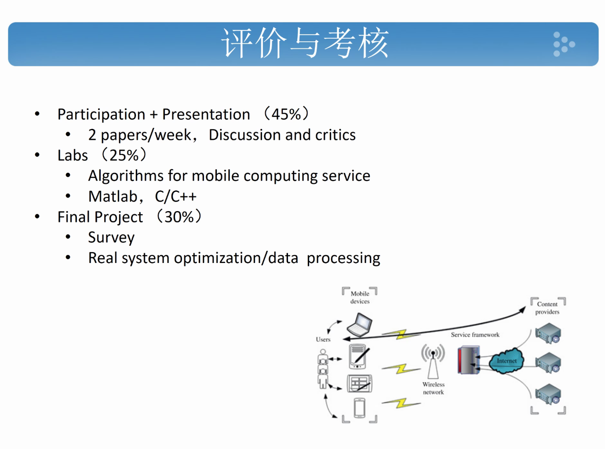

# class-1

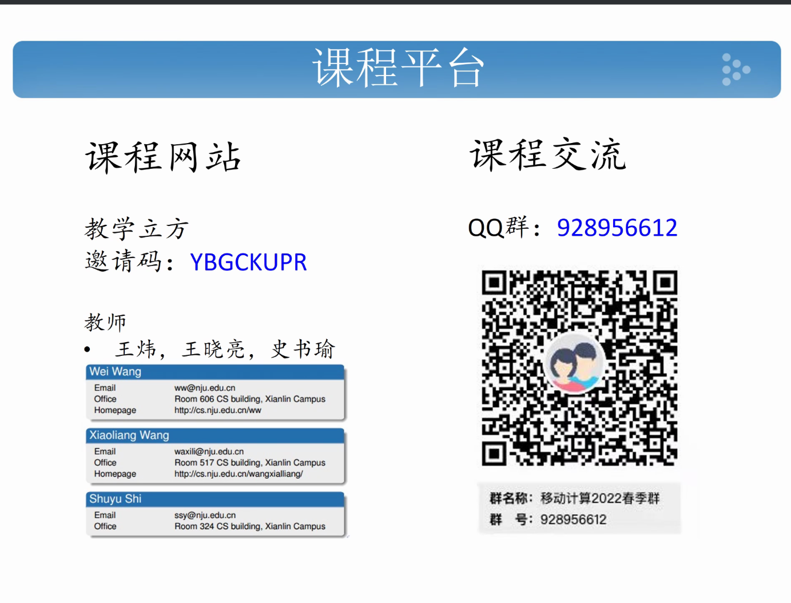

-

## 课程内容

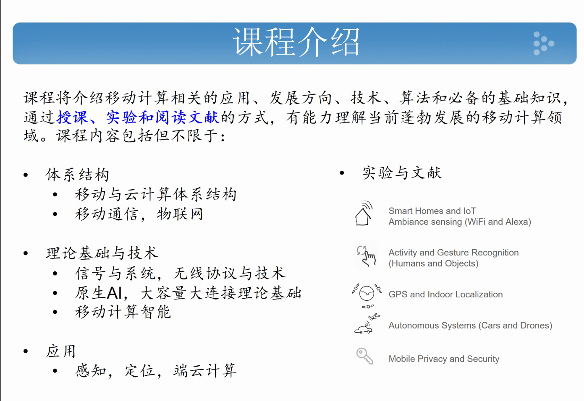

-

移动计算分为

- 移动通信
- 移动硬件
- 移动软件

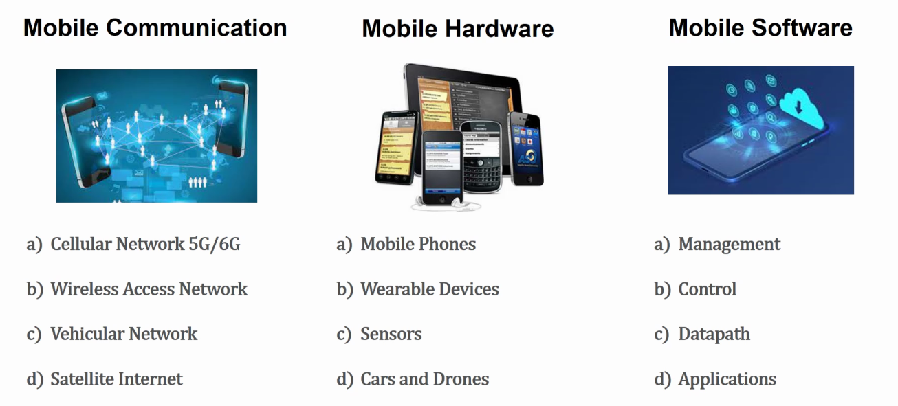

-

## 移动通信演进

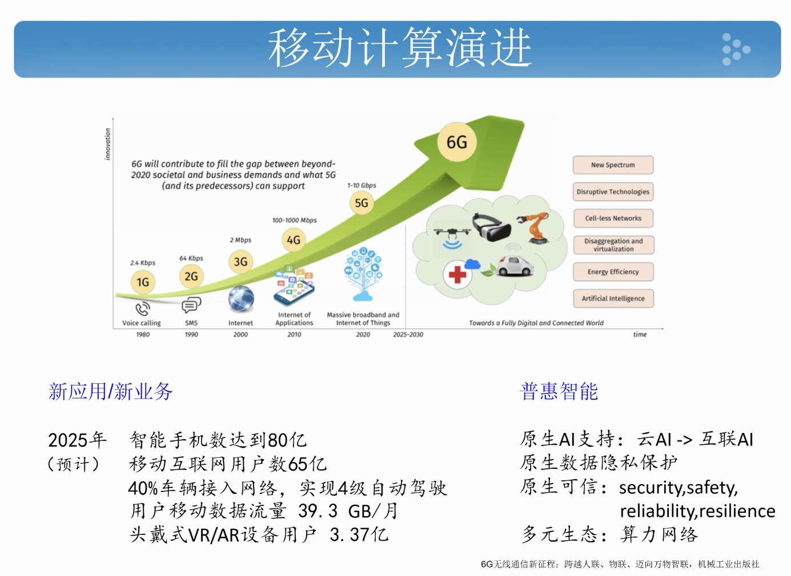

-

## 关键技术

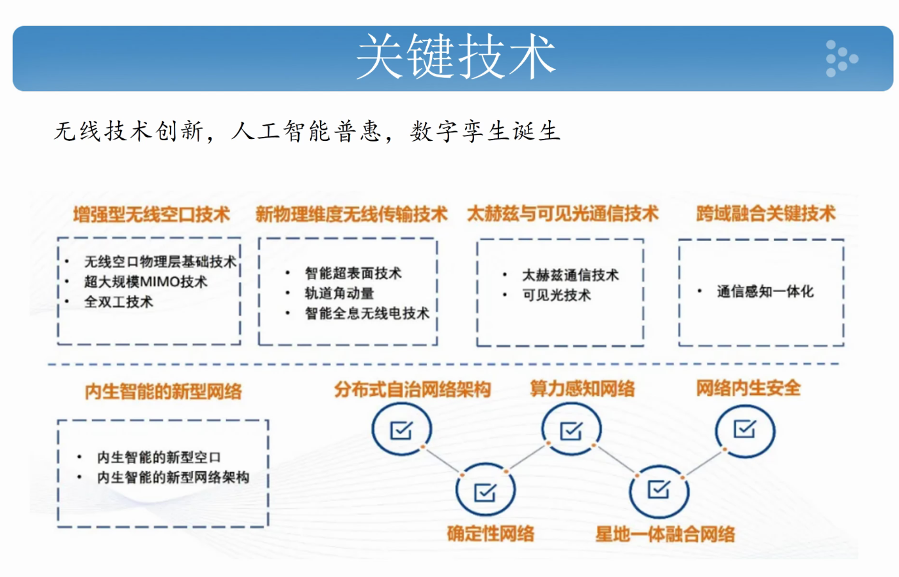

-

### 可见光的无线通信

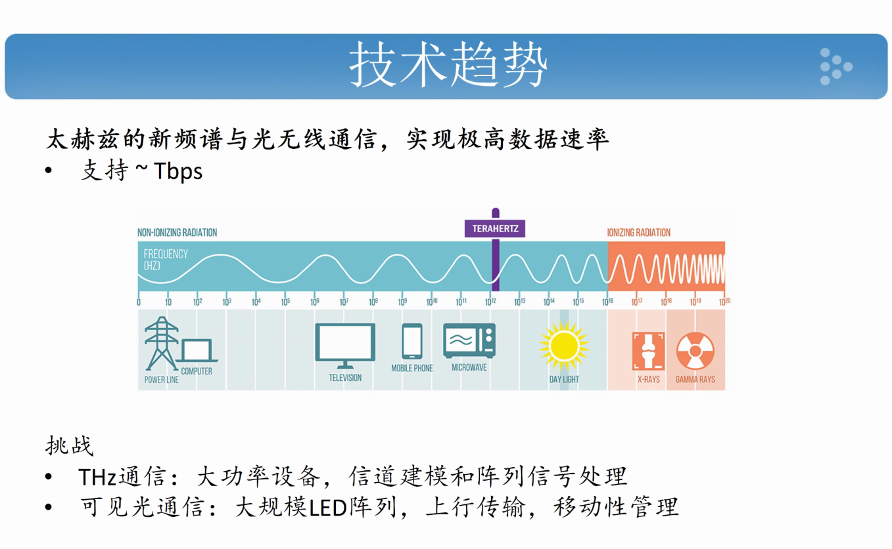

用LED阵列传输信息，LIFI，速度10~100Gbps

-

### 通信感知一体化

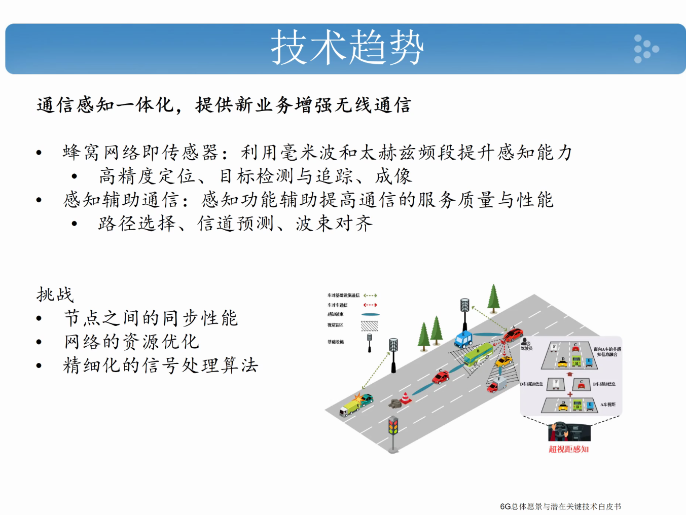

-

### AI for system

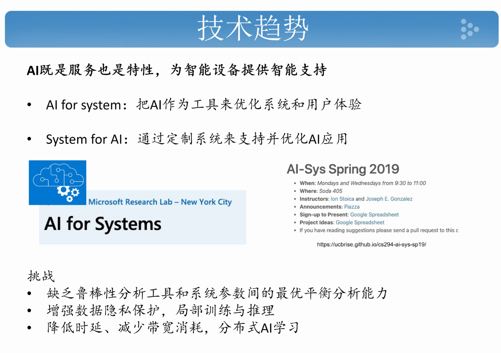

-

### 多模信任模型，新型密码技术

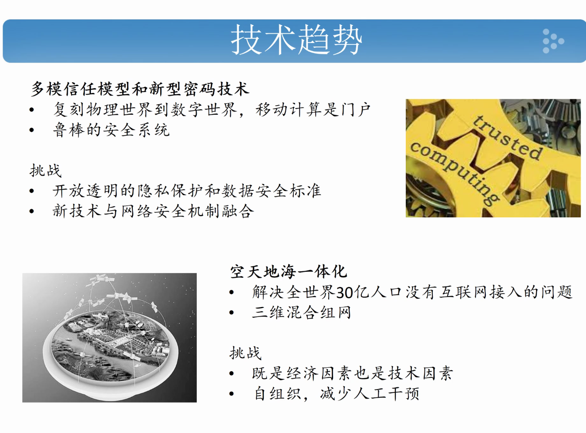

### 节能

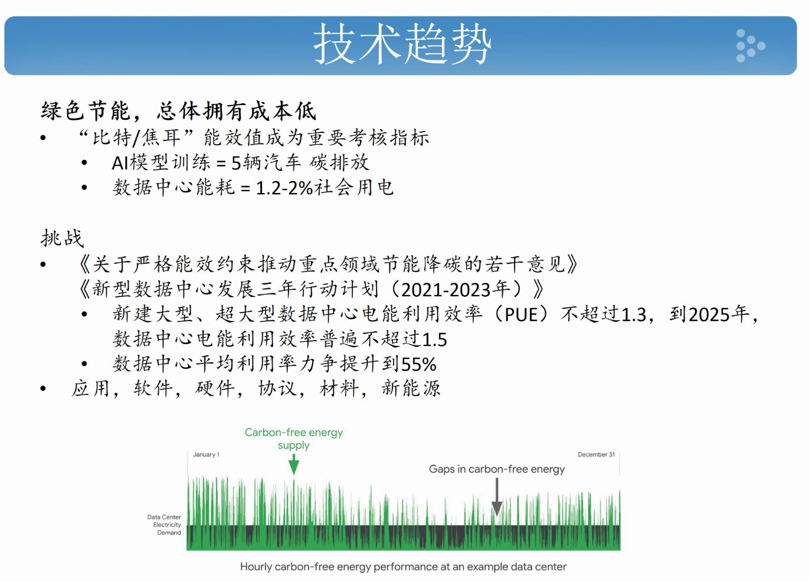

### 沉浸式用户体验

10ms是底线，不然会让用户头晕想吐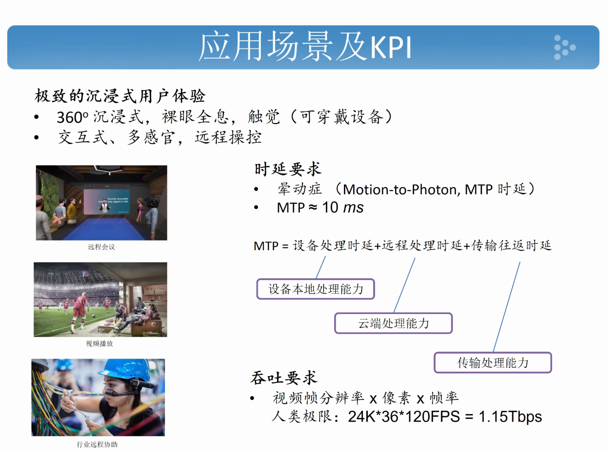

### 感知、定位、成像

矿场里机器人挖矿，精细化

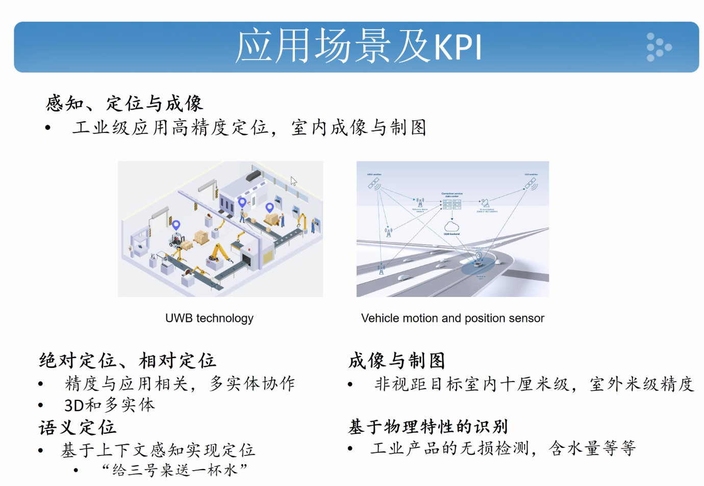