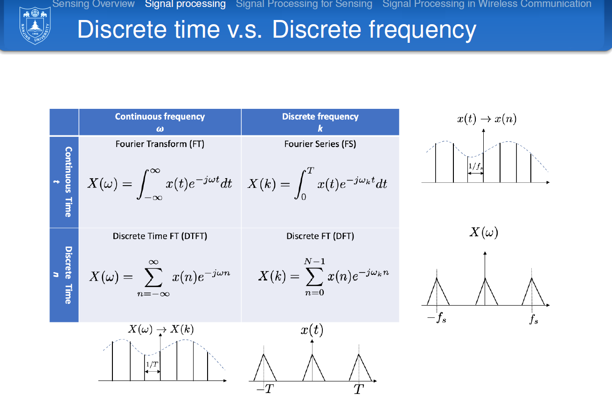

考核：无期末考，老师讲8-10课，学生6-8课，每周2篇论文，讨论答疑

pre 45%

lab 25%：移动计算服务的算法，c++，matlab

final project30%：做一个实际的东西，survey，论文

# class-1

-

## 课程内容

-

移动计算分为

- 移动通信
- 移动硬件
- 移动软件

-

## 移动通信演进

-

## 关键技术

-

### 可见光的无线通信

用LED阵列传输信息，LIFI，速度10~100Gbps

-

### 通信感知一体化

-

### AI for system

-

### 多模信任模型，新型密码技术

### 节能

### 沉浸式用户体验

10ms是底线，不然会让用户头晕想吐

### 感知、定位、成像

矿场里机器人挖矿，精细化

# class-2

一些术语，缩写

RAN：接入网

UE：user equipment

## 移动计算通用架构

-

3G时代，你的请求可能会跑到3 4公里外的基站处理，而不是你身边1cm的基站，因为做负载均衡。

4G时代，做端到端时延的降低，让eNodeB之间互联。个人用户的电路交换是附在ip包上的，4G没有拉到电话网里数据传输，纯用ip网络，但是ip是锁死的，灵活性不如纯ip

S-GW：和基站相连，gate way，负责数据业务转发

MME：移动性管理，小区切换，接管了BSC和RNC的一部分功能

P-GW：和ip网络相连

-

整体趋势：2G->3G->4G解耦，功能上移

-

## 234G网络对比

十倍量级的变化

## 万物互联时代

## 5G指标

空中接口：空口，用户设备-RAN之间的接口（目前的瓶颈）

LTE：4G LTE

## 5G组网架构

### 1

最简单的一个图了嗷，两层架构

gNB：G Node B

### 2

灵活性和可扩展性的要求，要求建立更多基站，但没这么多地皮来建基站了，咋办？

所以5G尽量继承一下234G的基础设施，一点点演进过来。非独立子网->演进到独立子网

现在的5G还是借助4G的非独立子网，有点类似ipv6藏在ipv4里运输？

-

5G的接入网：

34G基站体积都很大，覆盖范围1km

5G覆盖范围200m，微基站50m

要想覆盖江苏省，需要的基站也忒多了。。现在每个楼的楼顶都有基站，一人高，白盒子，一打开里面密密麻麻都是线

-

5G的核心网：

可靠，可扩展，稳定性，大负载，低时延

不能像以前那样用专有设备来做这件事，这样不满足可扩展，面对潮汐时也不经济（只能按最大流量买设备）

灵活：要求网络切片，粒度要很小，比如就这几小时，在南大体育馆，办一个比赛，直播。

## 5G接入网

从左到右时代进化ing，解耦

## 5G组网架构变革技术

### NFV

NFV：虚拟化，用通用设备达到专用设备的效果

专用设备，无论是路由器还是交换机，其设计都是很完美的，CPU，内存都是匹配好的，当需求变化时，只能新买整机

### SDN

用软件做一切的功能

开放可编程的接口，方便做验证，部署，升级

问题：分布式系统可以做到自适应，鲁棒性好，集中式的管理容易出问题。但历史就是在分布式-集中式之间跳转，循环向上

## 5G技术要点

亚马逊，微软Azure，阿里，腾讯的云服务，可以体验下

-

# class-3 Iot&Edge

edge和iot所在的位置，红圈

-

## 物联网发展

隐私要求、低功耗要求

本地数据安全、传输安全（传输层，应用层都加密）、云计算安全

## 什么是物

提到了数字孪生设备

## 朴素iot模型

四层模型

## iot七层模型

## iot平台

一张arm的架构图

大厂在做小盒子，学名SD-WAN，提供第二列的服务

tx阿里只做了12列

华为做了全4列

## iot edge计算平台

edge位于Iot hub之前/

-

## MQTT协议

IBM自己搞的协议

## CoAP协议

IETF官方协议，TCP也是这个组织制定的

内容很复杂

protobuf底层也是这个，在网络环境不好时使用

## C-RAN

买本书系统化看看，不要看视频碎片化

# class-4

讲了2h的趋势

计算能力部署

- 物联网网关，CDN
- 提供服务质量保证
- 业务流调度：多云，多网
- **安全与隐私：SASE：secure access service edge**

另，课件没发，下节课信号处理

# class-5

## 感知

感知：移动设备对周围环境的感知能力，利用传感器等实现，日后做产品这是一个很重要的概念

## 模拟信号 vs. 数字信号

模拟信号：连续函数，连续的dom和rang，蕴含了无穷的信息量（从不同方向解读出无穷信息）

数字信号：对模拟信号进行采样得到的离散函数

## 傅里叶变换 Fourier Transform

为什么要有傅里叶变换？在deep learning领域，有些样本特征太小，不好学，放大到频率域之后特征就很显著了

### 连续傅里叶变换

傅里叶变换：对于周期函数，进行时域和频率域的变换，借助cos和sin的性质

### 离散傅里叶变换

### 正vs.逆 离散vs.连续

### 应用

应用：通过傅里叶变换，可以把心跳、呼吸区分出来（变换后有明显区别）

## 卷积 convolution vs 相关性 correlation

计算得到信号量的某种属性

## 线性

f(a+b) = f(a) + f(b)，具体是讲什么没听清

# class-6

迟到40min，课件未发

## Orithogonal Frame Structure

做OFDM的时候

循环位移，保证信号互相正交不干扰，循环10位，在频域上表现为加上了一个数，可以逆向出来

然后讲下一个课件了

## sensor

继续sensor

-

手机摄像头的光圈是按一行一行的条状采样，如果LED灯的频率和细条适合，就会显示几条暗，几条亮，照片呈条纹状。

-

步幅，步频，判断走路，跑步和摔倒状态

# class-7 定位

两大定位方法

## Range-Based Localization

### 三角定位

一式减掉二式，得到线性方程，二式减掉三式，同样，所以只要解线性方程组

### 测距方法

TOA受限于source和dst的时钟不一致，时钟慢1微秒，光速走了300m

TDOA：多个接受天线、用声波

### TOA-GPS

非常厉害的工程，1970s，没有大规模集成电路，还要考虑由于卫星飞行造成相对论的时钟误差，精度几十米

**并且提供了纳秒级的时间信息**

-

国内的所有基站都连了GPS天线，用于时间同步，如果GPS关了，那么基站的时钟会慢慢偏掉

-

GPS信号的频率高，没有办法穿墙

比特率很低，50bit/s，传递一个超帧要30s

### TDOA-Cricket

### BeepBeep

声音采样率48k/s，每秒采样48k次，声速340m/s，除一下就是7mm

-

测相位，波峰的距离差

### Centroid

天花板上布置密集的bacon

### APIT

不那么密集

如果一个点M在三角形ABC内部，他无论往哪个方向移动，都会离某个顶点越来越近

如果在外部，总能找到某个方向，同时远离三个顶点

APIT使用邻居作为虚拟移动点，用户不用真的去移动来移动去

# class-8 

3节课讲部署DeepLearning的知识，最后一节讲大作业

## logistic regression vs. lonear regression

损失函数不同，梯度是一样的

# class-9

？

# class-10

review on last class

用硬件方案对深度学习进行加速

模型大小进行优化

提高并行度，优化矩阵乘法

---

分享论文

1. ppt准备好，可以使用原作的ppt，魔改一下 
2. 20min讲解，10min讨论，回答其他同学的问题
3. 最后提交一篇review，内容类似审论文的pros&cons，其他同学的问题，基于这篇论文的启发等等，ddl期末

---

实验

1. 有框架，自己要改的不多

首先是数据解调，raw->cir

然后是数据拼接，*.cir 拼成 *.nmp

然后是hand_recognition，深度学习识别手势

toAndroid_cnn.py中三条线训练，可以自行修改该文件

# 论文分享

题目：Ekya: Continuous Learning of Video Analytics Models on Edge Compute Servers

一句话总结：在计算边缘上用持续学习进行视频流分析

问题list

1、为什么视频分析要在edge上跑，而不上传到server？

2、edge上跑DNN有什么限制，怎么解决？

3、 持续学习的代价是什么？

4、基于此，改进目标是什么？

1、为什么视频分析要在edge上跑，而不上传到server？

两方面原因，隐私和带宽

隐私方面：

1. 视频是敏感数据
2. 法规禁止将视频传到公有云上

带宽方面：

1. 带宽不够传
2. 网络不稳定
3. 网络不可靠

2、edge上跑DNN有什么限制，怎么解决？

两方面限制，模型和数据漂移

模型方面：

1. 模型小，泛化能力差

数据漂移：

1. 观察到的数据分布与训练集数据分布不一致
2. 例如，训练时，对车辆识别的准确率高，行人识别率低。但实际观察到的行人很多，车很少

解决方法：持续学习

1. 持续性学习会周期性进行重复训练

3、持续学习的代价

1. retraining的时候会占用资源，影响模型推理的精度
2. 适当的配置可以改变代价

4、基于此，改进目标是什么？

通过选择配置和资源分配，最大化所有相机的平均推理精度

5、改进策略是什么？

总目标是最大化平均精度，自变量是GPU cost

如果一个retraining job可以带来更高的精度，那就多给他资源

平衡一下retaining从推理部分拿走的时间和资源，防止推理部分精度出现跳水现象