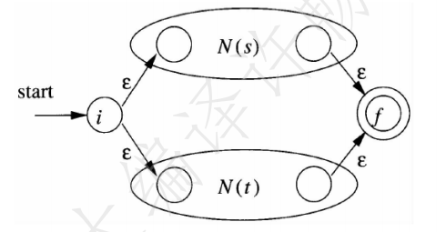
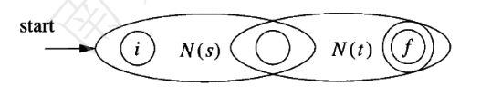
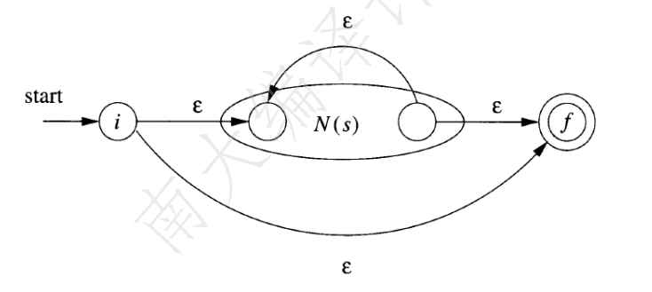
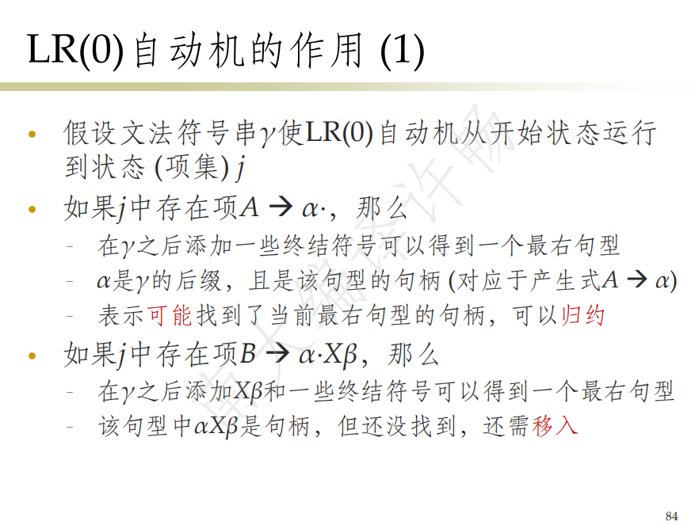
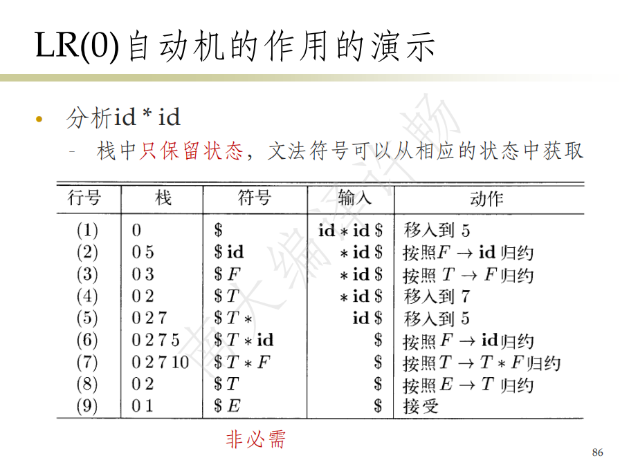
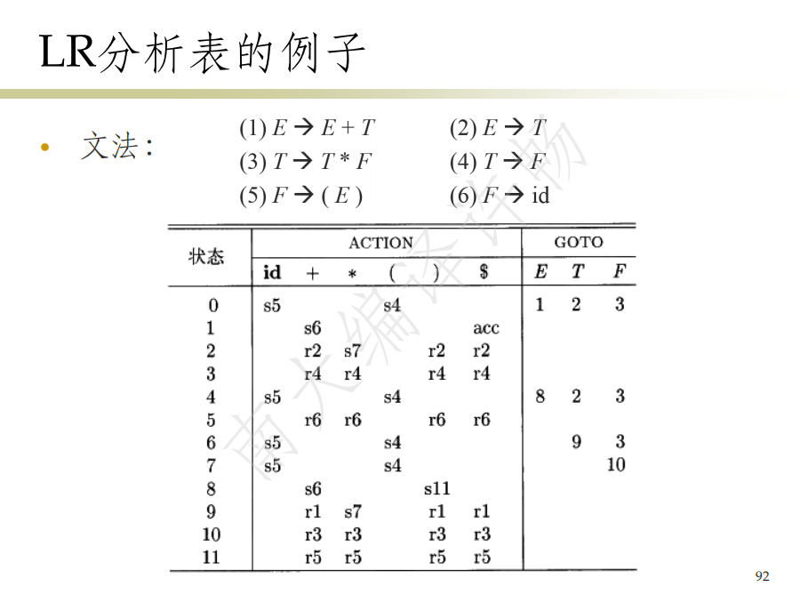
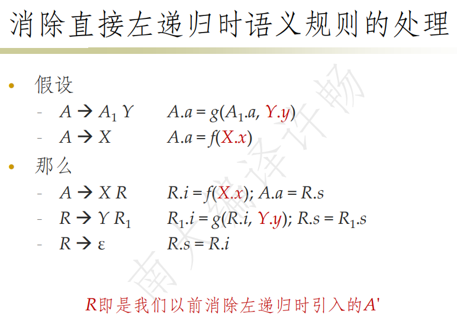
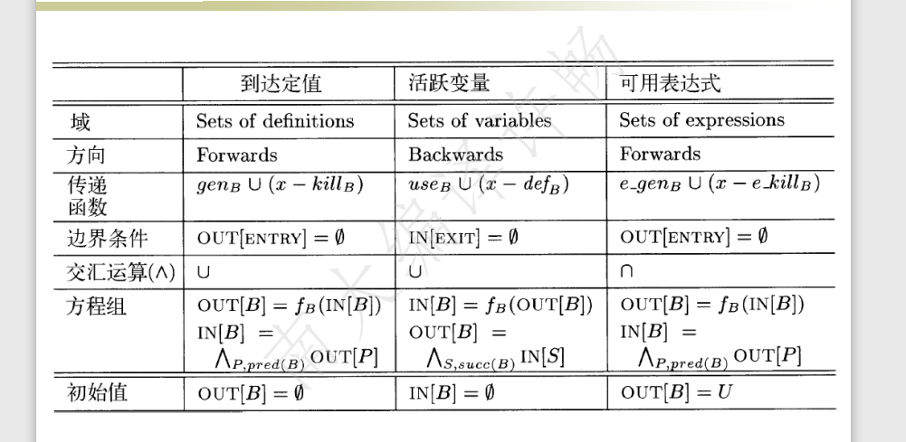

编译原理复习笔记

***

# ch1 概论

## 需要掌握的问题

1. 编译器编译程序的顺序
2. 环境与状态是什么
3. 编译和翻译的区别？代表是？

## 回答

### 1. 编译器编译程序的顺序

字符流=>|词法分析|=>符号流=>|语法分析|=>语法树=>|语义分析|=>语法树=>

|中间代码翻译|=>中间代码=>|中间代码优化|=>|机器代码生成|=>|机器代码优化|

### 2. 环境与状态是什么

环境：变量名到存储位置的映射

状态：存储位置和值的映射

### 3. 编译和翻译的区别？代表是？

编译：把源程序转换成可执行程序，代表C/C++

翻译：不生成可执行程序，直接根据语义执行，代表python

> java是编译和翻译的结合

# ch3 词法分析

## 需要掌握的问题

1. 词法单元、模式、词素的概念
2. 字母表、串、语言的概念
3. 语言4个运算：并、连接、kleene闭包、正闭包
4. 正则表达式的4个运算：选择、连接、闭包、括号；扩展运算+ ？ []
5. NFA 、DFA的定义
6. 正则到NFA的转换
7. NFA到DFA的转换
8. NFA的合并
9. 状态的区分、DFA状态数量最小化
10. 词法分析器的状态最小化
11. 下推自动机和有穷自动机

## 回答

### 6. 正则到NFA的转换

根据规则递归构造

基本：

start-->i--eps-->(f)

start-->i--a-->(f)

归纳：

* 选择 s | t：开两路，都eps

* 连接 s | t：

s的结尾f，拼t的开头i

* 闭包 s*

s的结尾f出一条eps边指向开头i，再新增i和f

### 7. NFA到DFA的转换

子集构造法：

eps-closure(s)：从s经一次或多次eps可到达的状态集合

eps-closure(T)：从T集合中的状态经一次或多次eps可到达的状态集合

move(T, a)：对于输入a，从T集合中的状态经一次a可到达的状态集合

算法：

1. 初始集合A = eps-closure(s0)，s0是NFA的开始状态
2. 计算 B = eps-closure(Move(A, a))，a是一个输入符号，得到 Dtran(A, a) = B
3. 计算 C = eps-closure(Move(B, a))，得到 Dtran(B, a) = C
4. ....
5. 直到计算不出新的状态集合，就算结束，根据 Dtran 表画出新的DFA，开始状态是NFA中包含s0的状态集合，接收状态是NFA中包含接受状态的状态集合

### 8. NFA的合并

NFA合并，就是新增一个开头i，然后出若干条eps边指向每个NFA的i

### 9. 状态的区分、DFA状态数量最小化

区分：DFA中的两个状态s1和s2，如果s1能通过一个输入符号a到达接收状态，而s2不能，那么就说a区分了s1和s2

DFA状态数量最小化：

1. eps区分了接受状态集合和非接收状态集合（1+1）
2. 再细分
3. 最后不可区分的状态集合合并为新状态

### 10. 词法分析器的状态最小化

和DFA类似，区别只在于，每个模式的接收状态是不一样的，所以初始划分为：所有模式的非接受状态集合+各个模式接收状态集合（1+x）

# ch4 语法分析

## 需要掌握的问题

1. 上下文无关文法（CFG）
2. BNF是啥
3. 自顶向下、自底向上语法分析器、LL，LR的概念和关系
4. 推导、推导序列、最左推导、最右推导、句型、句柄、句子
5. 正则表达式有穷自动机的缺陷，NFA到上下文无关文法的转换
6. 消除二义性if-else例子
7. 消除左递归
8. 预测分析法、提取左公因子
9. 递归下降分析+回溯
10. FIRST集和FOLLOW集的计算

## 回答

### 3. 自顶向下语法分析

自顶向下：从根节点创建，对应最左推导，每次把最左边的非终结符找到产生式

### 6. 消除二义性if-else例子

有二义性的if-else

stmt -> if expr then stmt 

| if expr then stmt else stmt

| other

消除二义性

stmt -> matched_stmt | open_stmt

matched_stmt -> if expr then matched_stmt else matched_stmt

| other

open_stmt -> if expr then stmt

| if expr then matched_stmt else open_stmt

### 7. 消除左递归

自顶向下的语法分析技术无法处理左递归，需要消除

自底向上的语法分析技术可以处理左递归

左递归形式 $A =>^{+} Aa$

立即左递归消除：

$A \rightarrow Aa_1 | A a_2 | ...| A a_m | b_1 | b_2 |...|b_n$

观察到匹配的句子是 b a*格式

那么改写为

$A \rightarrow b_1 A'| b_2A'|...|b_n A'$

$A' \rightarrow a_1A'|a_2A'|...|a_mA'|\epsilon$

注意最后的eps

通用消除左递归：给非终结符排个序，后面的符号中的前面符号全部展开，然后消除立即左递归

弊端：难以找到原文法和消除后文法的关联，语义分析困难

### 8. 预测分析法、提取左公因子

预测分析法：通过查看下一个输入符号，给最左边的非终结符选择一个产生式

> 在遇到相同前缀产生式时无能为力，所以需要提取左公因子

$A \rightarrow aA_1|aA_2|...|\gamma$

提取后

$A \rightarrow a B| \gamma$

$B \rightarrow A_1|A_2|...$

### 10. FIRST集和FOLLOW集的计算

FIRST(X)：

1. X是终结符，加入X
2. X是非终结符，且X->A1A2...An，加入FIRST(A1)，如果含有eps，再加入FIRST(A2)，如果再含有eps，继续加
3. 如果FIRST(Ai)全有eps，再加eps

FIRST(X1X2Xn)：

1. 加FIRST(X1)
2. 如果FIRST(X1)中含eps，加FIRST(X2)，...
3. 如果FIRST(Xi)全有eps，再加eps

FOLLOW(X)：

1. 如有产生式 $A \rightarrow aB\beta$，把FOLLOW($\beta$)加入FOLLOW(B)
2. 如有产生式 $A \rightarrow aB$，把FOLLOW(A)加入FOLLOW(B)
3. 如有产生式 $A \rightarrow aB\beta$，且FIRST($\beta$)中包含eps，把FOLLOW(A)加入FOLLOW(B)

要算FOLLOW集合是整体算

1. 把开始状态的FOLLOW集，FOLLOW(S)中添加右端终止符$
2. 迭代计算所有非终结符的FOLLOW，直到不再变化

### 11. LL(1)文法定义

对于任意两个产生式 A->a | b

1. FOLLOW(a) ∩ FOLLOW(b) = 空集
2. 若B可推导出eps，那么FOLLOW(A) 与 FISRT(a) 无交集

### 12. 预测分析表的构造，预测分析算法

输入：文法G，输出：预测分析表M

对于G中的每个产生式A->a

1. 对FIRST(a)中的每一个终结符x，M[A，x] 添加 A->a
2. 如果FIRST(a)中含有eps，那对于FOLLOW(A)中的每一个终结符x，M[A, x] 添加 A->a
3. 在所有空白条目中填error

> 如果预测分析表冲突了，那么说明这个文法是有二义性的，不是LL(1)的，LL(1)不可能存在二义性

预测分析算法：

1. 栈中初始为s$，栈顶符号为top，输入区初始为输入串w，指针ip指向符号a，已有预测表M[A, a]
2. 如果top是终结符且top = a，出栈，ip前移
3. 如果top是非终结符，选择M[top, a]里的右侧式子替换top
4. 其他均error
5. 等匹配完$栈空的时候就完事了

> 已匹配的部分+栈里的东西 = 一个最左句型

### 13. 自底向上语法分析、移入-归约算法、冲突

最右句型：AAAAaaa形式，左边全是非终结符，右边全是终结符

句柄：S =>* aAw => abw，则说A->b是一个句柄

> 在最右句型中，一个句柄的右边只有终结符

例如：

id1*id2，选用F->id归约，则id1是句柄

F*id2，选用T->F归约，则F是句柄

T*id2，选用F->id归约，则id2是句柄

T*F，选用E->T *F归约，则T * F是句柄

E

移入：从输入缓冲区里选择符号移入栈

归约：把栈顶的若干符号归约成产生式左边的非终结符

完成：最后归约成初始符号S

移入-归约冲突：不知道是否该移入

归约-归约冲突：不知道该选择哪个产生式进行归约

总结来说，搞一个LR语法分析，文法G，增广为G'，求G‘的项集规范族，然后求FOLLOW(A), GOTO(Ii, A), 自动机，然后求SLR语法分析表，然后用算法去算。

### 14. SLR、LR

LR(k)的含义：L是最左扫描，R是反向构造最右推导，k是最多往前看k个符号，通常k<=1有意义

LR(k)比LL(k)能分析的文法更多、由表格驱动

### 15. 项集、增广文法、项集闭包、GOTO函数

项集：产生式+产生式右边某处放一个点

增广文法：新增S' -> S产生式

项集闭包CLOSURE(I)：

1. I本身
2. 比如S->A·Br的闭包，就包含把B的产生式B->·b添加进去，然后迭代算

GOTO(I, X) ：I是项集，X是终结符或非终结符，把I中所有的 S->A·XB 都换成 S->AX·B，然后求项集闭包

LR(0)自动机

。

。

LR(0)自动机有ACTION和GOTO两个功能

归约过程：栈里存的是项集（也称状态），设栈顶状态s，有一个输入缓冲区，当前输入为a
* 栈中初始状态为 S'->S 的闭包对应项集编号

* 每次看ACTION(s, a)
  * 如果是移入，就移入栈
  * 如果是归约，那就归约栈顶的若干符号为一个符号，然后用把露出来的栈顶i，push上 GOTO(i, a)为新的栈顶
  * 如果是接受，那就结束

### 16. SLR分析表的构造，如何得到ACTION和GOTO表

1. 状态i中，如果有 S-> A·aB，且$GOTO(I_i, a) = I_j$，则 ACTION(i, a) = 移入j
2. 状态i中，如果有 S-> a· ，那么对于FOLLOW(S)中的所有x，ACTION(i, x) = 按S->a归约
3. 状态i中，如果有 S' -> S，ACTION(i, $) = 接受
4. $GOTO(I_i, a) = I_j$，那么GOTO表里的 GOTO(i, a) = j

如果分析表不冲突，那么该文法就是SLR的，可能考一个判断是否为SLR文法？

### 17. 规范LR方法（LR(1)项集）、向前看LR方法（LALR方法）

LR(1)项集格式 [A->a·b, x] 含义是如果将来要按 A->ab归约，那么下一个符号必须是x

### 18. 二义性文法

### 19. 预测分析中的错误恢复：恐慌模式/短语层次的恢复

# ch5 语法制导的翻译

## 需要掌握的问题

1. SDD和SDT的概念

## 回答

### 1. SDD和SDT的概念

SDD：语法制导的定义

属性文法：没有副作用的SDD

S属性SDD：只包含综合属性的SDD

### 2. 消除左递归时语义规则的处理

# ch6 中间代码生成

## 需要掌握的问题

1. 三元式、四元式、间接三元式、静态单赋值
2. 类型表达式
3. bool表达式的回填技术

