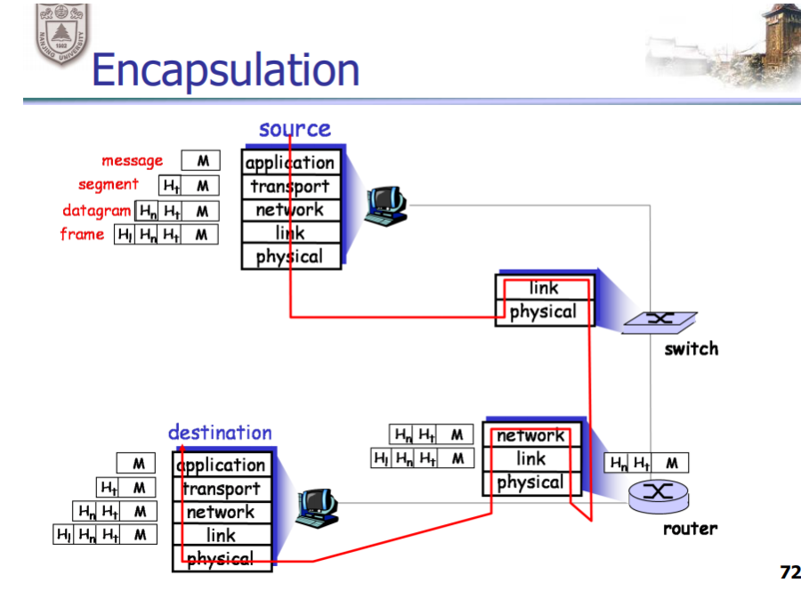
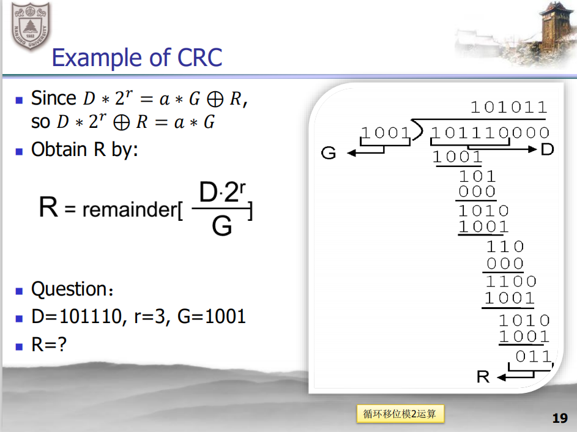
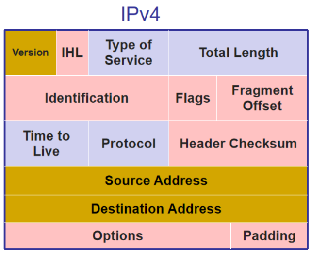
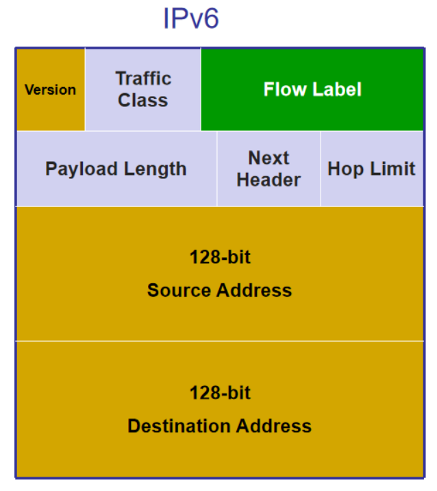
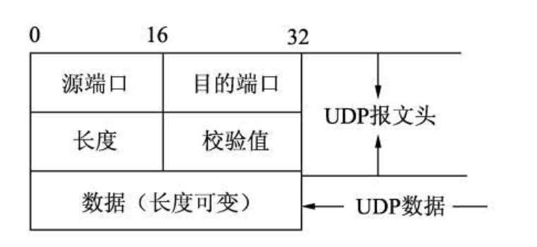
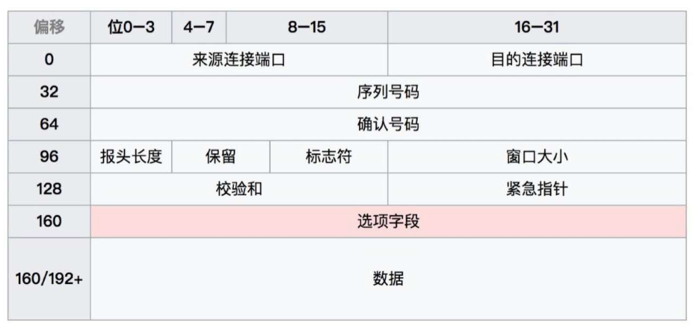

计网讲课笔记

---

# ch1 概论

## 需要掌握的问题

1. Internet是什么？由什么组成？
2. 网络边缘是什么？
3. 接入网络是什么？
4. 网络核心是什么？
5. 电路交换、分组交换、虚电路是怎么运作的？
6. 为什么需要多层协议体系结构？（分层的好处）
7. OSI七层模型是哪七层？每一层的功能是什么？
8. TCP/IP模型是哪五层、每一层的功能是什么？
9. 七层和五层的对应关系是什么样的？
10. 网络核心是如何传输数据的（网络核心的两大功能）
11. 电子邮件用到的应用层协议名称
12. 传输时延、传播时延、排队时延、处理时延是什么？

## 回答

### 1. Internet是什么？由什么组成？

因特网是许多小网络相互连接而成，小网络中包含终端、路由器、网络传输介质

三大组成：网络边缘、接入网络、网络核心

### 2. 网络边缘是什么？

终端，比如手机、笔记本、智能手环、智能家电等等

### 3. 接入网络是什么？

物理传输介质，比如双绞线、光纤

无线链路

### 4. 网络核心是什么？

路由器（这里的路由器不是单单指家里的那个路由器，他是具备转发和路由功能的机器的统称）

### 5. 电路交换、分组交换、虚电路是怎么运作的？

电路交换：类似于老电话，你告诉接线员你想打哪个号码，接线员给你接上去，建立专用电路，期间一直霸占专用电路，结束时拆除专用电路。实现简单，保证报文有序到达

* 优点：数据传输路径可以预测、传输简单迅速

* 缺点：电路建立和拆除时操作复杂、用户数量扩展性差、中间交换机挂了的话电路交换也会挂

分组交换：不建立专用电路，把长报文切成小块（分组），每个分组都记录源地址、目标地址、在长报文中的编号，然后逐个发出去。由于每个分组走的路不一定相同，所以需要处理达到报文乱序的问题、丢包问题、排队问题

* 优点：有效利用了网络资源、实现简单
* 缺点：无法预测传输路径、需要缓冲区、需要拥塞控制

虚电路：还是发小块（分组），但是路由的路径预先确定好，需要建立虚电路-通信-拆除虚电路，期间不会霸占线路

* 优点：数据传输路径可以预测、有效利用网络资源
* 缺点：服务价格贵（因为实现复杂）、需要缓冲区

### 6. 为什么需要多层协议体系结构？（分层的好处）

为上层屏蔽下层的细节，更专心上层的功能实现

每一层在更新自己的时候，只需要保持对上和对下的接口不变，提供的服务不变即可，不需要改动整体架构

### 7. OSI七层模型是哪七层？每一层的功能是什么？

OSI七层从下到上分别是：物理层、数据链路层、网络层、传输层、会话层、表示层、应用层

每一层都负责提供给上层更强一点的功能

物理层：按比特传数据，可能发生错误，常用介质是光纤、双绞线

* 宏观上是光纤的两端在通信

数据链路层：按帧（帧就是有格式的比特串）传数据，可以保证帧传出去和接到的是一样的，没有比特错误

* 宏观上是两台有MAC地址的交换机在通信

网络层：**尽力**让数据包（数据包就是头部信息+链路层的帧）到达目的地

* 宏观上是两台有IP地址的计算机在通信

传输层：**保证**让传输层的包（头部信息+数据包）到达目的地

* 一台计算机上的一个进程，和另一台计算机上的一个进程的通信，标识符是进程的端口号

会话层、表示层、应用层：通过前面4层发送数据，从而实现交流

*示意图：应用层的信息M是如何一层层封装，传到另一台计算机，再一层层解封装的*

### 8、TCP/IP模型是哪五层、每一层的功能是什么？

物理层、数据链路层、网络层、传输层、应用层

### 9. 七层和五层的对应关系是什么样的？

七层里的上三层（会话层，表示层，应用层）合并为应用层

### 10. 网络核心是如何传输数据的（网络核心的两大功能）

路由和转发

路由：选择下一跳应该发往哪个router

转发：把数据从router的入口发往路由器的出口

### 11. 电子邮件用到的应用层协议名称

SMTP、MINE、POP、IMAP

### 12. 发送时延/传输时延、传播时延、排队时延、处理时延是什么？

发送时延/传输时延：英文transmission delay，指主机/路由器把一个数据帧放到信道上所花的时间

* 发送时延 = 数据帧长度（b） / 信道带宽（b/s）

传播时延：英文propagation delay，指的是信道长度 / 介质的速率。

* 传播时延 = 信道长度（m） / 电磁波在信道上的传播速率（m/s）

排队时延：数据帧到达路由器的时候，会进入输入队列等待，在路由器确定转发出口后，还要进入输出队列等待

处理时延：主机或路由器收到分组时会花时间处理，比如插入输入队列、决定走哪个出口出去、解析分组内容等

# ch2 数据链路层

## 需要掌握的问题

传输和流量控制

1. 单工、半双工、全双工是什么？
2. 停等协议（stop-and-wait）是怎么运作的？
3. 滑动窗口（sliding window）中，发送方的窗口左边界会在什么时候更新？接收方的窗口左边界会在什么时候更新？
4. 滑动窗口中，接收方向发送方发送ACK的时候，ACK的值是什么？

***

检测和纠正比特错误

1. 二维的奇偶校验（Parity Checking）的行parity bit和列parity bit是怎么计算的，以及怎么纠错的？
2. CRC校验，给定D=101110，r=3，G=1001，要求计算校验码R

***

链路层的包

1. HDLC的flag字段的组成，发送方如何预处理包以避免和flag重复？接收方如何恢复包里的内容？

令牌环

1. 拿到令牌时，如果没有要发送的数据包，做什么？如果有要发送的数据包，做什么？

***

以太网

1. 以太网的速率在多少到多少之间？
2. 时分复用，频分复用，码分复用
3. 时隙ALOHA工作过程，工作效率
4. 纯ALOHA工作过程，工作效率
6. CSMA/CD工作过程，工作效率
7. 什么是二进制指数后退算法

***

交换机

1. spanning-tree算法
2. 交换机的转发和过滤过程
3. 交换机的自学习过程

***

无线链路

1. CSMA/CA 协议的工作过程
2. 为什么CSMA/CD 在无线环境中不适用

## 回答

传输和流量控制

### 1. 单工、半双工、全双工是什么？

单工：只能由发送方往接收方发消息

半双工：双方可以互发消息，但同一时间只能有一方的消息在载体上传输

全双工：双方可以互发消息，可以同时发送消息和接收消息

### 2. 停等协议（stop-and-wait）是怎么运作的？

发送方：发包，然后等待

接受方：收到包后回复ACK

发送方：收到ACK后再发下一个包

### 3. 滑动窗口（sliding window）中，发送方的窗口左边界会在什么时候更新？接收方的窗口左边界会在什么时候更新？

发送方的窗口更新：发送包时更新、收到NAK的时候重传

接收方的窗口更新：收到包时更新

### 4. 滑动窗口中，接收方向发送方发送ACK的时候，ACK的值是什么？

期望收到的下一个包编号（比如已接收0、1、2号包，那么下一个期望接受3号包）

***

检测和纠正比特错误

### 1. 二维的奇偶校验（Parity Checking）的行parity bit和列parity bit是怎么计算的，以及怎么纠错的？

如果是奇校验，数一数一行有n个1，如果n是奇数，校验位取1，如果n是偶数，校验位取0

纠错：根据行列确定是哪个点出问题了，然后取反即可

### 2. CRC校验，给定D=101110，r=3，G=1001，要求计算校验码R

***

链路层的包

### 1. HDLC的flag字段的组成，发送方如何预处理包以避免和flag重复？接收方如何恢复包里的内容？

01111110

发送方避免：发送方每读到连续5个1，就插入一个0

接收方恢复：每读到连续5个1，看下一位或两位，如果是0，那就删掉这个0；如果是10，就认为是分隔标志

msg = 1111110

handle_msg = 11111010

send = 01111110  11111010  01111110

***

令牌环

### 1. 拿到令牌时，如果没有要发送的数据包，做什么？如果有要发送的数据包，做什么？

没有要发：把令牌给下一个主机

有要发：发送数据包，把令牌给下一个主机

***

以太网

### 1. 以太网的速率在多少到多少之间？

10Mbps~10Gbps

### 2. 时分复用，频分复用，码分复用

时分复用：把时间切成片，每个主机占用不同的时间片。需要同步时间

频分复用：把频率分段，不同频段的包互不干扰。需要额外硬件

码分复用：每个发送端有各自的chipping sequence，用来编码原始信息，接收端用发送端的chipping sequence给接收到的信息做内积，可以求出原始信息。增大了信息量

### 3. 纯ALOHA工作过程，工作效率

发送端：有包就立刻发

接收端：收到包，确认完整性，完整则回复ACK，不完整则回复NAK

发送端：如果没收到ACK，以概率p立刻重发，以概率1-p 隔一个帧发送出去的时间 后重发

效率最大值 $\frac{1}{2e}$

### 4. 时隙ALOHA工作过程，工作效率

发送端：如果有包，则在下一个时隙开始时发送

接收端：收到包，确认完整性，完整则回复ACK，不完整则回复NAK

发送端：如果有碰撞，则会在发送的这个时隙检测到碰撞，然后以p的概率在之后的每个时隙重传，直到无碰撞发出去

效率最大值 $\frac{1}{e}$

### 5. CSMA/CD工作过程，工作效率

发送端：有包要发前先侦听信道，空闲则发送，

如果发送后检测到碰撞，则立刻停止发送，

然后用二进制指数后退算法选择重发的时间，

如果失败次数在10~16次之间，二进制指数后退中的n一直保持10，

如果失败次数超过16次，放弃发送。

### 6. 什么是二进制指数后退算法

失败次数为n，那本次在 $0$\~$2^n-1$ 中，等概率选择一个数x，经过x个【一个帧端到端往返一趟所需时间】后，重发这个包。

***

交换机

### 1. spanning-tree算法

1. 选定根节点root
2. 计算根节点到其他节点的最短路，只保留最短路，其他链路不使用

主要解决洪泛问题

### 2. 交换机的转发和过滤过程

一个包到来时，到来接口号x

1. 如果目的地址在表里，转发接口为y
   * 如果x=y，丢弃这个包
   * 如果x != y，转发到y接口上
2. 如果目的地址不在表里，转发到除了x以外的所有接口上

### 3. 交换机的自学习过程

1. 表初始为空
2. 对于每个接口进来的帧，把[源地址，接口号，当前时间]存入表
3. 经过老化时间后，删除对应表项

***

无线链路

### 1. CSMA/CA 协议的工作过程

当有包要发时

1. 如果初始监听到信道空闲，则等待分布式帧间间隔后发送该包
2. 否则选择一个随机回退值，然后继续监听信道，如果空闲则递减该值，如果忙碌则保持该值不变
3. 当计数值减小到0时，发送包
4. 如果收到确认，就ok了，下次再发包时从第2步开始执行协议；如果没收到确认，回到第2步执行协议，并且选择一个更大的回退值

### 2. 为什么CSMA/CD 在无线环境中不适用

1. CSMA/CD协议要求发送后不断侦听信道，但无线环境要实现这个花费很大
2. 即使发送时检测到信道空闲，由于无线电波可以向各个方向传播，在接收端仍可能碰撞冲突
3. 无线信号强度范围波动大，冲突检测困难

# ch3 分组交换网络

## 需要掌握的问题

1. 路由器的两大功能
2. 路由器的内部结构
3. IPv4数据包格式，IPv6数据包格式，两者中有哪些字段是类似的
4. 链路状态路由选择算法（LS）
5. 距离向量路由选择算法（DV）
6. 毒性逆转是什么
7. RIP，OSPF，BGP的功能
8. 多播路由算法，组共享的树和基于源的树的区别

## 回答
### 1. 路由器的两大功能

转发和路由

### 2. 路由器的内部结构

输入端口-交换结构-输出端口

### 3. IPv4数据包格式，IPv6数据包格式，两者中有哪些字段是类似的

.

version相同

toc 和 traffic class 都表示服务类型

ttl 和 hop limit 相同

protocol 和 next header 相同

total length 和 payload length 相似，一个表示整个包长度，一个表示数据部分长度

source address 和 destination address 相同（除了长度不同）

### 4. 链路状态路由选择算法（LS）

本质是dijkstra算法

### 5. 距离向量路由选择算法（DV）

链路状态变化时，向邻居传递自己到其他节点的路由信息

### 6. 毒性逆转是什么

假如A经由B到达C且B是第一跳，那么A在DV算法中告诉B：A到C的距离是正无穷

### 7. RIP，OSPF，BGP的功能

域内路由

* RIP：底层是DV算法
* OSPF：底层是LS算法

域间路由：

* eBGP：AS的边际路由器之间互相通知对方，自己到达某个网段的cost
* iBGP：边际路由器学习到了之后，通知给AS内的路由器

### 8. 多播路由算法，组共享的树和基于源的树的区别

用单播模拟多播：1个发送方和n个接收方，用n次单播模拟多播

组共享的树：m个发送方和n个接收方，共享一棵树，包通过树来发给接收方

基于源的树：m个发送方和n个接收方，一共m棵树

# ch4 传输层

## 需要掌握的问题

1. UDP包格式
2. UDP和TCP的区别
3. TCP包格式
4. TCP的SampleRTT、EstimatedRTT、DevRTT、TimeInterval的计算
5. TCP可靠数据传输原理、计时器
6. TCP三次握手和四次挥手
7. TCP拥塞控制的做法，Reno和Tahoe的区别
8. TCP平均吞吐量

## 回答

### 1. UDP包格式

### 2. UDP和TCP的区别

UDP：

* 无需建立连接、无连接状态
* 尽力而为，不保证送达，也不保证正确性，也没有拥塞控制
* 可能会被防火墙挡

TCP：

* 需要建立连接、保持连接状态、关闭连接
* 保证送达、保证正确性、有拥塞控制
* 通常不会被防火墙挡

### 3. TCP包格式

### 4. TCP的SampleRTT、EstimatedRTT、DevRTT、TimeInterval的计算

$EsitimatedRTT = (1-a)EstimatedRTT + a SampelRTT$

$DevRTT = (1-\beta)DevRTT+\beta |EstimatedRTT - SampleRTT|$

$TimeInterval = EstimatedRTT + 4DevRTT$

### 5. TCP可靠数据传输原理、计时器

发送方：

1. 有新包要发，且计时器处于运行状态的话，启动计时器，发包
2. 如果计时器超时，重传最小的未被确认的包，然后启动计时器
3. 收到ACK，看ACK的值和已被确认的最大序号，如果ACK>Base，更新Base=ACK，如果还有已发送但未被确认的包，启动计时器

### 6. TCP三次握手和四次挥手

三次握手：

1. 客户->服务器：SYN = 1，Seq = client_init_seq，len = 1
2. 服务器->客户：SYN = 1，Seq = server_init_seq，ack = client_init_seq+1，len = 1
3. 客户->服务器：SYN = 0，seq = client_init_seq+1，ack = server_init_seq+1

四次挥手：

1. 客户->服务器：FIN = 1，客户以后不再发送应用数据
2. 服务器->客户：ACK = 1，还有应用数据要发送给客户
3. 服务器->客户：FIN = 1，服务器以后不再发送应用数据
4. 客户->服务器：ACK = 1，客户定时等待后关闭TCP，服务器收到这个包后关闭连接

### 7. TCP拥塞控制的做法，Reno和Tahoe的区别

Reno是带快速恢复的，触发条件是收到3个冗余ack

Tahoe是不带快速恢复的，收到3个冗余ack会进入慢启动

慢启动：cwnd从0开始，每收到一个ack就把cwnd加1，直到

* cwnd>=ssthresh，就cwnd = ssthresh，进入拥塞避免
* 遇到3个冗余ack，ssthresh = cwnd/2，cwnd = ssthresh+3，进入快速恢复
* 超时，ssthresh = cwnd/2，cwnd = 1，重新慢启动

拥塞避免：每收到一个ack就把cwnd增加$\frac{1}{cwnd}$，一个RTT后cwnd的增量就是1，直到

* 遇到3个冗余ack，ssthresh = cwnd/2，cwnd = ssthresh+3，进入快速恢复
* 超时，ssthresh = cwnd/2，cwnd = 1，重新慢启动

快速恢复：

* 继续收到冗余ack，cwnd = cwnd + 1，保持快速恢复
* 收到非冗余的ack，cwnd = ssthresh，进入拥塞避免

### 8. TCP平均吞吐量 

一条连接的平均吞吐量为 $\frac{0.75\times W}{RTT}$，W是cwnd能达到的最大值

计算方法是，拥塞避免从发生3个冗余ack之前，cwnd=W，3个冗余ack之后，cwnd降为W/2，然后每个RTT内增加1，平均吞吐量即为 $\frac{\frac{(W+ \frac{W}{2})}{2}} {RTT}$

# ch5 网络安全

## 需要掌握的问题

1. 凯撒密码
2. 改进的凯撒密码
3. 块密码的输入、输出、映射的数量
4. 对称加密块密码算法有哪些 AES DES
5. RSA的公私钥的生成、加密解密过程
6. MAC的过程
7. 数字签名的过程，提高效率的方法
8. 端点鉴别，CA
9. 安全电子邮件
10. SSL握手、挥手的过程、每一步的合理性

## 回答

### 1. 凯撒密码

发送方和接收方共享数字k

发送方加密时，对字母m，加密为m后的第k个字母

接收方解密时，对字母e，解密为e前的第k个字母

### 2. 改进的凯撒密码

发送方和接收方共享数字序列 k1, k2, k3..., kp

发送方加密时，对第1个字母用凯撒(k1)加密，第2个字母用凯撒(k2)加密，....

接收方同理

### 3. 块密码的输入、输出、映射的数量

k-块密码：把文本切成若干块，每块k个比特

一个块的输入就有$2^k$种，输出也有 $2^k$ 种，从输入到输出的映射有 $2^k !$ 种

### 4. 对称加密块密码算法有哪些？

AES, DES, 3DES

### 5. RSA的公私钥的生成、加密解密过程

选取素数pq

计算 n = pq

计算 z = (p-1)(q-1)

选取e，满足 e < z，e和z互素

选取d，满足 ed mod z = 1

得到私钥(n, e)，公钥(n, d)

加密：明文m，私钥e，密文 = m^e mod n

解密：密文c，公钥d，明文 = c^d mod n

>  注意：假定需要加密的东西表示成数字是m，那么选取大素数pq的时候，需要满足 pq>m，否则在解密时对n取模后一定恢复不了m

### 6. MAC的过程

发送方有报文m，双方共享秘密s，发送方将m和Hash(m+s)拼接后发给接收方

缺点是双方需要事先共享秘密s，如果有n个人两两进行MAC，那么需要$\frac{n(n+1)}{2}$个共享秘密s

### 7. 数字签名的过程，提高效率的方法

数字签名是为了证明这份文件是我签署的，所以需要给文件打上我独有的标记，即私钥

假定你持有原文m和我签名后的文件c，然后你用我的公钥去解密，得到K+(c)

* 假如c是我签名的，那么c=K-(m)，你就会发现K+(K-(c))和原文m一致，那么就证明了这份文件m是我签署的
* 假如c不是我签名的，那么K+(K-(c))与m不同，那么说明m不是我签名的

提高效率的原因：公私钥加密计算量大，算的慢

提高效率：我只需要对Hash(m)进行签名即可，计算量大大降低

### 8. 端点鉴别，CA

端点鉴别：判断和我通话的人的身份，几种攻击和鉴别协议1.0~4.0看书

CA：认证中心，会给认证过的人发放证书

证书：设认证中心的私钥是$K_{CA}^-$，被认证人的公钥是$K_{Bob}^+$，那么证书里的主要东西就是 $K_{CA}^-(K_{Bob}^+)$

### 9. 安全电子邮件

需求：报文安全性，报文完整性，发送方鉴别，效率

发送方：

* 对报文 $m$ 计算哈希，$H(m)$，再用自己的私钥加密，$K_{A}^-(H(m))$，这里提高了效率（$H(m)$ 比 $m$ 短多了）
* 将$m$ 和 $K_{A}^-(H(m))$ 拼接，这里是完整性和发送方鉴别
* 然后将拼接结果用对称密钥$K_s$加密，这里提高了效率（对称加密比非对称加密快多了）
* 对称密钥$Ks$用接收方的公钥加密，拼接第3步结果，发给接收方，这里是安全性

画图结果看书p466

### 10. SSL握手、挥手的过程、每一步的合理性

SSL握手

1. client hello：客户端向服务器发自己支持的算法列表，包括对称、非对称、MAC，以及客户端不重数
2. server hello：服务器向客户端发自己选择的算法，服务器证书，服务器不重数
3. 客户端验证了服务器证书后，生成PMS，用服务器公钥加密PMS，发给服务器
4. 服务器和客户端此时均拥有PMS、双方的不重数，然后将PMS分割成4部分，分别为$E_A, E_B, M_A, M_B$
   * $E_A$ ：Alice（客户）向Bob（服务器）发送消息时的对称密钥
   * $E_B$ ：Bob（服务器）向Alice（客户端）发送消息时的对称密钥
   * $M_A$：Alice（客户）向Bob（服务器）发送消息时的MAC密钥
   * $M_B$ ：Bob（服务器）向Alice（客户端）发送消息时的MAC密钥

5. client handshake message：客户端向服务器发送 客户端发的和收到的所有报文 的一个MAC
6. server handshake message：服务器向客户端发送 服务器发的和收到的所有报文 的一个MAC

SSL挥手：

1. 想结束的人发一条SSL报文，其中SSL报文的类型字段设置为终止会话
2. 这样可以防止中间人用TCP FIN来断开SSL连接

SSL记录格式：

类型 | 版本 | 长度 | 数据 | MAC

> 其中，MAC里包含了 数据、SSL序号、类型

> 数据和MAC都被 $E_A$ 或者 $E_B$ 加密了