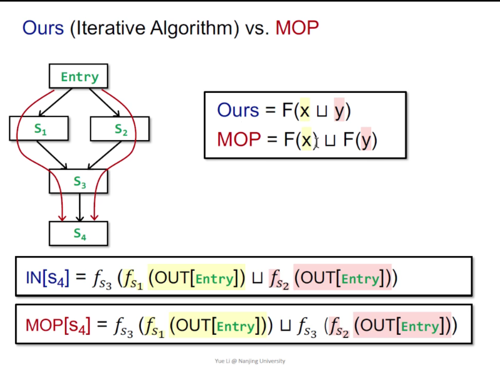
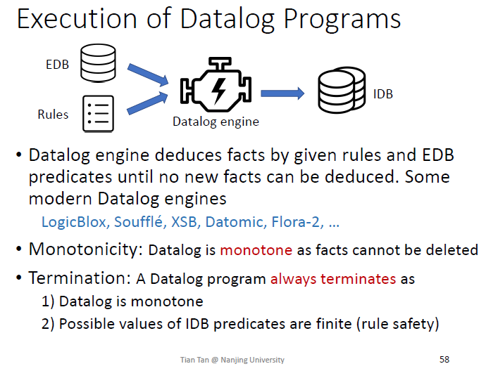
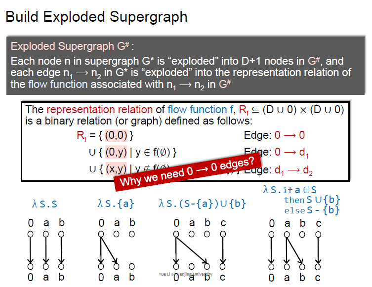
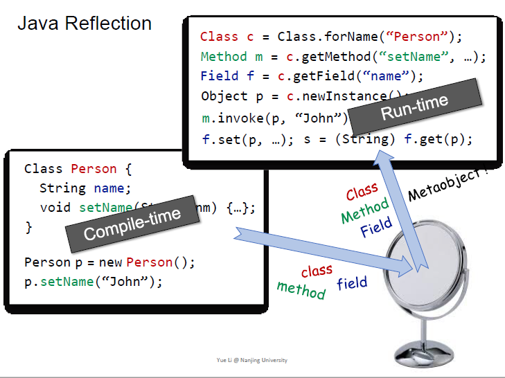

软件分析笔记

50实验，50理论考试（英文考试，作答中英都可以）

# class-1

网课（b站）听过了就可以不用听了

主讲的是静态分析，static program analysis

Programming Language，简称PL，在liyue看来可以分为三个部分

- 理论：语法，语义，...
- 环境：编译器，运行环境，...
- 应用：程序分析，程序验证，程序合成，...

虽然语言很多，但是从2000年开始，语言的核心，就没有变过了（这意味着理论和环境变化很少，变化多的是应用）

语言分为三种范式

- 命令式语言：有时序，和状态修改
- 函数式编程语言：弱化了时序和状态修改。函数作为变量，表达式求值，lambda演算
  - 由于弱化了时序，很难出现并发错误，多用于金融系统
- 逻辑式编程语言：mysql，datalog等，基于谓词演算逻辑，主要用于处理大数据

静态分析能干哪些事？

- 程序可靠性：在运行前（称为静态期，编译期）检测出空指针引用，内存泄漏等
- 程序安全：隐私保护，注入攻击等
- 编译优化：死代码消除，代码转移等
- 程序理解：IDE的类调用图，类型提示

不要浮躁

认识自己

重拾自信

---

Rice's Theorem：recursively&enumerable的语言（re语言，是图灵机可识别的语言）的non-trival properties（理解为运行时行为）不存在完美的（sound&complete）程序分析

解释一下，程序有5个bug，sound就是我说这程序有10个bug，保证5个都包含，即误报。complete就是我说这程序有2个bug，这俩都在那5个里，即漏报。

现实世界里，大部分程序分析都在妥协sound，即允许误报，不允许漏报。

-

1和2的分析都是sound的，正确的。

静态分析：在保证（接近）soundness时，在精度和开销大之间做平衡

静态分析的大框架：分为两步走

1. 抽象 abstraction
2. 过近似 over-approximation
   - transfer function
   - control flows

以“预测一个程序中所有变量的正负性”这个目标展开的静态分析为例：

abstraction: 给每个变量定义正，负，0，不确定，未定义这5种类型

transfer function：规定正+正＝正，正+负=不确定等

control flow：将控制流图里的汇聚点找出，确定每个汇聚点的变量是什么符号

---

实验任务安排如上

---

本节课的重点

TODO：回答上述问题

1. 运行前vs运行时
2. 那个圈圈图
3. 误报是允许的，但漏报就会导致错误
4. +-0，确定符号的例子回顾

# class-2

讲中间表示 intermediate representation

4种文法分类（由强到弱，开销也由大到小）：图灵机，上下文相关文法，上下文无关文法，正则表达式

## AST vs. 3AC

为什么静态分析不用AST，而是用三地址码IR呢？

AST

- 比较high-level，近似语法结构
- 和语言相关
- 对type检查很快
- 缺乏控制流信息

3-Address Code（3AC）

- 比较low-level，接近机器码
- 和语言无关
- 缺乏类型信息，简单
- 看得出来控制流信息

-

对java中的一些解释

## SSA

Static Single Assignment（SSA）静态单赋值

- 一个变量只会有一个定义

为了解决分支造成的变量值不确定，引入了phi-function

SSA好处：流的信息进入变量名、def-use清晰

SSA坏处：引入很多变量和phi函数，生成机器码时候不高效

## Control Flow Analysis

为了看的更清楚，把3AC画成CFG

CGF中的node都都是Basic Block（BB）

-

Basic Block定义

- 最大的，满足如下条件的连续语句
  	1. 只有一个入口
   	2. 只有一个出口

## Basic Block

BB切分算法：

入口（leader）：

1. 第一条指令
2. 跳转语句的target
3. 跳转语句的下一条指令

出口：不用管了，leader之间夹着就足以确定BB了

如何添加边（edge）：

1. A到B有跳转关系
2. B在A下面顺序执行，且A的最后一句不是无条件goto

goto i号语句，可以改成goto Bi基本块，这样清晰且不用考虑语句i的编号增加

给CFG添加entry和exit

--

今日重点

-

需要掌握

1. 为什么IR比AST更常用？IR更简单，语言无关，有控制流信息
2. BB的定义，划分算法，如何添边
3. CFG（并不是非要由BB组成）是怎么画出来的
4. 开篇的那张关于词法分析，语法分析，语义分析，IR。。。的图

# class-3

may analysis：分析的结果可能是对的（over-approximation），漏报会出问题

must analysis：分析的结果一定是对的（under-approximation）漏报没关系，顶多是少优化一点

前向分析和后向分析

前向分析时，OUT[B]是算出来的，IN[B]是B的前驱的OUT们简单meet出来的

后向分析时，反的

-

数据流分析不考虑：函数调用，别名

-

## Reaching Definition

是forward analysis和may analysis

definition定义：

用途：检测undefined variables（在程序entry处给所有变量一个undefine的定义，然后检测是否reaching到变量被使用的地方，如果reaching，就说明未定义就使用啦）

求reaching definition的迭代算法

Q：为什么要区分entry和B\entry？因为这种迭代算法是一个模板，虽然在这个例子里都是初始化为空，但别的算法里未必。

Q：为什么初始化为空？想象在程序entry的地方，什么definition都没有。

Q：为什么迭代算法能停？

观察发现，gen和kill是不变的如果IN不变，那么OUT也不会变

OUT[S] = gen U (IN[S] - kill)

当更多的fact进入IN时，多出来的1有可能被kill，也可能保留下来

所以OUT永远不会shrink，只有0->1，1->1

而fact的次数是有限的，所以能停

Q：为什么OUT不再改变，算法就可以停了，结果就是精准的最后的结果呢？

这个和程序的单调性有关，达到不动点（后续讲）

# class-4

## Live Variables Analysis

v在给定的程序点P之后一直到exit，是不是还有被用到，且路上没有再次被定义

他是一个backward analysis（后向更加简洁直接，不代表前向无法做到哈）

考虑定义，一个变量将来是否可能被用到，假如有多条路径，即使有的路我不跑过去，我也是全部考虑，所以是may analysis

给定OUT求IN，OUT很好做，OUT=U(In of successors)，如何定义transfer function呢？

注意情况4，看似v被改了，但是首先v先被v-1用到了，所以我们先去除redefine的，然后加上use的

。下面看算法

以后讲为什么是初始化为空0000000（一般，may analysis都是空，must analysis都是1111111）

## Available Expressions Analysis

是一个forward，must analysis

一个表达式x op y在给定程序点P是可用的，如果满足1，从entry到P的**所有**路径都要求值x op y，在最后一次x op y算完之后，不能对x和y进行重定义

有几个表达式就有几个0/1

怎么考虑gen和kill呢？

kill的是IN里含有被redefine的表达式

gen的是BB里的x op y

-

这是一个反直觉的例子，看起来x被改了，但是根据定义，e^16 * x确实在两次last计算后都没有改x，所以在c这一句之前的程序点，表达式是可用的

有人可能会问：哎，那我使用这个表达式的时候x的值在ab处不一样呀。如下，就行了

-

merge怎么考虑呢？注意是一个must analysis，要用**与**操作

-

算法如下

U代表1111111（TOP）

理论课会讲这和不动点有关，直观的想就是，因为用了“与”，如果初始化为0000，那没机会变1了

-

## analysis comparison of the 3

transfer function中，available exp之所以也可以这么写，是因为所谓的IN和OUT是可以反一反的

-

本课重点

# class-5

讲数据流分析的数学基础

迭代算法的遍历是在格上爬升？抵达不动点？单调性？可分配性？

事后复习可看ppt第8部分，一图流

-

换一种视角看迭代算法

Xi = F(Xi)，说明Xi是F的一个不动点

-

3个general的问题：

- 迭代算法模板一定能停吗？
- 不动点是唯一不动点吗？如果不是的话，我们的不动点是最好的结果吗？
- 什么时候能抵达不动点？

-

回顾一下

## 离散背景

### 偏序集（<=代表一种二元关系，自定义）

- 自反性：x <= x
- 反对称性：x<=y ^ y<=x => x=y
- 传递性：x <=y, y<=z  => x<=z

-

偏序偏在哪？两个元素之间不一定可比

-

### 上界和下界

注意，P是幂集，上界不一定要在S中，在大的P中即可，如下图

-

下面定义最小上界，least upper bound，简称lub，或者join

最大下界，greatest lower bound，glb，或者meet

-

-

注意，当S只有两个元素是，join就像交，meet就像并

-

一些重要性质：

不是每个偏序集都有lub或者glb

如果偏序集有lub和glb，那么一定是唯一的

-

### 格，lattice

如果偏序集poset，中的任意两个元素同时有lub和glb，那么就是格

example1，整数，<=，是的

example2，一些字符串，子串关系，不一定嗷

example3，abc的幂集，子集关系，是的

-

### 半格，semilattice

相当于格的一半，如果偏序集poset，中的任意两个元素

如果只有lub存在，就是join semilattice

如果只有glb存在，就是meet semilattice

### 全格，complete lattice

现在要求格的任意子集都存在lub和glb

example1，整数，<=，不是，如果一个子集包含了所有正整数，它没有upper bound，但如果把正无穷符号引入，它就是了

example2，幂集，是的

-

下面引入全格的top和bottom概念，且一定存在

- top就是P最大的上界
- bottom是P最小的下界

-

一个性质

格如果是有限的，那他一定是全格

所有全格一定是有限格吗？不一定是的，例如0~1里的实数，无穷多个，但有top和bottom

### product lattice

一堆格，假如每个格都有上下界

-

-

## 数据流分析和格

迭代式算法就是在格上面跑transfer function，meet，join

但是呢，需要满足一些条件才能保证后面能停。

-

### 单调性

函数f: L->L，如果x<=y，那么f(x)<=f(y)

### 不动点理论

假如f: L->L是单调的，全格L是有限的

那么最小不动点是可以从bottom一路ffff上去的

最大不动点是可以从top一路ffff上去的

-

证明分两步，一步是证明可以获得不动点，第二步证明是最小不动点

第一步：

核心：因为L是有限的，所以可以通过有限步（L的高度）的f应用于bottom

-

第二步如下：

-

# class-6 Data Flow Analysis - Foundations II

## join meet monotonic证明

由上节课的内容，我们知道了单调函数F可以让bottom达到最小不动点，top达到最大不动点，那么我们接下来要证明meet和join是单调的

就是要证明当x<=y时，xuz <= yuz

证：

x <= y

y <= yuz

所以x <= yuz

又 z <= yuz

所以 yuz是x和z的upper bound

而xuz是x和z的the least upper bound

所以xuz <= yuz

由此证明了join函数是单调的

-

## 迭代算法何时收敛

接下来只剩一个问题，算法何时收敛？

定义格的高度h，假设CFG里节点一共有k个，最坏情况就是：每次迭代只有1个节点的1个位变化了，总共需要h*k次迭代

-

## may must analyses from lattice view

这张图很直观

另一种角度解释达到的是最大和最小不动点：u和^操作都是最小上界/最大下界，所以迭代的每一个step都是最小的，所以能一个个step达到最小不动点/最大不动点

-

 ## 精度有多高

MOP概念：把每条路径的f组合起来

-

迭代算法vsMOP

先u再f  ---vs--- 先f再u

-

证明F(xuy) <= F(x) u F(y) 熟悉的感觉

当F是可分配的时候，我们的分析和MOP一样准

哪些是可分配的呢？例如前面提到的reaching definition, available expression, live variable，同时满足

- bit-vector：问题转换成集合的交和并
- gen/kill problem

哪些是不可分配的呢？

下面这个例子就是不可分配

## constant propagation

-

这次的meet不是一个简单交并了

-

otherwise其实只剩val(y),val(z)中有UNDEF的情况了

identity function：恒等函数，等于啥也不做

比如if，goto之类的语句

-

非分配的例子		

。

## worklist algorithm

对迭代算法的一种优化：迭代算法如果一个节点变了一点就要重新算一遍所有的，存在冗余，所以我们改一改，只计算那些OUT变化了的节点（对前向分析来说）

OUT变化意味着后继节点的IN会改，然后后继节点的OUT也会改，所以需要把后继节点加入worklist

-

重点

# class-7 Inteprocedual Analysis

过程内（intraprocedural）分析是按最保守的假设来的，不够准确

在这个例子里，x=42，y=43是更精确滴

-

## Call Graph

调用图的概念

-

OOPLs的call graph有哪些应用

-

## Java的call有三种类型

- static call
- special call
- virtual call

-

SOOT中采用的格式，绿的是我们课内简写

-

起作用的是方法名，参数类型

相当于找实际调用的是哪个类的方法

-

## Classs Hierarchy Analysis (CHA)

假设A a可以指向A类和它的子类，CHA就是找目标method

-

怎么求解？分情况讨论

static call就是自己的foo就行了

注意special call不是只找父类就完事了，因为父类B里不一定有foo，可能是父类的父类

-

virtual call需要去找c的声明类型C的所有子类（包括子类的子类）

-

一个例子，注意B，B需要Dispatch(B), DIspatch(C), Dispatch(B)，B本身没有foo，所以Dispatch(B)会找到父类A的foo

-

即使B b = new B()，依然是ACD，因为CHA只看b的声明类型！不看实际指向。

可以发现这也导致了一个问题，C.foo()和D.foo()在下图的例子里是假的

-

CHA的特点

pros：快，只看声明类型

cons：导致引入假方法

-

用途：IDE方法提示

## call graph construction

从main开始

-

T是一个目标方法的集合（之所以是集合，因为virtual call的存在，一对多）

-

## Interprocedural Control-Flow Graph (ICFG)

ICFG是所有method的CFG加上call edge和return edge

-

-

一个例子，里面黄色部分标注的边其实没有也可以呀，但是还是要有

-

## Interprocedural Data-Flow Analysis

主要处理多出来的两种边

-

之所以要有b = addOne(a)到c=b-3的边（这样的边称为call-to-return edge），因为a=6这样的local dataflow如果跟着过程调用跑一遍会低效，如下图

-

注意要kill b，这样才能和返回值merge成常量，不然就是NAC了，丢失精度

kill b的位置不是call site，而是call-to-return edge的transfer edge时kill。call site只做恒等变换

-插播TT的话

> 现在对于调用语句（如x = m(...);）的node transfer改为identity function（见87页），把kill LHS variable值的操作挪到了call-to-return edge的edge transfer当中（见100--103页对b = ten()的处理）。此外作为参考，105页总结了interprocedural constant propagation的node/edge transfer。
>
> 做出上述改动是为了可以更一致地处理不同类型的ICFG edges，同时简化interprocedural data-flow analysis solver的算法与实现。相关作业文档也会讲解改动后的算法，届时请同学们以最新课件以及作业文档为准。

-

一个小总结

-

重点

- 怎么建立class hierarchy analysis？从main开始一个类似BFS
- 过程间分析要处理哪些关键？与过程内分析有哪些区别？--过程间要处理call edge和return edge。比起过程内，过程间的结果更精确
- 过程间的常量传播是怎么处理edge的？

-

后续预告

# class-8 Pointer Analysis

五节课介绍他

-

这个例子里CHA只考虑了class hierarchy，所以不精确

-

指针分析的话，看n具体指向哪个对象

-

## Pointer Analysis

指针分析研究有一个pointer可以指向什么值

指针分析是may analysis，做保守的分析

即使过了40年之久，指针分析还是一个活跃的问题

-

输出一个表格

variable和field都是指针，都要考虑

-

当程序规模扩大的时候就问题来了，如何做的又快又准

-

指针分析和别名分析（alias analysis）

别名分析回答的是：两个指针是否指向同一个object

可以看出别名分析可以从指针分析中得到，指针分析更难

-

指针分析应用

德国的dagstuhl seminar每年举办研讨会，大佬都说指针分析最重要：）

-

## 哪些因素会影响指针分析的精度和效率

下面展开说

-

### heap abstraction

heap里可能new出无限个对象，循环停不下来，如果静态分析也跟着while跑，那分析也停不下来，所以需要做抽象。

抽象成有限个对象

-

咋做抽象的呢？

一类是store based model，另一类是storeless

调用点抽象是最常用的

-

allocation-site abstraction

循环里new三次，我们就用一个o2来抽象

程序里有几句new，就有几个o2，所以是有限的

-

### context sensitivity

一个method被不同地方调用时有不同的上下文

上下文敏感就是区分上下文，精度更高。不敏感就是凡是上下文全放一起，不区分，更快。

上下文的概念在interaprocedural中都会用到，比如你跨函数的constant propagation，分开就是不同c1 c2，合一起就是NAC

-

### flow sensitivity

流敏感：对于每个程序点（语句之类）都记录了这个点上的信息

流不敏感：不关心语句执行顺序，一锅端，要考虑所有顺序

-

流敏感要存的信息量很大，对于OO语言来说开销太大，比如java里，栈内存会自动销毁，堆内存只能靠垃圾回收，静态分析时候为了sound，就得全考虑进去，程序跑到后面就越来越大。1亿条的表格没法存了都

所以还是流不敏感能用

-

### analysis scope

全程序分析提供全部分析

需求驱动的只关心需求里的那些pointer，以及会影响这些pointer的东西（拔出萝卜带出泥，对复杂程序开销也不小，且只满足一种需求，万一多个客户，有冗余）

-

-

## 哪些对象我们关心

程序里有很多复杂语句，但我们不关心，只关心影响pointer的语句

-

关心的对象有这些东西

static field类似全局变量，和local variable一起处理。

数组有很多下标，但在静态分析里我们只认为有一个array.arr，和instance field一样处理

-

## 哪些语句我们关心

影响指针的语句

x.f.g.h这种可以打散成左边的五种

-

focus on最难的virtual call

-

重点

-

别着急，还有一部分。。

# class-8-2 Pointer Analysis Foundations

## 指针分析的domain

variable + instance field = Pointers

-

rule是推导式，横线上面是前提，横线下面是结论

-

-

-

# class-9

## 实现Pointer Analysis

课上的算法易于理解，重新设计过了，而且比较完备

指针分析是指向关系在指针之间传播

有的研究人员（andersen，安徒生）认为指针分析是在求解约束关系（Andersen-style analysis）

-

实现的关键是处理变化，传播这种变化

用图来帮助描述分析

-

## Pointer Flow Graph（PFG）

node就是pointer

edge指的是流向关系，x->y说明x指向的对象may流到y去

>  为什么是may？pointer analysis是一个may analysis，多包含了一些信息
>
> 哪些边是may flow to呢？后面说

-

例如

-

例子

-

如果新加一句b=new T()，pt(b) = {oj}这件事会流到e

-

实现PA难得地方在于，建立PFG，和传播指针信息是相互依赖的

所以PA不是单纯的传递闭包问题

>  1依赖2体现在，首先得知道c指向oi，然后才能得出a->oi.f这些边

-

## PA Algorithm

算法如下，solve是main函数

-

为啥需要第3条呢？假如s->t这条边已经建立了，那么当s的指针集变化时，s的指针集会传给t，没有问题，但假如s->t还没有建立，没有第3条的话，t指向的对象就少了

-

从WL里取出一个指针和指针集

差集delta，减少冗余计算，这样做不会漏传，因为pt(n)中含有的东西已经/在之后肯定会传播出去

-

传播

-

下面处理field的问题

> 为啥是may引入新边呢？
>
> 比如有个x2.f = y先让y指向oi.f了，那就不用有新边了

-

一个例子，看ppt走一遍

-

重点

# class-10

## Pointer Analysis with Method Calls

过程间分析的时候，需要知道参数a指向了哪些对象，就是需要建立Call Graph，但是这个call graph的建立也依赖a

所以，指针分析和call graph的建立是互相依赖的

-

call的rule：

this看成一个特殊的参数，他决定了callee是谁

为啥x不能新建一条指向m_this的边呢？

如果x指向 new A，那么dispatch的m结果是A.foo，A.this指向new A；如果x指向new B，那么dispatchm结果是B.foo，B.this指向new B，C也是一样。

如果x指向 {new A, new B, new C}，但是A.this只能指向单一对象new A，把ABC都传过去就不对了

-

我们只分从main开始的reachable的mothods，这样的好处是精度和时间复杂度都好

精度为什么好？如果我特地额外分析了unreachable的方法（如m9），假如这个m9指向了m4，会导致m4里的指针新增了“m9里的指针指向的那些玩意”，那就不准嘞

-

## algorithm

算法的主体部分和上节课的不涉及过程调用的指针分析差不多

-

问题1：为什么addReachable只处理x = new T()和x = y这两种语句呢

因为其他的x.f = y，在新方法被分析时，x的指针集是空的，没法分析啊

但是x = new T() 和 x=y是确定的

-

问题2：processCall中为什么要判断l->m不属于CG？

m是dispatch的结果，可能之前有其他变量也dispatch出m了

-

一个例子，自己看ppt，需要注意的是x = new T()其实分两步：

1. x = new T
2. x.\<init\>()

-

重点

# class-11 Pointer Analysis Context Sensitivity

按之前学的，x和y的值来源于n，n来源于n1和n2，那么pt(x) = {new One(), new Two()}

但实际上程序执行的时候，x只指向 new One()，产生了精度损失

-

如果我们把id分开处理，就可以提升精度

-

## Context Insensitivity为什么不准

因为他把method call的上下文混在一起，这些混合的上下文通过method的返回值和副作用传播了出去，造成假的数据流

-

## Context Sensitivity

一种好理解的：java抛异常时候的调用栈

-

堆也需要上下文，细分对象

-

一个例子

在没有heap context的时候，虽然x1，x2都分开了，但是第八行的new X，o8.f同时指向o1 o2，就丢精度了

-

另一个例子，没有变量context，有heap context的话，也不对

-

## Rules

把乱七八糟的东西前面都加上c

-

new，assign，store，load

-

invoke

需要注意的是Select，需要继承（？）一下caller的上下文，所以需要用到call site的信息，和call site的上下文信息

-

本讲重点

# class-12 Static Analysis for Security

## Information Flow Security

主要关注injection和sensitive data exposure？

访问和控制对于一个系统来说都是需要的

-

信息流

长得很像指针分析

-

高低安全性之间有偏序的关系

-

信息流policy

高级的变量H不能流向低级的变量L，这样才无法通过L推理出H

-

## Confidentiality and Integrity

-

## Explicit Flows and Covert Channels

隐私流：L受H影响，造成leak

-

最后一种例子，越界会抛异常

-

### Covert/Hidden Channels

定义covert channels：一个变量流到另一个变量，是一个channel，程序中那些不是为了传递信息而实际上传了信息的channel是covert channel（无意中的泄露）

-

显式流比隐式流更容易发现，而且泄露的信息更多（下图32bit，1bit）

## Taint Analysis

污点分析

数据

- 将我们感兴趣的数据，给他打上标记，成为污点数据
- 其他是非污点数据

source：获得污点数据的地方，getPassword，getInput等

sink：关键函数，会把你的数据广播出去，泄露出去

污点分析类似于同位素标记，同时可以解决保密性和完整性问题

-

将指针分析和污点分析结合起来

把污点数据当成object

把source当成allocation site

这里提到的指针分析不带上下文，但是可以带，更准确

-

输入是source和sinks

-

### rules

call有新意

-

同指针分析

-

## Example

-

注意，按rules找污点可能找不到，比如cmd = ... + x，cmd的指针不会指向污点。sb.append(s)，sb也不会带上污点数据。

-

本讲重点

# class-13 Datalog Based Program Analysis

datalog是一种编程语言，有额外好的特性

-

## Motivation

命令式语言做程序分析的时候比较繁琐，大量细节需要考虑

-

datalog语言，逻辑语言，比较精炼，可读性强

-

## Introduction to Datalog

诞生于1980s中期，起初用来写数据库，后来被发现做程序分析，网络协议，大数据，云计算都适合

-

谓词（predicate），就是一张表，表里的一个项代表一个事实（fact）

-

term可以是变量也可以是常量

-

relational atom关系型原子，值是true/false

arithmetic atom算术型原子

-

-

逗号看成逻辑and

-

一个例子，可以推导出Adult

-

问题是data是哪来的

-

EDB是预设的表，不可变

IDB是推导出来的表

-

表示逻辑或的两种方法，与优先级高于或

-

取反

-

递归，推导式可以递归

例如求图可达性的传递闭包

如果没有递归，datalog的表达能力就和sql差不多

-

### Rule Safety

这俩例子都会造成无穷多的A(x)

所以一个safe的规则需要每个变量都在非取反的关系型原子中出现至少一次

-

这个例子不收敛，递归和非要分开

-

datalog的不同实现都有些功能的增减，比如logicblox支持修改一下EDB

-

## Pointer Analysis via Datalog

### 非call语句

EDB和IDB的设置

-

对应指针分析的基本输入

-

严格的11对应关系

-

### call 语句

call比较复杂，分三步

第一步推导callGraph

-

第二步推导参数

-

第三步处理返回值

-

### whole program

需要新增一个entry method的reachable

需要对new做小小的改动，只添加reachableMethod的new，避免不可达方法的分析

## Taint Analysis via Datalog

污点分析

-

图改了

-

## pros & cons

缺点就是优点

简洁：逻辑不好表示

引擎高度优化：黑盒，性能不可控

-

本节重点

- datalog语法
- pointer analysis
- taint analysis

# class-14 CFL-Reachablility and IFDS

-

## Feasible and Relizable Paths

函数可达好判断，但是路径可不可达不好判断，这样引入了不精确

-

motvation

x = -1传回到x是不可避免地，但是x = 30是可以避免的，我们需要改进掉x = 30

-

realiazable path：call和return匹配的path（范围更大）

executable path：动态执行时可能执行的path（包含于realiazable之中）

两者关系：

realiazable不一定executable，但不realiazable一定不excutable

-

如何寻找realiazable path？类似括号匹配，callsite带着信息作为左括号，return作为右括号要和callsite的信息匹配。

括号匹配的CFG（这里的CFG是context-free grammar）

-

-

比如下面图里，1 call foo(18)是realizable的，但是2 call foo(30)返回到1 call foo(18)是non-realizable的

## IFDS

目的就是求出realizable path

-

回忆一下MOP的概念，把从start到end的所有path都meet起来（path为单位，而不是某个节点meet）

MRP比MOP更小

-

-

-

-

lambda表达式

flow function：决定每个节点抵达前未被初始化的变量

-

x/a表示用a替换x

P当中的P(a)就是a替换a，等于没动

retp的地方要-{g}，是因为callee可能会影响全局变量g，所以要删掉

-

return edge处的-{a}是已经超出p的范围了，所以要把本地的a kill掉

-

这啥。。把flow function变成图

把

-

-

用0->0把所有的flow-function串起来

-

一个例子，把flow-function改成exploded graph，自己看ppt

-

还有没讲完的内容，如何把空心点改成实心点

-

### Tabulation算法

复杂度O(E D^3)

E是icfg的边个数

D是点的个数

-

### IFDS的分配性

IFDS不能用来解常量传播和指针分析

why？

首先，infinite domain，cp不满足，domain = int的个数

其次，IFDS在点亮点的时候，一次只能点一个点，（1个fact）

但是常量传播时候，一个二元表达式，需要同时考虑2个fact

-

如果只要求2种表达式，第一种是直接赋值，第二种是线性的赋值，那可以用IFDS

-

指针分析不行的原因

建立的图如下，发现0到z不可达

原因是x.f = x只连了x到x.f这条边，没有连x到y.f。而x.f和y.f是alias

要考虑到x和y是alias的话，又需要同时用两个fact

-

本讲重点

-

# class-15 Soundiness

社会险恶

## soundiness

几乎所有的产品都是unsound的

因为语言有难以分析的成分，对静态分析不友好

-

sound：完美的分析

soundy：允许对hard的那部分内容不处理，但要求说明具体边界

unsound：也不是完全没用，平衡的好的话，对于关注的那一部分很有用

## Java Reflection

反射的基本例子

-

不分析反射会出问题

-

尝试解决反射

05年的paper，分析字符串常量

但是，如果是动态信息没法在编译器知道

-

14年tt和ly：从使用者的信息来推测那些method

-

19年进化了：目前最好的分析反射的系统

-

另一种方法，用动态运行时，记录下object信息等，然后帮助静态分析

但是这些信息依赖于程序输入

## Native Code

System.out.println一层层下去会调用JNI，用C实现的

-

native code难分析的原因

- 你得写java和c的分析器
- heap model得互通
- 解决c里类似反射的东西

-

现在的方法是手动给native code建模

比如这个例子，分析native arraycopy的时候

- 改写成等同语义的java
- 在指针分析时候，由于不考虑数组下标，所以写成array之间的赋值

-

本讲重点

